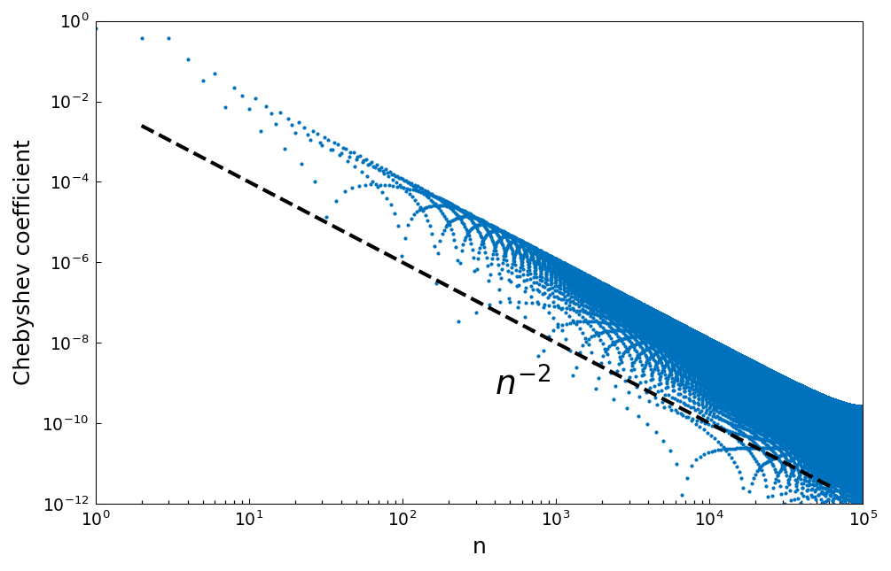
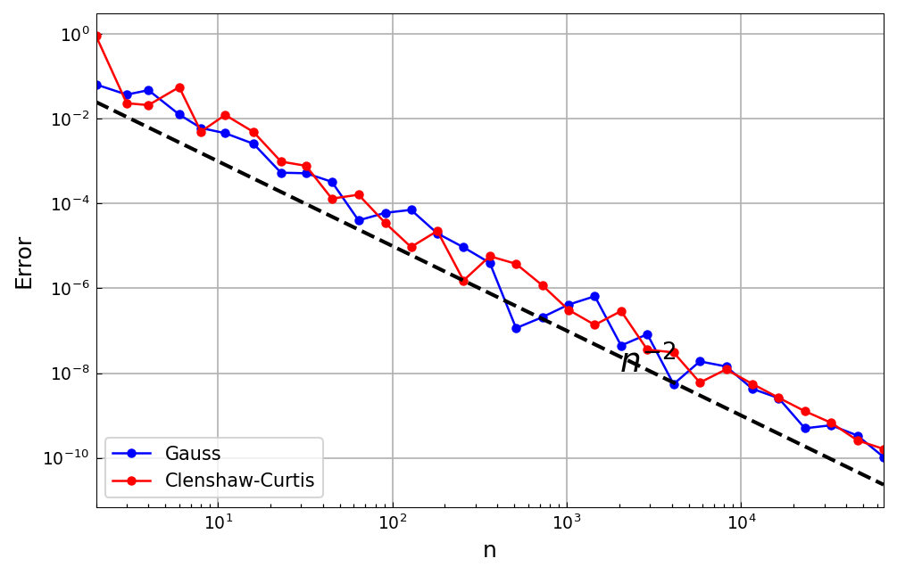

# Quadrature convergence rates for differentiable functions

*Nick Trefethen*

[Original MATLAB Chebfun example](https://www.chebfun.org/examples/quad/QuadratureConvergence.html)

(Chebfun example quad/QuadratureConvergence.m)

It is often said that Gauss quadrature converges twice as fast as
Clenshaw-Curtis, but for functions of finite smoothness the story is
subtler.  Take $f(x) = |x - 0.3|$, whose Chebyshev coefficients decay
at the rate $O(n^{-2})$:

```python
import jax.numpy as jnp
import chebfunjax as cj

fc = cj.chebfun(lambda x: jnp.abs(x - 0.3), n=100000)
```



Sweeping both quadrature rules up to $n = 2^{16}$ points shows both
converging at essentially the same $O(n^{-2})$ rate — for this class
of functions Clenshaw-Curtis is not behind at all:


