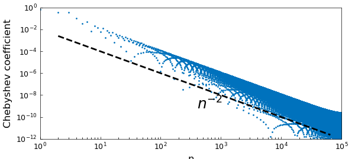
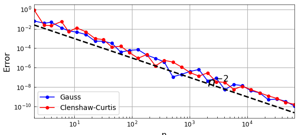

# Quadrature convergence rates for differentiable functions

*Nick Trefethen, June 2012*

[Original MATLAB Chebfun example](https://www.chebfun.org/examples/quad/QuadratureConvergence.html)

Python translation: [`examples/quad/quadrature_convergence.py`](https://github.com/ma-gilles/chebfunjax/blob/main/examples/quad/quadrature_convergence.py)

As pointed out first by Folkmar Bornemann, the Gauss and Clenshaw-Curtis quadrature formulas converge at a rate one power of $n$ faster than one might expect. For example, consider the function $f(x) = |x-.3|$. Its Chebyshev coefficients decrease at the rate $n^{-2}$:

```matlab
clf
x = chebfun('x');
f = abs(x-.3);
fc = chebfun(@(x) f(x),1e5);
LW = 'linewidth'; FS = 'fontsize'; MS = 'markersize';
plotcoeffs(fc,'loglog','.',MS,8), axis([1 1e5 1e-12 1])
xlabel('n',FS,12), ylabel('Chebyshev coefficient',FS,12)
nn = round(2.^(1:.5:16));
hold on, loglog(nn,.01*nn.^(-2),'--k',LW,2)
text(4e2,.5e-9,'n^{-2}',FS,18)
```



Since the integral of an $O(n^{-2})$ tail is normally of size $O(n^{-1})$, you might expect these quadrature formulas to have accuracy $O(n^{-1})$. But in fact, it is $O(n^{-2})$ again:

```matlab
clf, exact = sum(f);
errg = []; errc = [];
nn = round(2.^(1:.5:16));
for n = nn
  [s,w] = legpts(n);
  Igauss = w*f(s);
  errg = [errg abs(Igauss-exact)];
  [s,w] = chebpts(n);
  Iclenshawcurtis = w*f(s);
  errc = [errc abs(Iclenshawcurtis-exact)];
end
loglog(nn,errg,'.-',LW,1,MS,16), grid on
axis([1 1e5 1e-12 1]), hold on
xlabel('Npts',FS,12), ylabel('Error',FS,12)
loglog(nn,errc,'.-r',LW,1,MS,16)
title('Gauss and Clenshaw-Curtis',FS,14)
legend('Gauss','Clenshaw-Curtis','location','southwest')
loglog(nn,.01*nn.^(-2),'--k',LW,2)
text(7e2,.5e-9,'n^{-2}',FS,18)
```



Xiang and Bornemann develop theorems that establish that this effect occurs generally [1]. The reason is not hard to explain once you know to look for it. Both the Clenshaw-Curtis and Gauss formulas will integrate $T_m(x)$ incorrectly for $m\gg n$: instead of giving you the integral of $T_m$, they'll give you the integral of some lower-degree polynomial alias of $T_m$. But $T_m$ is highly oscillatory, with integral $O(n^{-1})$, and most of the time those aliases are highly oscillatory too, also with integral $O(n^{-1})$. So the error committed in integrating $T_m$ is typically of size $O(n^{-1})$, not $O(1)$. It's only as big as $O(1)$ for the unlucky values of $m$ that get aliased to a polynomial with a lot of energy at wave number $O(1)$, and only a fraction $O(n^{-1})$ of the values of $m$ have this unlucky property.

Or as Xiang and Bornemann put it: $E_n(T_m)$ is, up to some remainder, periodic in $m$ with a period of $O(n)$ and an *average* modulus of $O(n^{-1})$.

Xiang and Bornemann point out that for a function with so little smoothness as $|x-.3|$, these convergence results were noted earlier by Riess and Johnson (1971/72) for Clenshaw-Curtis and Davis and Rabinowitz (1984) for Gauss. The general theorems seem to be new, however, and their proofs require careful attention to details.

## References

1. S. Xiang and F. Bornemann, On the convergence rates of Gauss and Clenshaw-Curtis quadrature for functions of limited regularity, *SIAM Journal on Numerical Analysis,* 50 (2012), 2581-2587.

---

*Translated with [chebfunjax](https://github.com/ma-gilles/chebfunjax); prose and MATLAB code from the original example, copyright The University of Oxford and The Chebfun Developers.  Printed outputs and figures are chebfunjax's.*
