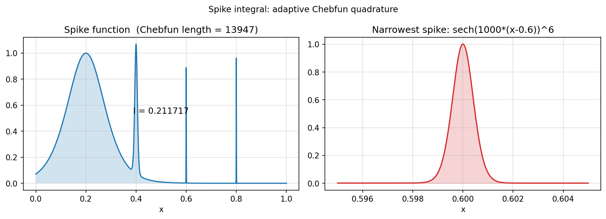

# Spike integral

**Nick Hale, October 2010**

[Original MATLAB Chebfun example](https://www.chebfun.org/examples/quad/SpikeIntegral.html)

---

The *spike function* (also known as F21F in the Kahaner benchmark) consists
of several spikes of increasing sharpness:

$$
f(x) = \text{sech}^2\!\bigl(10(x-0.2)\bigr)
      + \text{sech}^4\!\bigl(100(x-0.4)\bigr)
      + \text{sech}^6\!\bigl(1000(x-0.6)\bigr)
      + \text{sech}^8\!\bigl(1000(x-0.8)\bigr).
$$

The narrowest spike has width $\sim 10^{-3}$, requiring a very high polynomial
degree to represent accurately.

## Integration

```python
import jax.numpy as jnp
import chebfunjax as cj

def spike(x):
    return (
        (1/jnp.cosh(10  *(x-0.2)))**2 +
        (1/jnp.cosh(100 *(x-0.4)))**4 +
        (1/jnp.cosh(1000*(x-0.6)))**6 +
        (1/jnp.cosh(1000*(x-0.8)))**8
    )

f = cj.chebfun(spike, domain=(0.0, 1.0))
print("Chebfun length:", len(f))      # ~13862 (very high degree!)
print("Integral:", f.sum())           # ≈ 0.2117
```

## Individual contributions

Each spike contributes approximately:

| Spike | Width | Contribution |
|-------|-------|-------------|
| $\text{sech}^2(10(x-0.2))$ | $\sim 0.1$ | $2/10 = 0.2$ |
| $\text{sech}^4(100(x-0.4))$ | $\sim 0.01$ | $4/(3\cdot100) \approx 0.0133$ |
| $\text{sech}^6(1000(x-0.6))$ | $\sim 0.001$ | $16/(15\cdot1000) \approx 0.00107$ |
| $\text{sech}^8(1000(x-0.8))$ | $\sim 0.001$ | $\approx 0.00091$ |

```python
# Verify sech^2 contribution
f1 = cj.chebfun(lambda x: (1/jnp.cosh(10*(x-0.2)))**2, domain=(-0.5, 0.9))
print("I1 =", f1.sum(), "  exact ≈ 2/10 =", 2/10)
```

## Gallery



*Left*: The full spike function (polynomial degree ≈ 13000).
*Right*: Zoom on the narrowest spike at $x=0.6$.

## Reference

Kahaner, D. K. (1971). Comparison of numerical quadrature formulas.
In J. R. Rice (ed.), *Mathematical Software*. Academic Press, 229–259.
