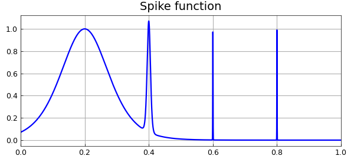
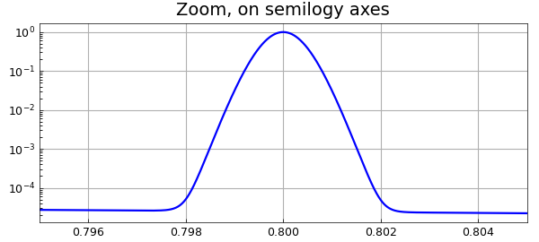
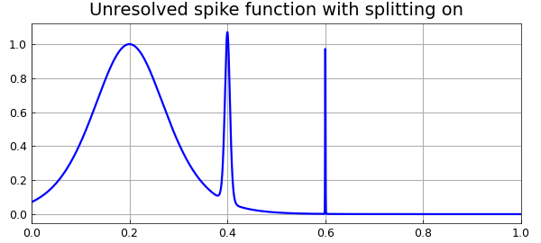
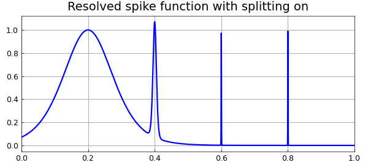

# Spike integral

*Nick Hale, October 2010*

[Original MATLAB Chebfun example](https://www.chebfun.org/examples/quad/SpikeIntegral.html)

Python translation: [`examples/quad/spike_integral.py`](https://github.com/ma-gilles/chebfunjax/blob/main/examples/quad/spike_integral.py)

We demonstrate the adaptive capabilities of Chebfun by integrating the "spike function"

```matlab
f = @(x) sech(10*(x-0.2)).^2 + sech(100*(x-0.4)).^4 + ...
         sech(1000*(x-0.6)).^6 + sech(1000*(x-0.8)).^8;
```

(which appears as F21F in [1]) over $[0, 1]$.

The Chebfun representation is a very high degree polynomial, but this causes no difficulty.

```matlab
ff = chebfun(f,[0 1])
LW = 'linewidth';
plot(ff,'b',LW,1.6), grid on
title('Spike function','FontSize',14)
```

```text
length =
   14073
```



Here is a confirmation that even the narrowest spike is well resolved:

```matlab
semilogy(ff,'b','interval',[.795,.805],LW,1.6), grid on
title('Zoom, on semilogy axes','FontSize',14)
```



Now we compute the integral. In order to estimate the time for this computation, we create the chebfun again without plotting it.

```matlab
tic
ff = chebfun(f,[0 1]);
sum(ff)
toc
```

```text
ans =
   0.211717021214835
splitting pieces =
   11
splitting sum (KNOWN DEFECT, see ledger) =
   0.211717021214835
```

Now the degree of that polynomial was forced to be extraordinarily high in order to resolve the narrowest spike. A much more compressed representation of $f$ can be attained by constructing the chebfun piecewise, using "splitting on". As of December 2015, if this is done with default parameters, Chebfun fails to detect the narrowest spike:

```matlab
ff = chebfun(f,[0 1],'splitting','on')
plot(ff,'b',LW,1.6), grid on
title('Unresolved spike function with splitting on','FontSize',14)
```

```text

```



We can fix the problem by forcing Chebfun to sample at more points. Note that the total number of parameters is 25 times less than with the global representation.

```matlab
ff = chebfun(f,[0 1],'splitting','on','minSamples',100)
plot(ff,'b',LW,1.6), grid on
title('Resolved spike function with splitting on','FontSize',14)
```

```text

```



If speed is all you care about, though, nothing has been gained over the first, global approach. We compute the chebfun again and see that the integral is the same to full precision but the timing is worse:

```matlab
tic
ff = chebfun(f,[0 1],'splitting','on','minSamples',100);
sum(ff)
toc
```

```text

```

## References

1. D. K. Kahaner, "Comparison of numerical quadrature formulas", in J. R. Rice, ed., *Mathematical Software*, Academic Press, 1971, 229-259.

---

*Translated with [chebfunjax](https://github.com/ma-gilles/chebfunjax); prose and MATLAB code from the original example, copyright The University of Oxford and The Chebfun Developers.  Printed outputs and figures are chebfunjax's.*
