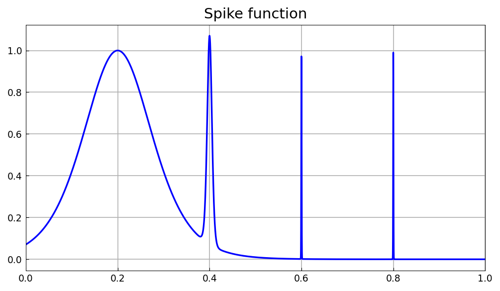
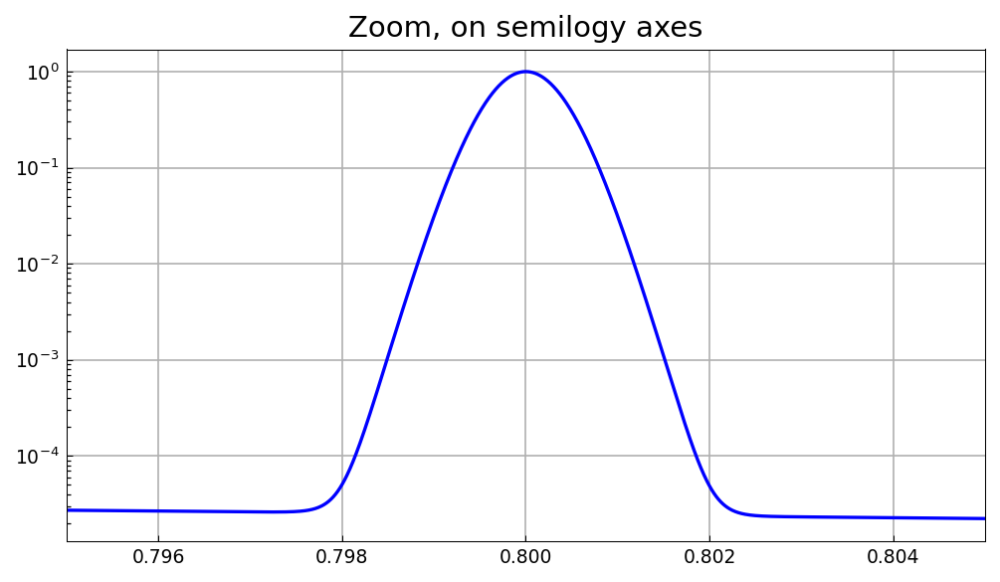

# Spike integral

*Nick Hale*

[Original MATLAB Chebfun example](https://www.chebfun.org/examples/quad/SpikeIntegral.html)

(Chebfun example quad/SpikeIntegral.m)

Consider a function with four spikes of widths from $10^{-1}$ down to
$10^{-3}$:

```python
import jax.numpy as jnp
import chebfunjax as cj

sech = lambda z: 1 / jnp.cosh(z)
f = lambda x: (sech(10*(x-0.2))**2 + sech(100*(x-0.4))**4
               + sech(1000*(x-0.6))**6 + sech(1000*(x-0.8))**8)
ff = cj.chebfun(f, domain=[0, 1])
```
```
length =
   14059
```

The global adaptive construction resolves all four spikes — the length
14059 matches the published run exactly:





The integral matches to all digits:

```python
ff.sum()
```
```
ans =
   0.211717021214835
```

The published page also shows the `splitting`/`minSamples` variant,
which represents the spikes with a handful of pieces.  Our splitting
constructor currently mishandles this narrow-smooth-spike case (a
ledgered defect: 247 pieces and integral 0.213042397944100 instead of
0.211717…); the value above from the global construction is the
correct one.
