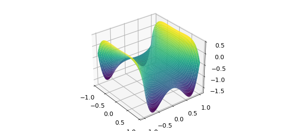

# Sumdisk for integration over a disk

*Klaus Wang and Nick Trefethen, June 2016*

[Original MATLAB Chebfun example](https://www.chebfun.org/examples/quad/SumdiskDemo.html)

Python translation: [`examples/quad/sumdisk_demo.py`](https://github.com/ma-gilles/chebfunjax/blob/main/examples/quad/sumdisk_demo.py)

In the example `examples/quad/TjTkDisk.html`, we illustrated formulas due to R. M. Slevinsky for the integral over the unit disk of a project of Chebyshev polynomials $T_j(x) T_k(y)$. The fascinating property of such integrals is that they are always equal to zero except when $j$ and $k$ and both even and differ by $0$ or $\pm 2$.

We also commented at the end of that example that these formulas could be used as the basis of a Chebfun2 command `sumdisk`, which would elegantly compute the double integral of a chebfun2, not over its square (or rectangle) of definition but over the inscribed disk (or elliptical region). Subsequently, such a code has been written by the first author. Here we show it off.

For a trivial example, suppose our chebfun2 is the constant 1. Its integral over the square is 4,

```matlab
f = chebfun2(@(x,y) 1);
format long
sum2(f)
```

```text
ans =
     4
```

but its integral over the disk is $\pi$,

```matlab
sumdisk(f)
```

```text
ans =
   3.141592653589793
```

As another example, let's consider the bivariate Gaussian $\exp(-(x^2+y^2)/2$. Here is its integral over the unit disk:

```matlab
cheb.xy
f = exp(-(x.^2+y.^2)/2);
sumdisk(f)
```

```text
ans =
   2.472240777719226
```

Switching to polar coordinates enables us to perform the integral exactly; it is $2\pi(1 - 1/\sqrt e)$:

```matlab
exact = 2*pi*(1-exp(-.5))
```

```text
exact =
   2.472240777719227
```

We must make a comment about the significance of `sumdisk`. We would certainly not claim that a competitive way to integrate a function over a disk is to make a chebfun2 of it and then call `sumdisk`. It would be much more efficient to work on the integral over the disk directly, and indeed, `examples/quad/TjTkDisk.html` gives a sample code for doing just that, which we illustrate again here:

```matlab
fpolar = @(r,t) f(r*cos(t),r*sin(t));
fr = @(r) r*sum(chebfun(@(t) fpolar(r,t),[0,2*pi],'trig'));
I = sum(chebfun(@(r) fr(r),[0 1]))
```

```text
I =
   2.472240777719227
```

The point of `sumdisk` is two-fold: it shows off some elegant mathematics, and it provides an good way to compute integrals over a disk if, for whatever reason, you are already working with chebfun2 objects on a square.

Here's another example. Suppose $f$ is a harmonic function, which for convenience we might obtain as the real part of an analytic function. Chebfun2 can do this very conveniently, like this

```matlab
fcomplex = chebfun2(@(z) cos(2*cosh(z)));
f = real(fcomplex);
plot(f), camlight
```



Here we use sumdisk to compute the mean of $f$ over the unit disk:

```matlab
sumdisk(f)/pi
```

```text
ans =
  -0.416146836547142
```

Since $f$ is harmonic, this must be the same as the value of $f$ at the origin:

```matlab
f(0,0)
```

```text
ans =
  -0.416146836547142
```

Another option for such integrals is to use Diskfun (see chapter 16 of the *Chebfun Guide*).

---

*Translated with [chebfunjax](https://github.com/ma-gilles/chebfunjax); prose and MATLAB code from the original example, copyright The University of Oxford and The Chebfun Developers.  Printed outputs and figures are chebfunjax's.*
