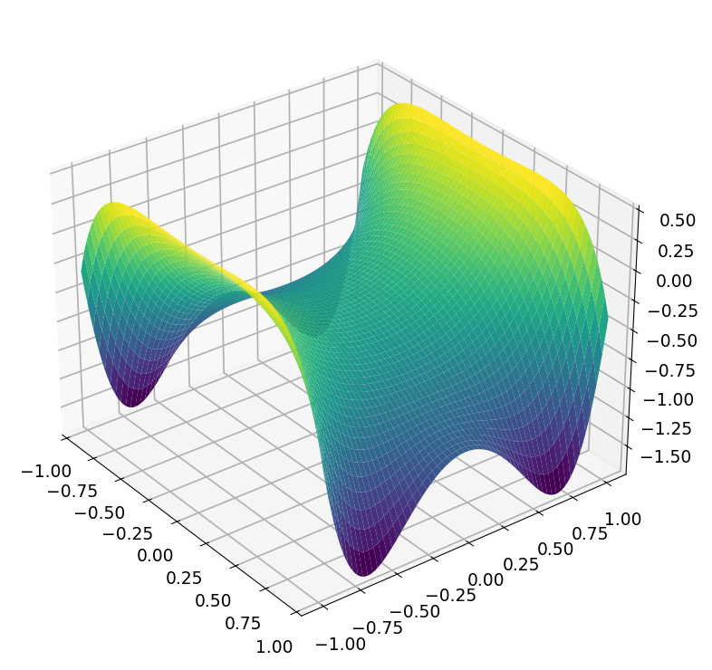

# Sumdisk for integration over a disk

*Klaus Wang and Nick Trefethen, June 2016*

[Original MATLAB Chebfun example](https://www.chebfun.org/examples/quad/SumdiskDemo.html)

(Chebfun example quad/SumdiskDemo.m)

In the example [quad/TjTkDisk](https://www.chebfun.org/examples/quad/TjTkDisk.html),
we illustrated formulas due to R. M. Slevinsky for the integral over the
unit disk of a product of Chebyshev polynomials $T_j(x) T_k(y)$.  The
fascinating property of such integrals is that they are always equal to
zero except when $j$ and $k$ are both even and differ by $0$ or $\pm 2$.

We also commented at the end of that example that these formulas could be
used as the basis of a Chebfun2 command `sumdisk`, which would elegantly
compute the double integral of a chebfun2, not over its square (or
rectangle) of definition but over the inscribed disk (or elliptical
region).  Subsequently, such a code has been written by the first author.
Here we show it off.

For a trivial example, suppose our chebfun2 is the constant 1.  Its
integral over the square is 4,

```python
import jax.numpy as jnp
import numpy as np
import chebfunjax as cj

f = cj.chebfun2(lambda x, y: 1.0 + 0*x + 0*y)
f.sum2()
```
```
ans =
     4
```

but its integral over the disk is $\pi$,

```python
f.sumdisk()
```
```
ans =
   3.141592653589793
```

As another example, let's consider the bivariate Gaussian
$\exp(-(x^2+y^2)/2)$.  Here is its integral over the unit disk:

```python
f = cj.chebfun2(lambda x, y: jnp.exp(-(x**2 + y**2)/2))
f.sumdisk()
```
```
ans =
   2.472240777719226
```

Switching to polar coordinates enables us to perform the integral
exactly; it is $2\pi(1 - 1/\sqrt e)$:

```python
exact = 2*np.pi*(1 - np.exp(-0.5))
```
```
exact =
   2.472240777719227
```

We must make a comment about the significance of `sumdisk`.  We would
certainly not claim that a competitive way to integrate a function over a
disk is to make a chebfun2 of it and then call `sumdisk`.  It would be
much more efficient to work on the integral over the disk directly, and
indeed, quad/TjTkDisk gives a sample code for doing just that, which we
illustrate again here:

```python
def fr(r):
    circ = cj.chebfun(lambda t: f(r*jnp.cos(t), r*jnp.sin(t)),
                      domain=(0.0, 2*np.pi), trig=True)
    return r * float(circ.sum())

def radial_vals(r):
    arr = np.atleast_1d(np.asarray(r, dtype=np.float64))
    vals = [fr(float(ri)) for ri in arr.ravel()]
    return jnp.asarray(vals, dtype=jnp.float64).reshape(arr.shape)

radial = cj.chebfun(radial_vals, domain=(0.0, 1.0))
I = float(radial.sum())
```
```
I =
   2.472240777719227
```

The point of `sumdisk` is two-fold: it shows off some elegant
mathematics, and it provides a good way to compute integrals over a disk
if, for whatever reason, you are already working with chebfun2 objects on
a square.

Here's another example.  Suppose $f$ is a harmonic function, which for
convenience we might obtain as the real part of an analytic function.
Chebfun2 can do this very conveniently, like this:

```python
fcomplex = cj.chebfun2(lambda z: jnp.cos(2*jnp.cosh(z)))
f = fcomplex.real()
```



Here we use `sumdisk` to compute the mean of $f$ over the unit disk:

```python
f.sumdisk() / np.pi
```
```
ans =
  -0.416146836547143
```

Since $f$ is harmonic, this must be the same as the value of $f$ at the
origin:

```python
f(0.0, 0.0)
```
```
ans =
  -0.416146836547142
```

(The published MATLAB page prints `-0.416146836547142` for both values;
the sumdisk-mean above differs in the 15th digit — a 1-ulp
construction difference.  The exact value is $\cos 2 =
-0.41614683654714238\ldots$)

## References

1. Klaus Wang and Nick Trefethen, [quad/TjTkDisk](https://www.chebfun.org/examples/quad/TjTkDisk.html)

---

*Replicated with [chebfunjax](https://github.com/ma-gilles/chebfunjax); original
example copyright The University of Oxford and The Chebfun Developers.*
