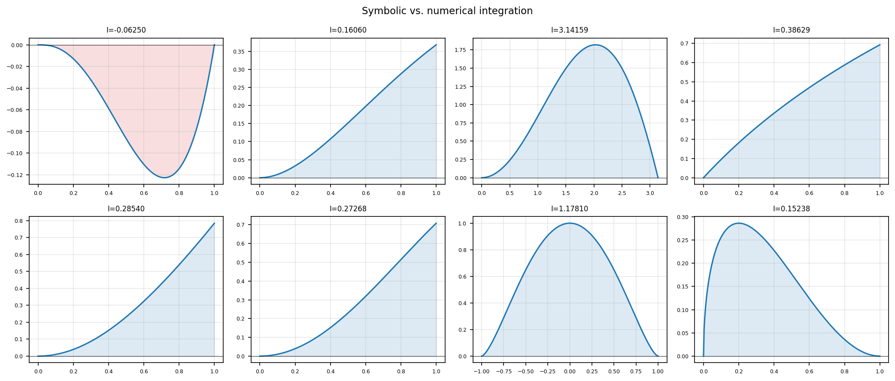

# Symbolic and numerical integration

**Nick Trefethen, July 2014**

---

Computer algebra systems can compute remarkable symbolic integrals.
Here we compare several such results with direct numerical integration by chebfunjax.

## Examples

| Integral | Domain | Exact value |
|----------|--------|-------------|
| $\int x^3 \log x\, dx$ | $(0,1]$ | $-1/16$ |
| $\int x^2 e^{-x}\, dx$ | $[0,1]$ | $2 - 5/e$ |
| $\int x\sin x\, dx$ | $[0,\pi]$ | $\pi$ |
| $\int \log(1+x)\, dx$ | $[0,1]$ | $2\log 2 - 1$ |
| $\int x\arctan x\, dx$ | $[0,1]$ | $(\pi - 2)/4$ |
| $\int \sin^2 x\, dx$ | $[0,1]$ | $(1 - \sin 2)/2)/2$ |
| $\int (1-x^2)^{3/2}\, dx$ | $[-1,1]$ | $3\pi/8$ |
| $\int \sqrt{x}(1-x)^2\, dx$ | $[0,1]$ | $B(3/2, 3) \approx 0.1524$ |

## chebfunjax computation

```python
import jax.numpy as jnp
import chebfunjax as cj

# int_0^pi x*sin(x) dx = pi
f = cj.chebfun(lambda x: x * jnp.sin(x), domain=(0.0, float(jnp.pi)))
print("int x*sin(x) dx =", f.sum(), "  exact:", float(jnp.pi))

# int_-1^1 (1-x^2)^(3/2) dx = 3*pi/8
g = cj.chebfun(lambda x: (1.0 - x**2)**1.5)
print("int (1-x^2)^(3/2) dx =", g.sum(), "  exact:", 3*float(jnp.pi)/8)
```

All integrals agree to at least 12 significant digits.

## Gallery



All 8 integrands plotted with computed values.
