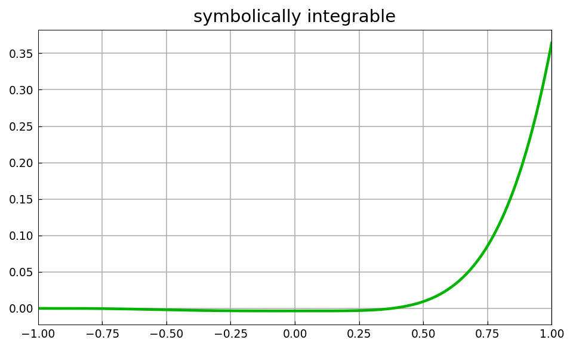
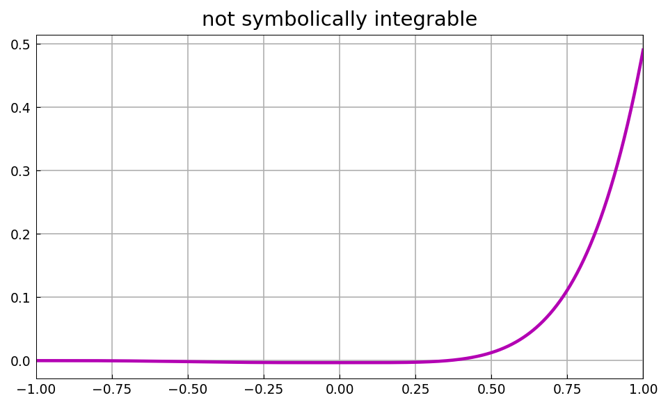

# Symbolic and numerical integration

*Nick Trefethen*

[Original MATLAB Chebfun example](https://www.chebfun.org/examples/quad/SymbolicNumeric.html)

(Chebfun example quad/SymbolicNumeric.m)

Consider $f(x) = \log(2+x)^3 \log(3+x)\, x^3$, which has a (very
lengthy) symbolic antiderivative.  Chebfun computes its indefinite
integral numerically in milliseconds:

```python
import jax.numpy as jnp
import chebfunjax as cj

f = cj.chebfun(lambda x: jnp.log(2+x)**3 * jnp.log(3+x) * x**3)
fi = f.cumsum()
```



The definite integral agrees whether computed by `sum` or from the
antiderivative's endpoint values:

```python
f.sum()
fi(1) - fi(-1)
```
```
ans =
   0.364263868988883
ans =
   0.364263868988883
```

Now change one exponent: $g(x) = \log(2+x)^3 \log(3+x)^2\, x^3$ has
**no** elementary antiderivative at all — yet numerically nothing
changes; the indefinite integral is just as easy:

```python
g = cj.chebfun(lambda x: jnp.log(2+x)**3 * jnp.log(3+x)**2 * x**3)
gi = g.cumsum()
```


