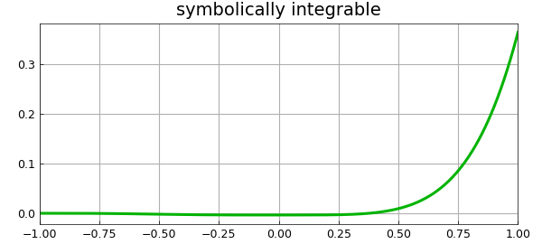
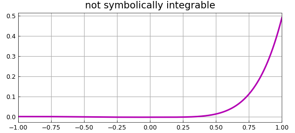

# Symbolic and numerical integration

*Nick Trefethen, July 2014*

[Original MATLAB Chebfun example](https://www.chebfun.org/examples/quad/SymbolicNumeric.html)

Python translation: [`examples/quad/symbolic_numeric.py`](https://github.com/ma-gilles/chebfunjax/blob/main/examples/quad/symbolic_numeric.py)

Mathematica can do extraordinary things with symbolic integration. One way to see it in action is to go to the Wolfram Mathematica Online Integrator and click on "Random Example".

For example, consider the function

$$ f(x) = \log(2+x)^3 \log(3+x) x^3 $$

The Online Integrator quickly delivers the following exact indefinite integral:

$$ (-759744 - 558290 x + 17705 x - 1050 x + 54 x + \\ 910528 \text{Log}[2 + x] + 400008 x \text{Log}[2 + x] - \\ 22836 x^2 \text{Log}[2 + x] + 2072 x^3 \text{Log}[2 + x] - \\ 162 x^4 \text{Log}[2 + x] - 302016 \text{Log}[2 + x]^2 - \\ 118800 x \text{Log}[2 + x]^2 + 11880 x^2 \text{Log}[2 + x]^2 - \\ 1680 x^3 \text{Log}[2 + x]^2 + 216 x^4 \text{Log}[2 + x]^2 + \\ 48384 \text{Log}[2 + x]^3 + 15552 x \text{Log}[2 + x]^3 - \\ 2592 x^2 \text{Log}[2 + x]^3 + 576 x^3 \text{Log}[2 + x]^3 - \\ 144 x^4 \text{Log}[2 + x]^3 + 309078 \text{Log}[3 + x] + \\ 79680 x \text{Log}[3 + x] - 5520 x^2 \text{Log}[3 + x] + \\ 592 x^3 \text{Log}[3 + x] - 54 x^4 \text{Log}[3 + x] - \\ 293976 \text{Log}[2 + x] \text{Log}[3 + x] - \\ 57600 x \text{Log}[2 + x] \text{Log}[3 + x] + \\ 7488 x^2 \text{Log}[2 + x] \text{Log}[3 + x] - \\ 1344 x^3 \text{Log}[2 + x] \text{Log}[3 + x] + \\ 216 x^4 \text{Log}[2 + x] \text{Log}[3 + x] + \\ 138672 \text{Log}[2 + x]^2 \text{Log}[3 + x] + \\ 13824 x \text{Log}[2 + x]^2 \text{Log}[3 + x] - \\ 3456 x^2 \text{Log}[2 + x]^2 \text{Log}[3 + x] + \\ 1152 x^3 \text{Log}[2 + x]^2 \text{Log}[3 + x] - \\ 432 x^4 \text{Log}[2 + x]^2 \text{Log}[3 + x] - \\ 46656 \text{Log}[2 + x]^3 \text{Log}[3 + x] + \\ 576 x^4 \text{Log}[2 + x]^3 \text{Log}[3 + x] - \\ 24 (5609 - 6756 \text{Log}[2 + x] + 4680 \text{Log}[2 + x]^2 ) \\ \text{PolyLog}[2, -2 - x] + \\ 288 (-563 + 780 \text{Log}[2 + x]) \text{PolyLog}[3, -2 - x] - \\ 224640 \text{PolyLog}[4, -2 - x]) / 2304 $$

```
Error updating Text. Following is the chain of causes of the error:

 String must have valid interpreter syntax: 
$$ (-759744 - 558290 x + 17705 x  - 1050 x  + 54 x  + \\\\   910528 \text{Log}[2 + x] + 400008 x \text{Log}[2 + x] - \\\\   22836 x^2  \text{Log}[2 + x] + 2072 x^3  \text{Log}[2 + x] - \\\\   162 x^4  \text{Log}[2 + x] - 302016 \text{Log}[2 + x]^2  - \\\\   118800 x \text{Log}[2 + x]^2  + 11880 x^2  \text{Log}[2 + x]^2  - \\\\   1680 x^3  \text{Log}[2 + x]^2  + 216 x^4  \text{Log}[2 + x]^2  + \\\\   48384 \text{Log}[2 + x]^3  + 15552 x \text{Log}[2 + x]^3  - \\\\   2592 x^2  \text{Log}[2 + x]^3  + 576 x^3  \text{Log}[2 + x]^3  - \\\\   144 x^4  \text{Log}[2 + x]^3  + 309078 \text{Log}[3 + x] + \\\\   79680 x \text{Log}[3 + x] - 5520 x^2  \text{Log}[3 + x] + \\\\   592 x^3  \text{Log}[3 + x] - 54 x^4  \text{Log}[3 + x] - \\\\   293976 \text{Log}[2 + x] \text{Log}[3 + x] - \\\\   57600 x \text{Log}[2 + x] \text{Log}[3 + x] + \\\\   7488 x^2  \text{Log}[2 + x] \text{Log}[3 + x] - \\\\   1344 x^3  \text{Log}[2 + x] \text{Log}[3 + x] + \\\\   216 x^4  \text{Log}[2 + x] \text{Log}[3 + x] + \\\\   138672 \text{Log}[2 + x]^2  \text{Log}[3 + x] + \\\\   13824 x \text{Log}[2 + x]^2  \text{Log}[3 + x] - \\\\   3456 x^2  \text{Log}[2 + x]^2  \text{Log}[3 + x] + \\\\   1152 x^3  \text{Log}[2 + x]^2  \text{Log}[3 + x] - \\\\   432 x^4  \text{Log}[2 + x]^2  \text{Log}[3 + x] - \\\\   46656 \text{Log}[2 + x]^3  \text{Log}[3 + x] + \\\\   576 x^4  \text{Log}[2 + x]^3  \text{Log}[3 + x] - \\\\   24 (5609 - 6756 \text{Log}[2 + x] + 4680 \text{Log}[2 + x]^2 ) \\\\    \text{PolyLog}[2, -2 - x] + \\\\   288 (-563 + 780 \text{Log}[2 + x]) \text{PolyLog}[3, -2 - x] - \\\\   224640 \text{PolyLog}[4, -2 - x]) / 2304 $$
```

In Chebfun, more prosaically, we could do this:

```matlab
LW = 'LineWidth'; CO = 'Color'; FS = 'FontSize';
f = chebfun(@(x) log(2+x).^3.*log(3+x).*x.^3);
fi = cumsum(f)
plot(fi,LW,2.2,CO,[0 .7 0]), grid on
title('symbolically integrable',FS,14)
```

```text
fi =
   chebfun column (1 smooth piece)
       interval       length     endpoint values
[      -1,       1]       28   2.1e-17     0.36
vertical scale = 0.36
```



These two results are so utterly different! -- and each would be superior in some applications.

The definite integral from $-1$ to $1$ could be computed in Chebfun like this,

```matlab
sum(f)
```

```text
ans =
   0.364263868988883
```

or like this,

```matlab
fi(1) - fi(-1)
```

```text
ans =
   0.364263868988883
```

If I ask WolframAlpha for the definite integral, it gives six numerical digits, $0.364264$, so perhaps it is bypassing the symbolic solution.

An example like this highlights the combinatorial complexity that can arise in symbolic computing. Of course, sometimes no symbolic answer is available at all. If $f$ is changed to

$$ g(x) = \log(2+x)^3 \log(3+x)^2 x^3, $$

then the Online Calculator reports: "Mathematica could not find a formula for your integral. Most likely this means that no formula exists." For Chebfun, on the other hand, it makes no difference:

```matlab
g = chebfun(@(x) log(2+x).^3.*log(3+x).^2.*x.^3);
gi = cumsum(g)
plot(gi,LW,2.2,CO,[.7 0 .7]), grid on
title('not symbolically integrable',FS,14)
```

```text
gi =
   chebfun column (1 smooth piece)
       interval       length     endpoint values
[      -1,       1]       26   5.8e-17     0.49
vertical scale = 0.49
ans =
   0.490519781481421
```



## References

1. L. N. Trefethen, Computing numerically with functions instead of numbers, *Communications of the ACM*, to appear.

---

*Translated with [chebfunjax](https://github.com/ma-gilles/chebfunjax); prose and MATLAB code from the original example, copyright The University of Oxford and The Chebfun Developers.  Printed outputs and figures are chebfunjax's.*
