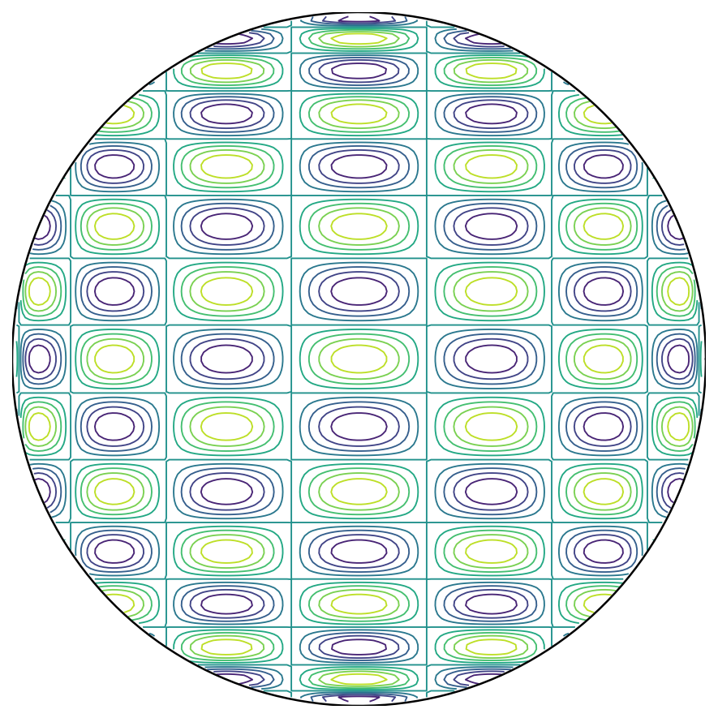

# Integrating Tj(x)*Tk(y) over the unit disk

*Mikael Slevinsky, Nick Trefethen, and Klaus Wang, May 2016*

[Original MATLAB Chebfun example](https://www.chebfun.org/examples/quad/TjTkDisk.html)

(Chebfun example quad/TjTkDisk.m)

## 1. Numerical integration over the disk

In studying cubature formulas, we needed to compute the integrals of
products of Chebyshev polynomials $T_j(x) T_k(y)$ over the unit disk,
like this one:

```python
import jax.numpy as jnp
import numpy as np
import chebfunjax as cj

T8 = lambda x: jnp.cos(8*jnp.arccos(x))
T16 = lambda x: jnp.cos(16*jnp.arccos(x))
s = np.linspace(-1, 1, 160)
xx, yy = np.meshgrid(s, s)
ff = np.array(T8(jnp.asarray(xx)) * T16(jnp.asarray(yy)))
ff[xx**2 + yy**2 > 1] = np.nan
# contour(s, s, ff) with the unit circle overlaid
```



If $j$ or $k$ is odd, the integral is zero, but even if they are both
even, to our surprise, we found that the integrals are still usually
zero!  In fact, a nonzero result only shows up if $j$ and $k$ differ by
0 or 2.  Thus the function plotted above, for example, has integral
exactly zero over the disk.  This is not obvious.

Speaking in general, suppose we want to integrate a smooth function
$f(r,t)$ numerically over the unit disk, where $r$ is radius and $t$ is
angle.  One could use Diskfun, but here, we use standard Chebfun.
Here is a numerical confirmation that the integral of $1$ is $\pi$:

```python
def disk_integral(f):
    def fr(r):
        circ = cj.chebfun(lambda t: f(r, t) + 0.0*t,
                          domain=(0.0, 2*np.pi), trig=True)
        return r * float(circ.sum())
    def radial_vals(r):
        arr = np.atleast_1d(np.asarray(r, dtype=np.float64))
        return jnp.asarray([fr(float(ri)) for ri in arr.ravel()],
                           dtype=jnp.float64).reshape(arr.shape)
    return float(cj.chebfun(radial_vals, domain=(0.0, 1.0)).sum())

I = disk_integral(lambda r, t: 1.0 + 0*t)
Iexact = np.pi
```
```
I =
   3.141592653589793
Iexact =
   3.141592653589793
```

For the function $f(r,t) = r^2$, the integral is $\pi/2$:

```python
I = disk_integral(lambda r, t: r**2 + 0*t)
Iexact = np.pi/2
```
```
I =
   1.570796326794897
Iexact =
   1.570796326794897
```

For the function $f(r,t) = r^2 \cos^2(t)$, the integral is $\pi/4$:

```python
I = disk_integral(lambda r, t: r**2 * jnp.cos(t)**2)
Iexact = np.pi/4
```
```
I =
   0.785398163397448
Iexact =
   0.785398163397448
```

## 2. Numerical integration of products of Chebyshev polynomials

What about those products of Chebyshev polynomials?  Here is a matrix
showing the numerically computed integrals for $k = 0,2,4,6,8,10$.  As
claimed above, the matrix is tridiagonal.

```python
M = np.zeros((6, 6))
for j in range(0, 11, 2):
    Tj = lambda x: jnp.cos(j*jnp.arccos(jnp.clip(x, -1.0, 1.0)))
    for k in range(0, j + 1, 2):
        Tk = lambda x: jnp.cos(k*jnp.arccos(jnp.clip(x, -1.0, 1.0)))
        f = lambda r, t: Tk(r*jnp.cos(t)) * Tj(r*jnp.sin(t))
        M[j//2, k//2] = disk_integral(f)
M = M + np.tril(M, -1).T
```
```
I =
    3.1416   -1.5708   -0.0000    0.0000   -0.0000    0.0000
   -1.5708    0.5236    0.2618    0.0000   -0.0000   -0.0000
   -0.0000    0.2618   -0.1047   -0.1571    0.0000   -0.0000
    0.0000    0.0000   -0.1571    0.0449    0.1122    0.0000
   -0.0000   -0.0000    0.0000    0.1122   -0.0249   -0.0873
    0.0000   -0.0000   -0.0000    0.0000   -0.0873    0.0159
```

(The signed-zero pattern above — down to which vanishing entries print
as `-0.0000` versus `0.0000` — reproduces the published MATLAB output
exactly.  The published timing was 3.7 seconds; this replica's nested
adaptive constructions take about 22 seconds under JAX on CPU.)

## 3. Analytic expressions for the integrals

Let $I_{jk}$ denote the integral of $T_j(x) T_k(y)$ over the unit disk.
The following explicit formulas derived by the first author (details not
reported here) give the integrals:

$$ I_{00} = \pi, $$

$$ I_{02} = I_{20} = -\frac{\pi}{2}, $$

$$ I_{kk} = \frac{\pi (-1)^{k/2}}{2 - 2k^2} \quad (k \hbox{ even},\ k\ge 2), $$

$$ I_{k,k+2} = I_{k+2,k} = \frac{\pi (-1)^{1+k/2}}{4k + 4} \quad (k \hbox{ even},\ k\ge 2). $$

In all other cases $I_{jk} = 0$.

Using these formulas, we can reproduce the matrix above as follows:

```python
A = np.zeros((6, 6))
A[0, 0] = np.pi
A[1, 0] = -np.pi/2
for k in range(2, 11, 2):
    A[k//2, k//2] = np.pi * (-1)**(k//2) / (2 - 2*k**2)
for k in range(2, 9, 2):
    A[1 + k//2, k//2] = -np.pi * (-1)**(k//2) / (4*k + 4)
A = A + np.tril(A, -1).T
```
```
I =
    3.1416   -1.5708         0         0         0         0
   -1.5708    0.5236    0.2618         0         0         0
         0    0.2618   -0.1047   -0.1571         0         0
         0         0   -0.1571    0.0449    0.1122         0
         0         0         0    0.1122   -0.0249   -0.0873
         0         0         0         0   -0.0873    0.0159
```

## 4. Application to integration of general functions

The results of the last section imply that there is an immediate way to
compute the integral of a chebfun2 over a disk: just take the
appropriate linear combination of its bivariate Chebyshev coefficients.
After this example was initially written, we developed this idea into a
Chebfun2 `sumdisk` command.  See the example
[Sumdisk for integration over a disk](SumdiskDemo.md).

---

*Replicated with [chebfunjax](https://github.com/ma-gilles/chebfunjax); original
example copyright The University of Oxford and The Chebfun Developers.*
