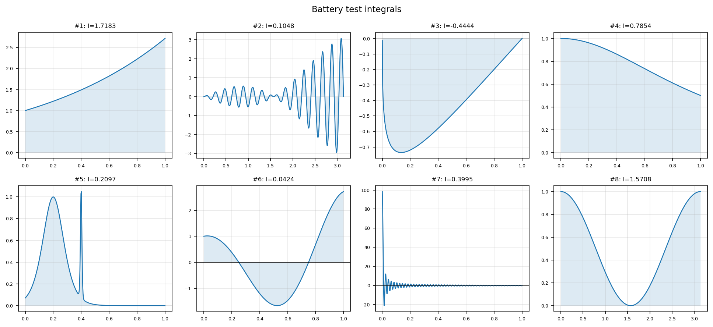

# Battery test of Chebfun as a general-purpose integrator

**Pedro Gonnet, September 2010**

[Original MATLAB source](https://github.com/chebfun/examples/blob/master/quad/BatteryTest.m)

---

This example applies chebfunjax to a selection of the *Kahaner battery* of
test integrands — functions that are challenging for classical adaptive
quadrature routines due to singularities, sharp spikes, or rapid oscillation.

## Representative integrals

| # | Integrand | Domain | Exact |
|---|-----------|--------|-------|
| 1 | $e^x$ | [0,1] | $e-1$ |
| 2 | $x\sin(30x)\cos x$ | $[0,\pi]$ | — |
| 3 | $\sqrt{x}\log x$ | $(0,1]$ | $-4/9$ |
| 4 | $1/(1+x^2)$ | [0,1] | $\pi/4$ |
| 5 | $\text{sech}^2(10(x-0.2)) + \text{sech}^4(100(x-0.4))$ | [0,1] | ≈0.21 |
| 6 | $e^x\cos(2\pi x)$ | [0,1] | — |
| 7 | $\sin(100\pi x)/(\pi x)$ | $(0,1]$ | — |
| 8 | $\cos^2 x$ | $[0,\pi]$ | $\pi/2$ |

## chebfunjax computation

```python
import jax.numpy as jnp
import chebfunjax as cj

# Exponential
f = cj.chebfun(jnp.exp)
print("int exp(x) dx =", f.sum())   # e - 1

# Arctan
g = cj.chebfun(lambda x: 1.0 / (1.0 + x**2))
print("int 1/(1+x^2) dx =", g.sum())   # pi/4

# Spike function
h = cj.chebfun(
    lambda x: (1/jnp.cosh(10*(x-0.2)))**2 + (1/jnp.cosh(100*(x-0.4)))**4,
    domain=(0.0, 1.0)
)
print("spike integral =", h.sum())
```

## Gallery



All 8 test integrands plotted with their computed integral values.

## References

1. Kahaner, D. K. (1971). Comparison of numerical quadrature formulas.
   In J. R. Rice (ed.), *Mathematical Software*. Academic Press.
2. Gonnet, P. (2010). A review of error estimation in adaptive quadrature.
   *ACM Computing Surveys*, **44**(4).
