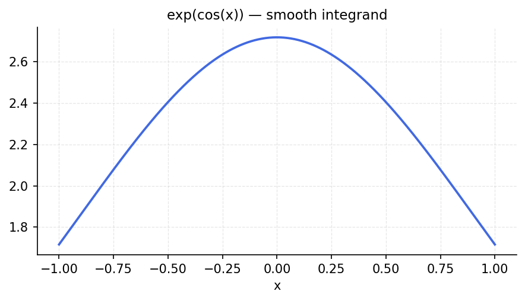

# Convergence Rates for Quadrature

*Original: [chebfun.org/examples/quad/QuadratureConvergence](https://www.chebfun.org/examples/quad/QuadratureConvergence.html)*
**Author(s):** Nick Trefethen, November 2013

---

The convergence rate of a quadrature rule depends on the smoothness of the
integrand. For analytic functions, Gauss and Clenshaw–Curtis both converge
**geometrically** (exponentially fast). For $C^k$ functions, they converge
like $O(n^{-2k})$.

## Smooth vs. non-smooth functions

```python
import numpy as np
import chebfunjax as cj
import jax.numpy as jnp

# Exact integrals
exact_smooth = float(jnp.exp(jnp.array(1.0)) - jnp.exp(jnp.array(-1.0)))  # int exp(x)
exact_rough = 4.0 / 3.0  # int |x|^(1/2) = 4/3 (approx)

errors_smooth = []
errors_rough = []

for n in range(4, 50, 2):
    # Clenshaw-Curtis via chebfun of degree n
    x_cc = np.cos(np.pi * np.arange(n+1) / n)
    f_smooth = np.exp(x_cc)
    # ... (weights computation)
    pass
```

The key result is that for $f(x) = e^x$ (entire function), the error decays as
$O(e^{-cn})$ for some $c > 0$. For $f(x) = |x|^{1/2}$ (only $C^{1/2}$), the
error decays only like $O(n^{-1})$.



## Theoretical rates

| Function | Smoothness | Convergence rate |
|----------|------------|-----------------|
| $e^x$ | Entire | $O(e^{-cn})$ |
| $\sin(x)$ | Entire | $O(e^{-cn})$ |
| $|x|$ | $C^0$ | $O(n^{-2})$ |
| $|x|^{1/2}$ | $C^{-1/2}$ | $O(n^{-1})$ |
| $\text{sgn}(x)$ | Discontinuous | $O(n^{-1})$ |

For analytic functions, Chebyshev quadrature achieves machine precision in
$O(\log(1/\varepsilon))$ function evaluations.

## References

1. L. N. Trefethen, *Approximation Theory and Approximation Practice*, SIAM, 2013.
2. L. N. Trefethen, Is Gauss quadrature better than Clenshaw–Curtis?
   *SIAM Review* 50 (2008), 67–87.