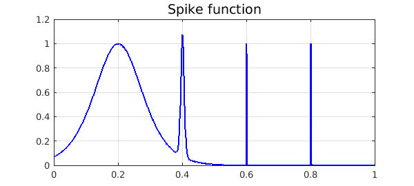
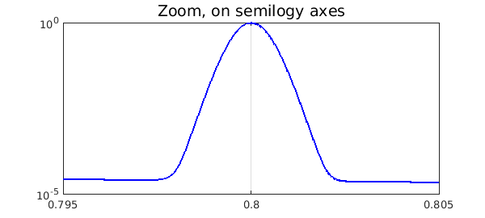
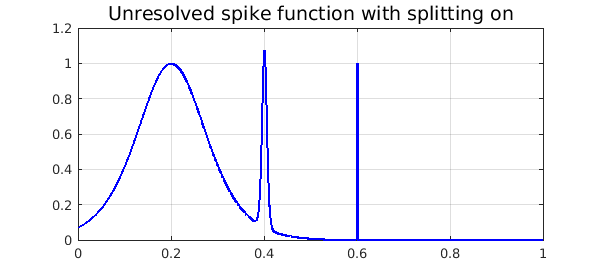
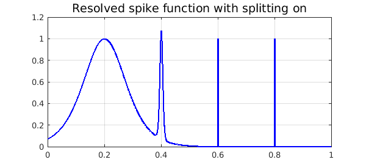

<!-- Generated by scripts/sync_chebfun_examples.py. -->
<!-- Source: https://www.chebfun.org/examples/quad/SpikeIntegral.html -->

<h1>Spike integral</h1>
<h2>Nick Hale, October 2010 in <a href='../'>quad</a><a href='/examples/quad/SpikeIntegral.m'>download</a>&middot;<a href='//github.com/chebfun/examples/blob/master/quad/SpikeIntegral.m'>view on GitHub</a></h2>

We demonstrate the adaptive capabilities of Chebfun by integrating the "spike function"

<pre class="mcode-input">f = @(x) sech(10*(x-0.2)).^2 + sech(100*(x-0.4)).^4 + ...
         sech(1000*(x-0.6)).^6 + sech(1000*(x-0.8)).^8;</pre>

(which appears as F21F in [1]) over $[0, 1]$.

The Chebfun representation is a very high degree polynomial, but this causes no difficulty.

<pre class="mcode-input">ff = chebfun(f,[0 1])
LW = 'linewidth';
plot(ff,'b',LW,1.6), grid on
title('Spike function','FontSize',14)</pre>

<pre class="mcode-output">ff =
   chebfun column (1 smooth piece)
       interval       length     endpoint values  
[       0,       1]    14059     0.071  4.5e-07 
vertical scale = 1.1 
</pre>

Here is a confirmation that even the narrowest spike is well resolved:

<pre class="mcode-input">semilogy(ff,'b','interval',[.795,.805],LW,1.6), grid on
title('Zoom, on semilogy axes','FontSize',14)</pre>

Now we compute the integral.  In order to estimate the time for this computation, we create the chebfun again without plotting it.

<pre class="mcode-input">tic
ff = chebfun(f,[0 1]);
sum(ff)
toc</pre>

<pre class="mcode-output">ans =
   0.211717021214835
Elapsed time is 0.101789 seconds.
</pre>

Now the degree of that polynomial was forced to be extraordinarily high in order to resolve the narrowest spike.  A much more compressed representation of $f$ can be attained by constructing the chebfun piecewise, using "splitting on".  As of December 2015, if this is done with default parameters, Chebfun fails to detect the narrowest spike:

<pre class="mcode-input">ff = chebfun(f,[0 1],'splitting','on')
plot(ff,'b',LW,1.6), grid on
title('Unresolved spike function with splitting on','FontSize',14)</pre>

<pre class="mcode-output">ff =
   chebfun column (6 smooth pieces)
       interval       length     endpoint values  
[       0,    0.38]       74     0.071     0.11 
[    0.38,    0.44]       87      0.11    0.034 
[    0.44,    0.59]       42     0.034   0.0015 
[    0.59,     0.6]       97    0.0015   0.0055 
[     0.6,    0.62]       76    0.0055  0.00081 
[    0.62,       1]       16   0.00081  4.5e-07 
vertical scale = 1.1    Total length = 392
</pre>

We can fix the problem by forcing Chebfun to sample at more points.  Note that the total number of parameters is 25 times less than with the global representation.

<pre class="mcode-input">ff = chebfun(f,[0 1],'splitting','on','minSamples',100)
plot(ff,'b',LW,1.6), grid on
title('Resolved spike function with splitting on','FontSize',14)</pre>

<pre class="mcode-output">ff =
   chebfun column (10 smooth pieces)
       interval       length     endpoint values  
[       0,    0.38]       74     0.071     0.11 
[    0.38,    0.44]       87      0.11    0.034 
[    0.44,    0.59]       42     0.034   0.0015 
[    0.59,     0.6]       97    0.0015   0.0055 
[     0.6,    0.62]       76    0.0055  0.00081 
[    0.62,    0.78]       16   0.00081  3.6e-05 
[    0.78,     0.8]       49   3.6e-05  2.6e-05 
[     0.8,     0.8]       56   2.6e-05     0.11 
[     0.8,    0.81]       71      0.11  1.9e-05 
[    0.81,       1]       15   1.9e-05  4.5e-07 
vertical scale = 1.1    Total length = 583
</pre>

If speed is all you care about, though, nothing has been gained over the first, global approach.  We compute the chebfun again and see that the integral is the same to full precision but the timing is worse:

<pre class="mcode-input">tic
ff = chebfun(f,[0 1],'splitting','on','minSamples',100);
sum(ff)
toc</pre>

<pre class="mcode-output">ans =
   0.211717021214835
Elapsed time is 0.282062 seconds.
</pre>

<h3 id="references">References</h3>
<ol>
<li>D. K. Kahaner, "Comparison of numerical quadrature formulas", in    J. R. Rice, ed., <em>Mathematical Software</em>, Academic Press, 1971, 229-259.</li>
</ol>

