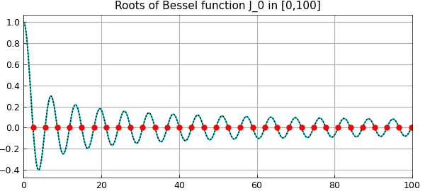
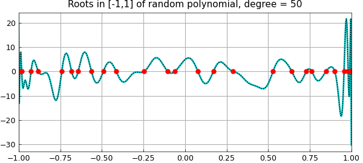
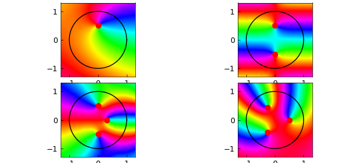

# Rootfinding with the AAA algorithm

*Stefano Costa, June 2022*

[Original MATLAB Chebfun example](https://www.chebfun.org/examples/roots/AAAZeros.html)

Python translation: [`examples/roots/aaa_zeros.py`](https://github.com/ma-gilles/chebfunjax/blob/main/examples/roots/aaa_zeros.py)

Recently, much attention has been paid to the AAA algorithm's capability of returning poles readily available for subsequent approximation tasks. However, we must not forget that it also returns zeros, and this example will show it is competitive with other methods for rootfinding. Here we tackle some problems previously published in the Examples-Rootfinding category.

To begin with, let's consider the Bessel function $J_0$ on the interval $[0,100]$, with its AAA approximation on a set $X$ of just 400 equispaced points:

```matlab
J0 = chebfun(@(x) besselj(0,x),[0 100]);
X = linspace(0,100,400);
tic, [j0,~,~,zer] = aaa(besselj(0,X),X); toc
```

```text
Elapsed time is 0.277808 seconds.
```

We keep only the real zeros in the interval, and measure the maximum difference from those computed by Chebfun:

```matlab
LW = 'linewidth'; MS = 'markersize'; FS = 'fontsize';
zer(imag(zer)~=0) = []; zer = sort(zer(zer>=0 & zer<=100))';
format long e
max_diff = norm(zer-roots(J0)','inf')
figure, plot(J0,'c'), hold on, plot(X,j0(X),'k:'), grid on
title('Roots of Bessel function J_0 in [0,100]')
plot(zer+1i*eps,'r.',MS,15)
```

```text
max_diff =
     3.566924533515703e-12
```



Another interesting test is how the AAA algorithm behaves with random real polynomials, intended as a linear combination of Legendre polynomials (normalized by 2-norm on $[-1,1]$) with random independent coefficients drawn from the standard normal distribution [1]. We build ten random polynomials of degree 50 on the interval with 600 evenly distributed points.

```matlab
X = linspace(-1,1,600); n = 50; diff = []; tic
rng(1)
for k = 1:10
  cleg = randn(n+1,1);                      % Legendre coeffs
  ccheb = leg2cheb(cleg,'norm');            % Chebyshev coeffs
  p = chebfun(ccheb,'coeffs');
  [pa,~,~,zer] = aaa(p(X),X,'tol',1e-9);    % AAA approximation
  zer(imag(zer)~=0) = []; zer = sort(zer(zer>=-1 & zer<=1));
  diff = [diff norm(roots(p)-zer,'inf')];
end, toc
```

```text
Elapsed time is 2.014592 seconds.
```

Here is the maximum difference between roots for each iteration, and how the last random polynomial looks like together with its zeros:

```matlab
diff = diff'
clf, plot(X,p(X),'c-',LW,2), hold on, plot(X,pa(X),'k:',LW,1)
plot(zer+1i*eps,'r.',MS,15), grid on
title('Roots in [-1,1] of random polynomial, degree = 50')
```

```text
diff =
     1.308897434881828e-12
     1.865174681370263e-14
     4.107825191113079e-15
     6.772360450213455e-15
     4.996003610813204e-15
     3.530509218307998e-14
     3.885419763705045e-12
     9.992007221626409e-15
     4.662936703425657e-15
     3.119171587684377e-12
```



Let's now find the roots in the unit disk for some complex functions. Needless to say, the AAA algorithm catches them instantly.

```matlab
Z = exp(1i*linspace(0,2*pi,1000));  % 1000 points on the disk boundary
ff = {}; zerff = {};                % cells for functions and zeros

tic
[ff{1},~,~,zer] = aaa((Z-0.5i).*exp(Z),Z);
zerff{1} = zer(abs(zer)<=1); zeros = cell2mat(zerff(1))
```

```text
zeros =
       1.661969028957675e-17 + 5.000000000000001e-01i
```

```matlab
[ff{2},~,~,zer] = aaa(cosh(pi*Z),Z);
zerff{2} = zer(abs(zer)<=1); zeros = cell2mat(zerff(2))
```

```text
zeros =
       4.406677765597786e-16 + 4.999999999999998e-01i
       3.885125721691876e-16 - 5.000000000000007e-01i
```

```matlab
[ff{3},~,~,zer] = aaa(cosh(exp(Z)).*(Z-.3).*(1+4*Z.^2),Z);
zerff{3} = zer(abs(zer)<=1); zeros = cell2mat(zerff(3))
```

```text
zeros =
      -5.593250910767616e-17 + 4.999999999999989e-01i
       7.767748660457609e-16 - 4.999999999999996e-01i
       2.999999999999988e-01 + 1.034546009067858e-15i
```

```matlab
[ff{4},~,~,zer] = aaa((Z.^3-1/8).*exp((-1-2i)*Z),Z);
zerff{4} = zer(abs(zer)<=1); zeros = cell2mat(zerff(4))
toc
```

```text
zeros =
      -2.499999999999965e-01 - 4.330127018922199e-01i
       4.999999999999986e-01 - 3.049833402248670e-15i
      -2.500000000000001e-01 + 4.330127018922187e-01i
Elapsed time is 0.289128 seconds.
```

Here's a beautiful phaseplot image, with the zeros highlighted in each subpicture.

```matlab
clf, for k = 1:4
    subplot(2,2,k), phaseplot(ff{k}), hold on
    plot(Z,'k-',LW,1), plot(zerff{k},'r.',MS,20)
end
```



---

*Translated with [chebfunjax](https://github.com/ma-gilles/chebfunjax); prose and MATLAB code from the original example, copyright The University of Oxford and The Chebfun Developers.  Printed outputs and figures are chebfunjax's.*
