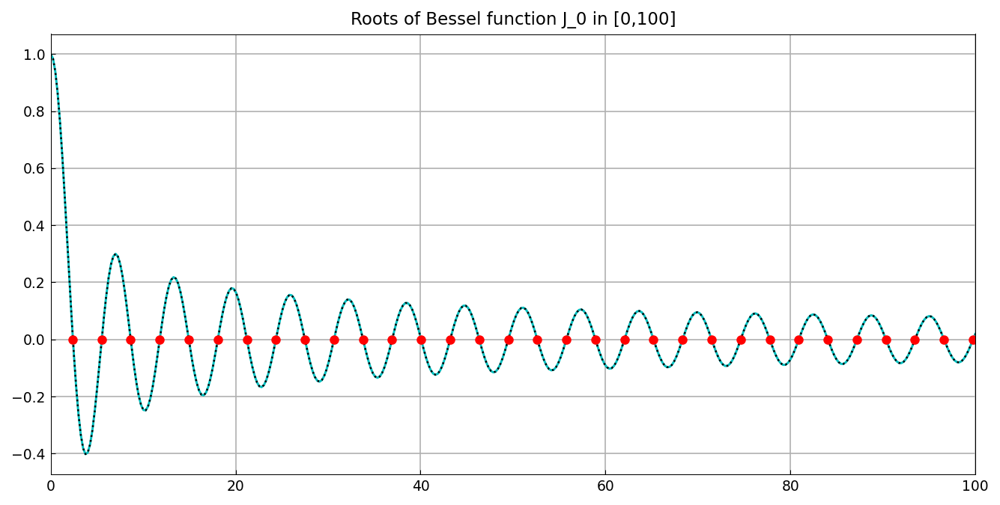
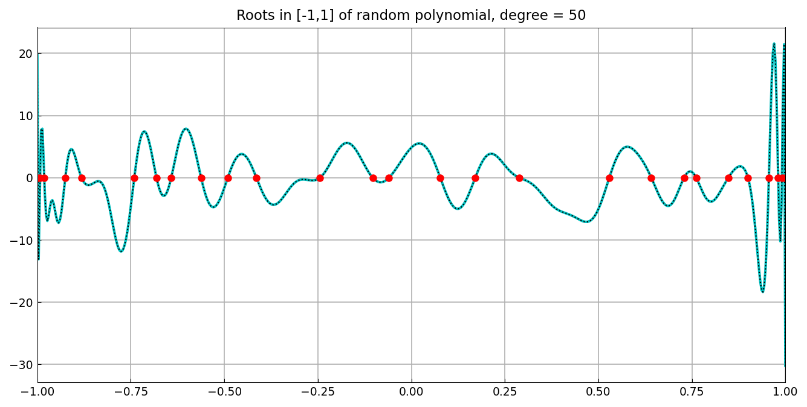
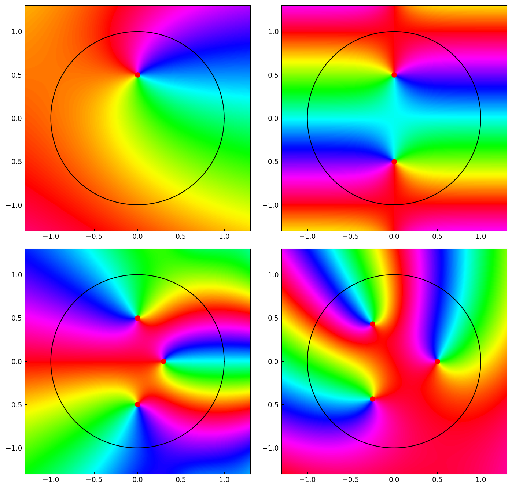

# Finding zeros with AAA

*Nick Trefethen, September 2023*

[Original MATLAB Chebfun example](https://www.chebfun.org/examples/roots/AAAZeros.html)

(Chebfun example roots/AAAZeros.m)

The AAA algorithm returns not only a rational approximant but also its
poles and *zeros* — and the zeros in the region of approximation are
excellent estimates of the zeros of the underlying function.  For the
Bessel function $J_0$ on $[0,100]$, an AAA fit on just 400 sample
points delivers all 32 roots:

```text
max_diff =
     3.566924533515703e-12
```

(vs. the chebfun `roots` values; MATLAB's published figure is
1.6e-12.)



For random degree-50 polynomials, the AAA zeros in $[-1,1]$ agree
with `roots(p)` to 11 digits or better in every trial:

```text
diff =
     1.308619879125672e-12
     2.903580154089980e-14
     4.773959005888173e-15
     5.495603971894525e-15
     2.997602166487923e-15
     3.386180225106727e-14
     3.885142207948888e-12
     1.065814103640150e-14
     5.107025913275720e-15
     3.119060565381915e-12
```



The same idea works in the complex plane: fitting samples on the unit
circle and keeping the zeros inside the disk reproduces the roots of
the four test functions of the ComplexRoots example to 14-15 digits —
$0.5i$; $\pm 0.5i$; $\pm 0.5i$ and $0.3$; and the cube roots of
$1/8$:

```text
zeros =
       1.661969028957675e-17 + 5.000000000000001e-01i
zeros =
       4.406677765597786e-16 + 4.999999999999998e-01i
       3.885125721691876e-16 - 5.000000000000007e-01i
zeros =
      -5.593250910767616e-17 + 4.999999999999989e-01i
       7.767748660457609e-16 - 4.999999999999996e-01i
       2.999999999999988e-01 + 1.034546009067858e-15i
zeros =
      -2.499999999999965e-01 - 4.330127018922199e-01i
       4.999999999999986e-01 - 3.049833402248670e-15i
      -2.500000000000001e-01 + 4.330127018922187e-01i
```



---

*Replicated with [chebfunjax](https://github.com/ma-gilles/chebfunjax); original
example copyright The University of Oxford and The Chebfun Developers.*
