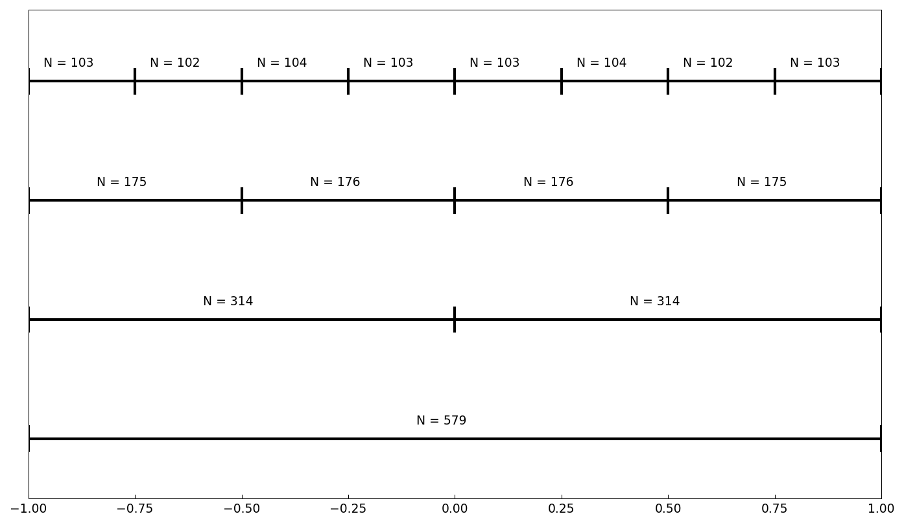
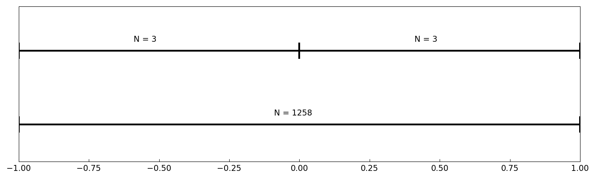
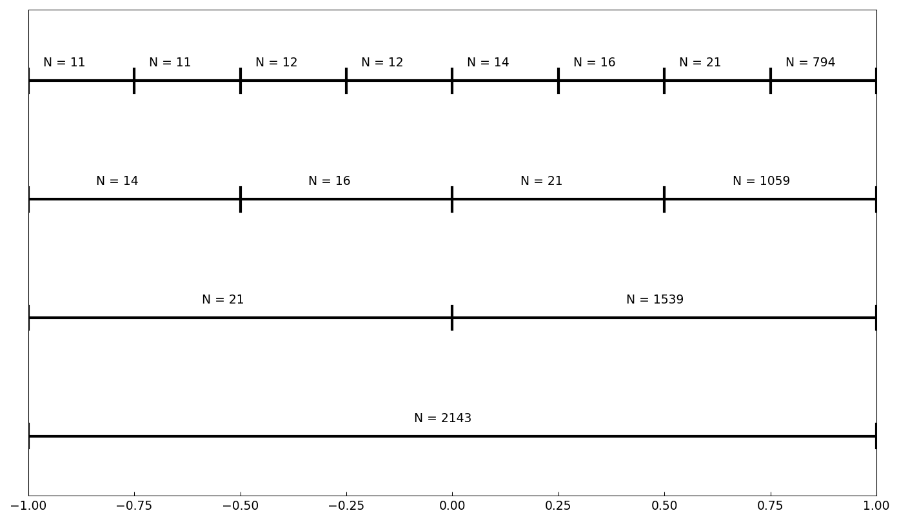

# The average degree reduction of subdivision (1D)

*Alex Townsend, August 2013*

[Original MATLAB Chebfun example](https://www.chebfun.org/examples/roots/AverageDegreeReduction1D.html)

(Chebfun example roots/AverageDegreeReduction1D.m)

Chebfun's 1D rootfinder subdivides the interval when the degree
exceeds 50.  The *average degree reduction* $\tau$ measures how the
polynomial degree shrinks per subdivision level: if a function needs
degree $N$ on $[-1,1]$ and on average degree $\tau^k N$ on
subintervals after $k$ levels, the recursion costs
$O(N^{\max(3\log_2\tau + 2,\, 1)})$ operations.

For the oscillatory $\sin(500x)$, $\tau \approx 1/2$ (halving the
interval halves the number of oscillations):

```text
tau = 0.56390
```



For $|x|^3$, whose global representation cannot resolve the kink but
whose halves are cubic polynomials, $\tau$ is tiny:

```text
tau = 0.00318
```



For $|x-0.01|^7$ and for $1/(x - 1.0001)$ (a pole just outside the
interval), intermediate values occur:

```text
tau = 0.38020
tau = 0.37424
```



(The published values are 0.56216, 0.00136, 0.33201, 0.37094; tau is
a ratio of adaptive construction lengths, which differ by a few
percent between implementations.)  Elliott's formula predicts the
degrees needed for $1/(x-1.0001)$ on the dyadically shrinking
intervals — digit-for-digit with MATLAB:

```text
m =
        2068
        1450
        1017
        713
```

Finally, timings of `roots` for a chebfun of $\sin(2000x)$ and of
$1/(x - 1.0001)$ confirm that subdivision keeps rootfinding tractable
even for high degrees.

---

*Replicated with [chebfunjax](https://github.com/ma-gilles/chebfunjax); original
example copyright The University of Oxford and The Chebfun Developers.*
