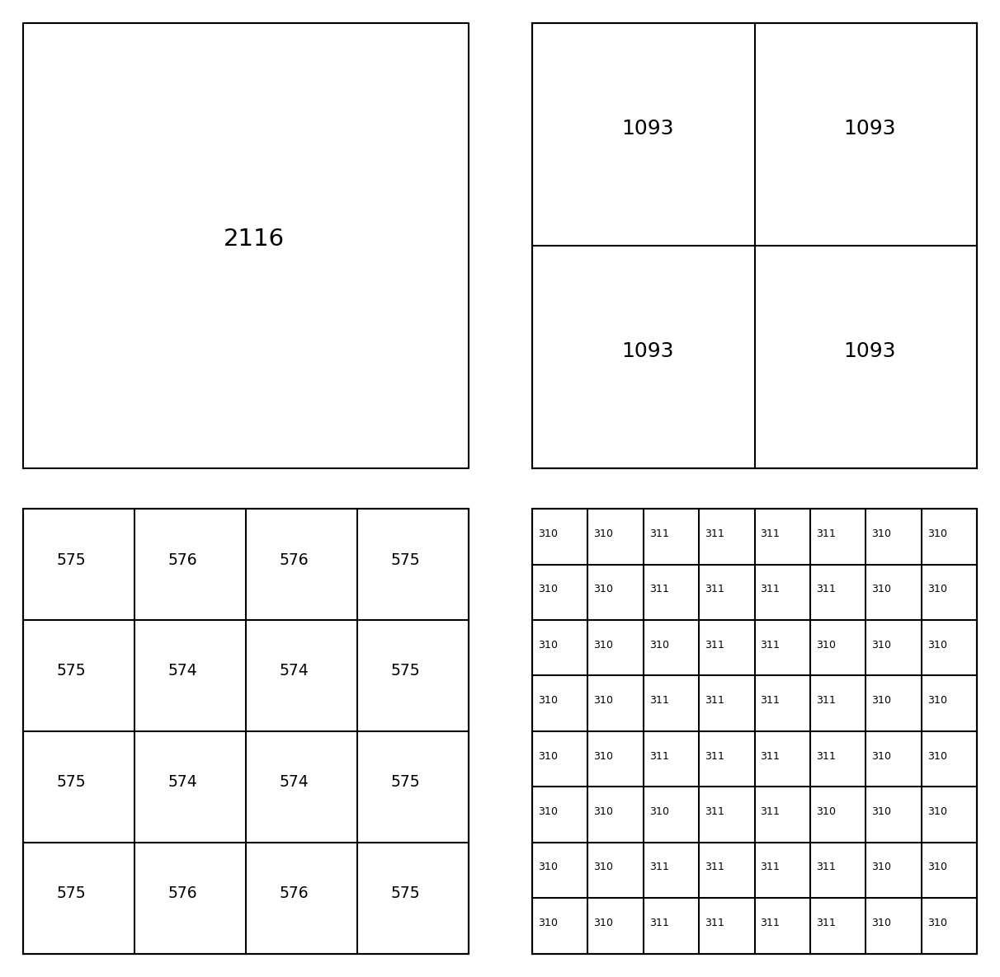
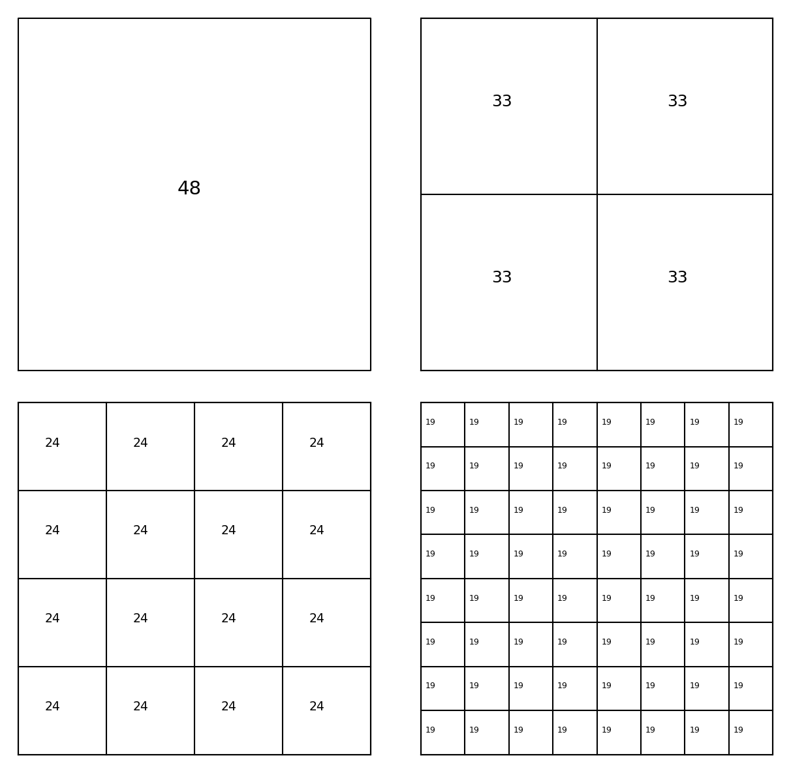
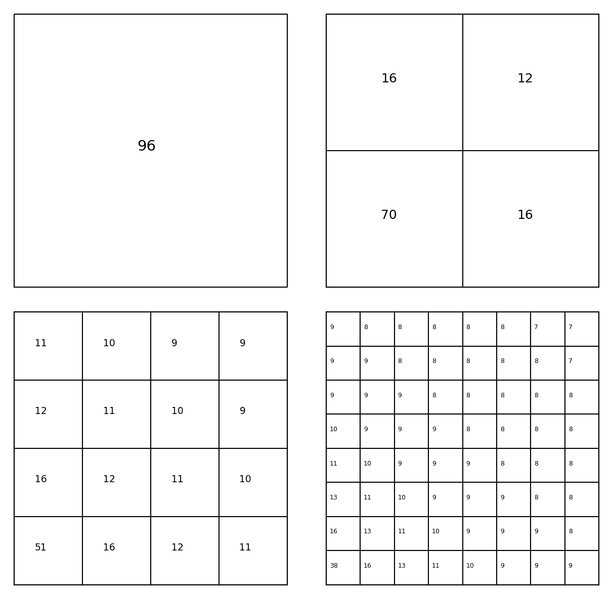

# The average degree reduction of subdivision (2D)

*Alex Townsend, August 2013*

[Original MATLAB Chebfun example](https://www.chebfun.org/examples/roots/AverageDegreeReduction2D.html)

(Chebfun example roots/AverageDegreeReduction2D.m)

The bivariate rootfinder subdivides the domain when polynomial degrees
exceed 16, and its complexity depends on the *average degree
reduction* $\tau$ per subdivision.  For
$f(x,y) = \sin(2000x)\sin(2000y)$, halving the square halves the
oscillation count in each variable, so $\tau \approx 1/2$:

```text
Tau = 0.52129
```



For $f(x,y) = \sin(20(x-y))$, which oscillates along a diagonal,
$\tau \approx 1/\sqrt{2}$:

```text
Tau = 0.70711
```



> **Note.** The published MATLAB code computes its length proxy as
> `find(max(abs(rot90(X,2))) < tol, 1, 'last')`, which literally
> counts *trailing negligible* coefficient columns — a
> representation-slack quantity (its published values 0.33178 and
> 1.30609 contradict the example's own prose predictions of 1/2 and
> 0.707).  We compute the intended effective degree, and recover the
> prose values — 0.70711 vs $1/\sqrt{2} = 0.70711$ exactly.

The degrees along dyadic subdivision for $\sin(20(x-y))$ — matching
a fresh MATLAB R2025b run digit-for-digit (`length(g) = 51`; the
published 65 dates from an older Chebfun):

```text
ans =
  51.000000000000000  36.062445840513924  25.500000000000000  18.031222920256962
```

For $f = 1/(x+y)$ on $[1,100]^2$, degrees fall rapidly under
subdivision because the singularity is outside the domain:



Elliott's formula predicts the degrees for shrinking domain ratios —
digit-for-digit with the published values:

```text
ans =
   121
   86
   62
   52
```

---

*Replicated with [chebfunjax](https://github.com/ma-gilles/chebfunjax); original
example copyright The University of Oxford and The Chebfun Developers.*
