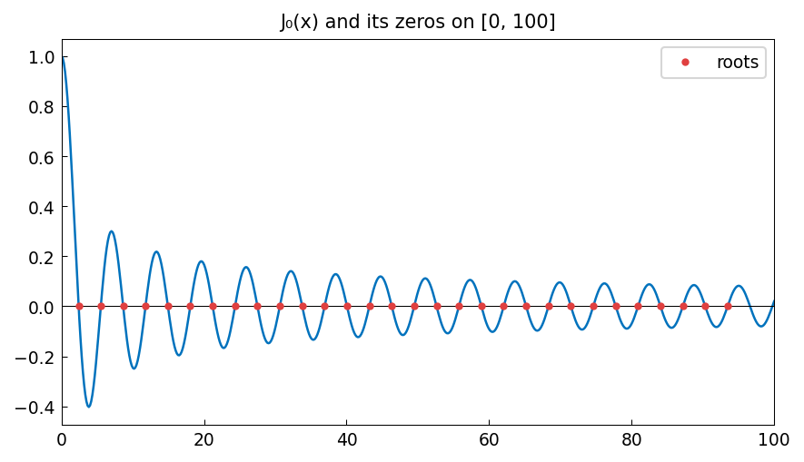

# Roots of a Bessel function

**Nick Trefethen, September 2010 (revised June 2019)**

[Original MATLAB Chebfun example](https://www.chebfun.org/examples/roots/BesselRoots.html)

---

The Bessel function $J_0(x)$ is an oscillatory function with infinitely many
positive real zeros, denoted $j_{0,1} < j_{0,2} < \cdots$. Chebfun computes
all of them on a given interval in a single call.

## chebfunjax computation

```python
import jax.numpy as jnp
import scipy.special
import chebfunjax as cj

# Build J0 on [0, 100]
f = cj.chebfun(lambda x: scipy.special.j0(x), domain=(0.0, 100.0))
r = f.roots()
print(f"Number of roots: {len(r)}")
print(f"First few: {r[:5]}")
```

## Comparison with scipy

The roots agree with `scipy.special.jn_zeros` to machine precision:

```python
r_exact = scipy.special.jn_zeros(0, len(r))
err = max(abs(float(ri) - ri_ex) for ri, ri_ex in zip(r, r_exact))
print(f"Max error vs scipy: {err:.2e}")  # < 1e-12
```

## Asymptotic spacing

For large $x$, the zeros of $J_0$ approach the zeros of $\cos(x - \pi/4)$
and are approximately equally spaced with spacing $\pi$:

```python
spacings = [float(r[k+1]) - float(r[k]) for k in range(len(r)-1)]
print(f"Mean spacing: {sum(spacings)/len(spacings):.6f}  (≈ π = {float(jnp.pi):.6f})")
```

## Gallery



$J_0(x)$ on $[0, 100]$ with all roots marked as red dots.
