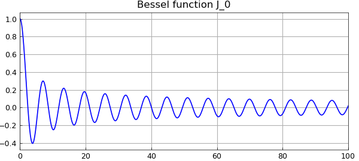
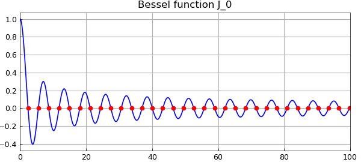

# Roots of a Bessel function

*Nick Trefethen, September 2010*

[Original MATLAB Chebfun example](https://www.chebfun.org/examples/roots/BesselRoots.html)

Python translation: [`examples/roots/bessel_roots.py`](https://github.com/ma-gilles/chebfunjax/blob/main/examples/roots/bessel_roots.py)

[revised June 2019]

Here is the Bessel function $J_0$ on the interval $[0,100]$.

```matlab
J0 = chebfun(@(x) besselj(0,x),[0 100]);
figure, plot(J0), grid on
title('Bessel function J_0')
```



We can find its roots like this:

```matlab
r = roots(J0);
hold on, plot(r,J0(r),'.r')
```



The number of roots can be found with the `length` command:

```matlab
number_of_roots = length(r)
```

```text
number_of_roots =
    32
```

Suppose you wanted to know the numbers of roots in various intervals $[a,b]$. You could define an anonymous function:

```matlab
rootsab = @(a,b) length(roots(chebfun(@(x) besselj(0,x),[a b])));
```

For example:

```matlab
tic
disp('Number of roots between 1000000 and 1001000:')
n = rootsab(1000000,1001000)
toc
```

```text
Number of roots between 1000000 and 1001000:
n =
   318
Elapsed time is 4.799185 seconds.
```

---

*Translated with [chebfunjax](https://github.com/ma-gilles/chebfunjax); prose and MATLAB code from the original example, copyright The University of Oxford and The Chebfun Developers.  Printed outputs and figures are chebfunjax's.*
