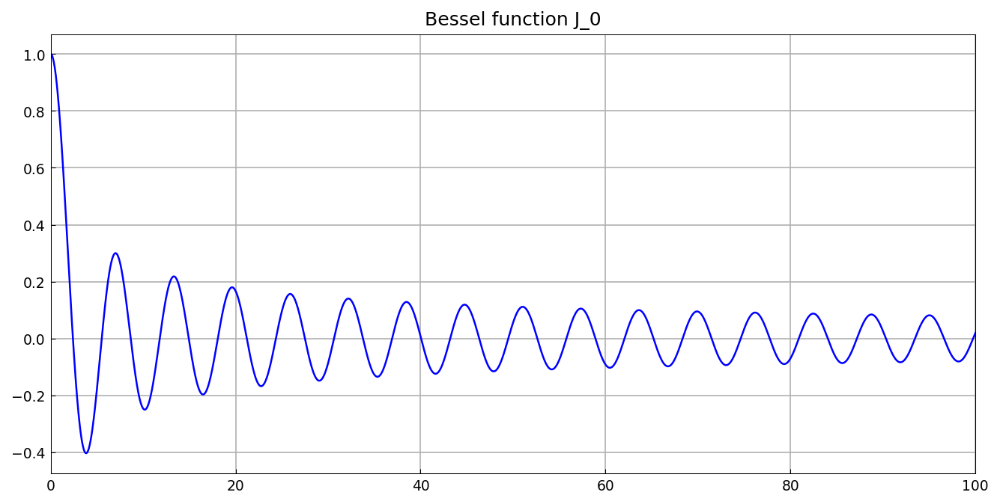
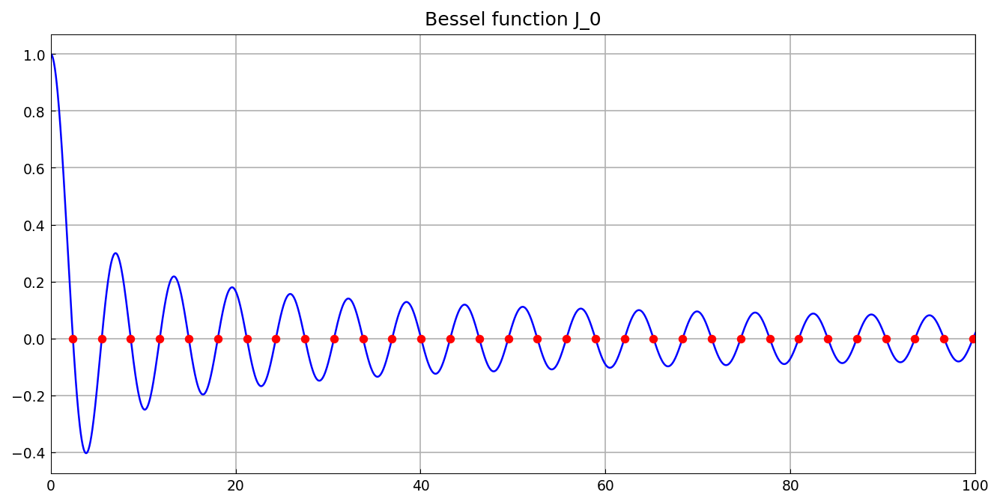

# Roots of a Bessel function

*Nick Trefethen, September 2010 (revised June 2019)*

[Original MATLAB Chebfun example](https://www.chebfun.org/examples/roots/BesselRoots.html)

(Chebfun example roots/BesselRoots.m)

Here is the Bessel function $J_0$ on the interval $[0,100]$.

```python
J0 = chebfun(lambda x: besselj(0, x), domain=(0, 100))
```



We can find its roots like this:

```python
r = J0.roots()
```



The number of roots can be found with the `length` command:

```text
number_of_roots =
    32
```

Suppose you wanted to know the numbers of roots in various intervals
$[a,b]$.  You could define an anonymous function:

```python
rootsab = lambda a, b: len(chebfun(lambda x: besselj(0, x),
                                   domain=(a, b)).roots())
```

For example:

```text
Number of roots between 1000000 and 1001000:
n =
   318
```

(Both counts are digit-for-digit the published MATLAB values.)

---

*Replicated with [chebfunjax](https://github.com/ma-gilles/chebfunjax); original
example copyright The University of Oxford and The Chebfun Developers.*
