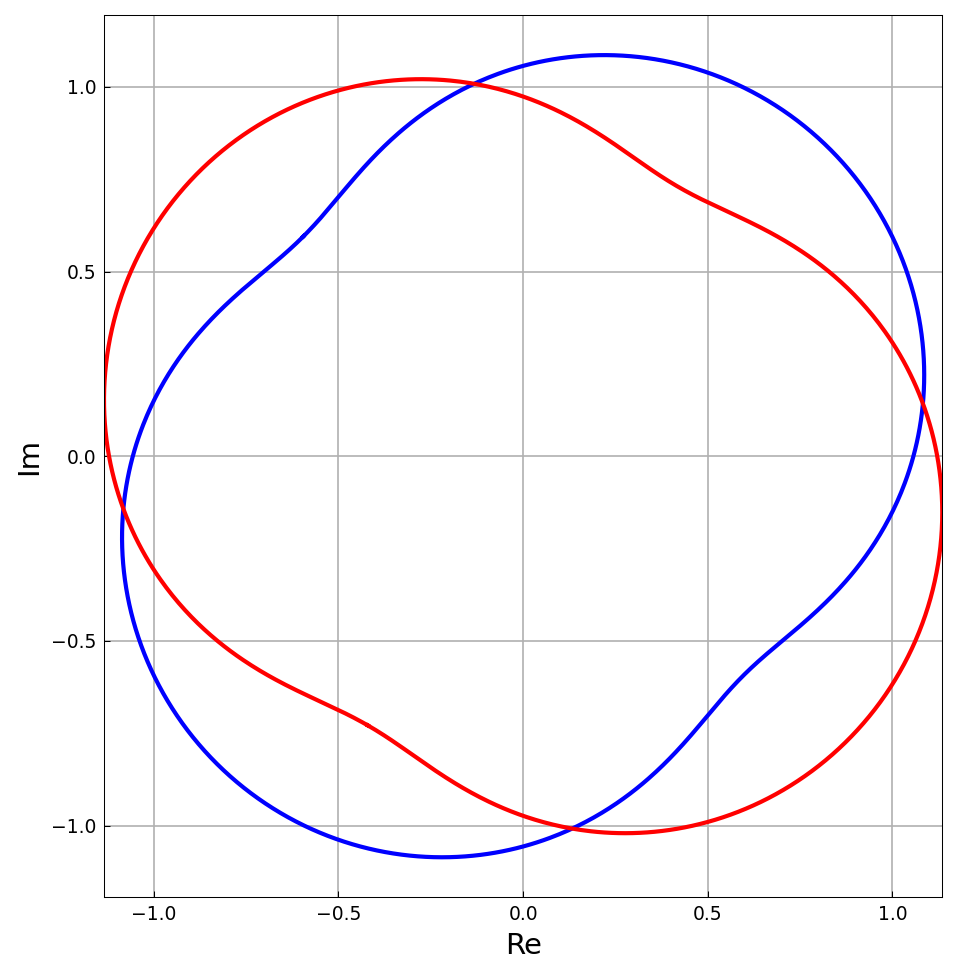
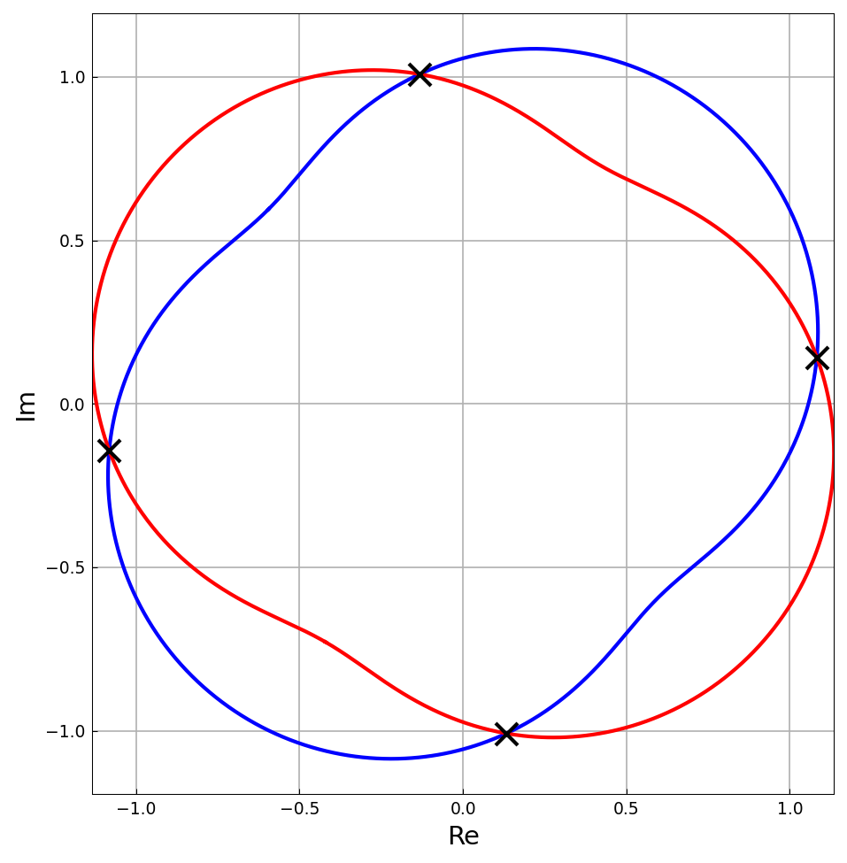

# Computing common roots of two bivariate functions

*Yuji Nakatsukasa, Vanni Noferini, and Alex Townsend, February 2013*

[Original MATLAB Chebfun example](https://www.chebfun.org/examples/roots/BivariateRoots.html)

(Chebfun example roots/BivariateRoots.m)

Given bivariate polynomials $f(x,y)$ and $g(x,y)$, their common roots
can be found by regarding them as univariate polynomials in $x$ with
coefficients depending on $y$, forming the (generalized Chebyshev)
Bezout matrix $A(y)$, and finding the values $y_*$ where $A(y_*)$ is
singular.  This polynomial eigenvalue problem is linearized with the
DLP (Lancaster-type) construction and solved as one generalized
eigenvalue problem.

Here we intersect the two parametrized curves
$c_1(x) = \sin(e^{i\pi x})e^{-i\pi/4}$ and
$c_2(y) = \sin(e^{i\pi y})e^{i\pi/3}$, i.e. solve
$f = u_1(x)-u_2(y) = 0$, $g = v_1(x)-v_2(y) = 0$ with $n = 25$
Chebyshev coefficients per curve component:



The generalized eigenvalue problem delivers the four intersection
points:



```text
errors =
   3.490937e-06
   1.458591e-05
   1.458604e-05
   4.443463e-05
```

The errors (distance between the two curve evaluations at the
computed parameters) match the published MATLAB values
$[0.0349, 0.1459, 0.4444, 0.1459]\times 10^{-4}$ — they reflect the
$n = 25$ truncation of the curves, not the eigenvalue solve.

## References

1. R. M. Corless, P. M. Gianni, and B. M. Trager, A reordered Schur
   factorization method for zero-dimensional polynomial systems with
   multiple roots, ISSAC 1997.
2. Y. Nakatsukasa, V. Noferini, and A. Townsend, Computing the common
   zeros of two bivariate functions via Bezout resultants, 2013.

---

*Replicated with [chebfunjax](https://github.com/ma-gilles/chebfunjax); original
example copyright The University of Oxford and The Chebfun Developers.*
