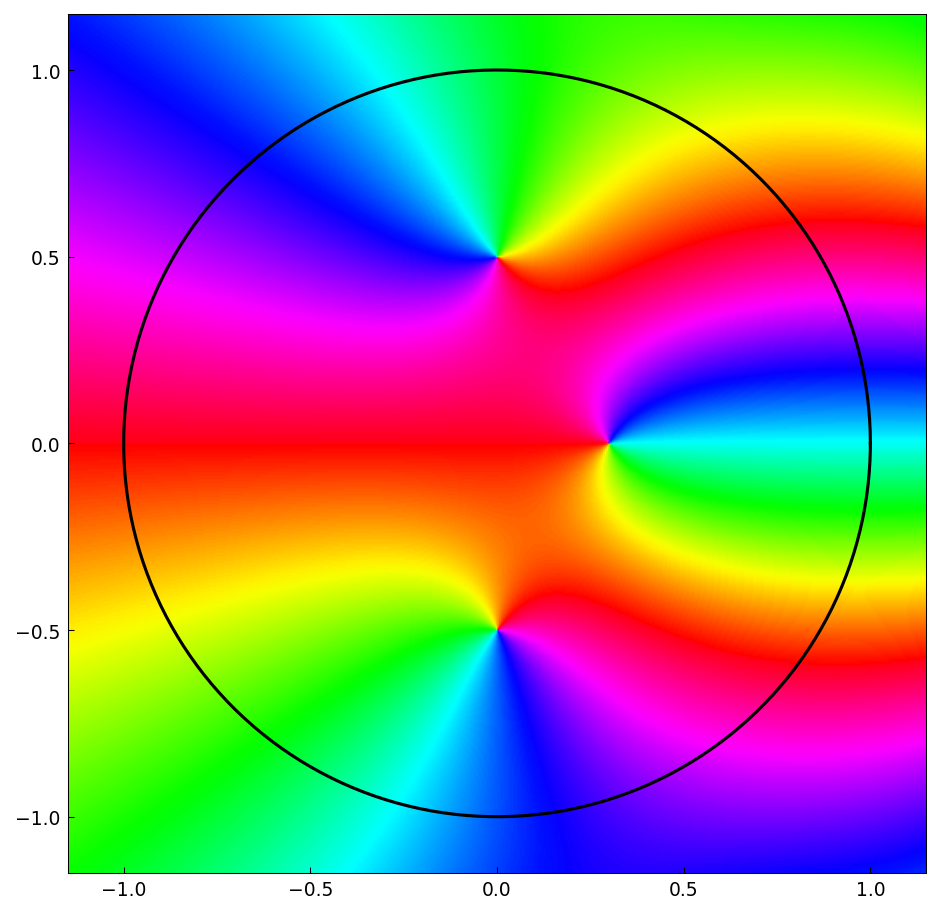
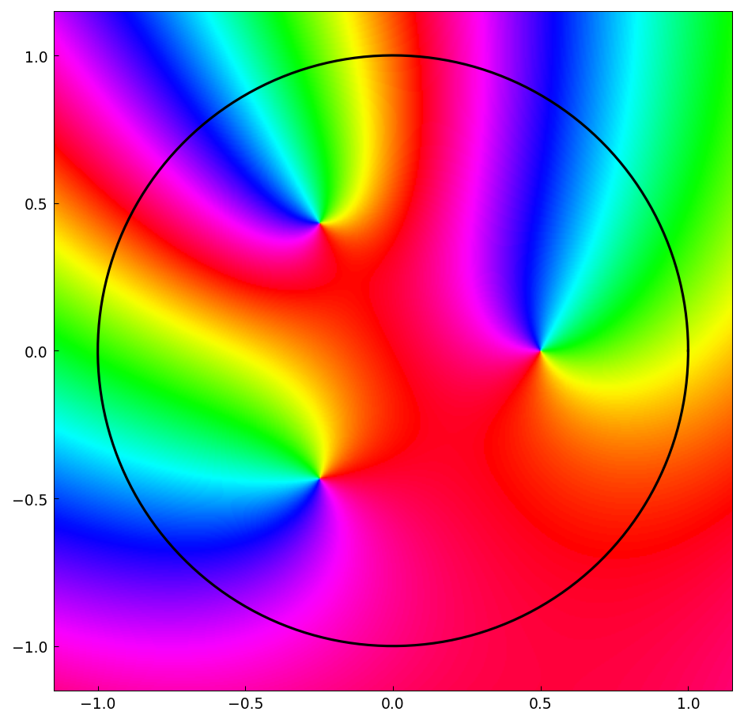

# Computing complex roots with contour integrals

*Nick Trefethen, December 2011*

[Original MATLAB Chebfun example](https://www.chebfun.org/examples/roots/ComplexRoots.html)

(Chebfun example roots/ComplexRoots.m)

If $f$ is analytic in and near the unit disk, the number of its roots
inside the disk and their locations can be computed from contour
integrals over the unit circle, following Delves and Lyness (1967):

$$ s_k = \frac{1}{2\pi i}\oint z^k \frac{f'(z)}{f(z)}\,dz. $$

With `z = chebfun(exp(1i*pi*t))`, these integrals are one-liners.
For $f(z) = (z - 0.5i)e^z$ the first moment recovers the root:

```text
s1 =
 -0.000000000000000 + 0.499999999999999i
```

For $f(z) = \cosh(\pi z)$, which has roots $\pm 0.5i$:

```text
s0 =
  2.000000000000000 - 0.000000000000000i
s1 =
      6.445011620003604e-16 + 2.580114553362148e-16i
s2 =
 -0.500000000000000 - 0.000000000000000i
ans =
 0.000000000000000 + 0.500000000000000i
 0.000000000000000 - 0.500000000000000i
```

Packaging the idea as a `roots3` function that constructs the cubic
whose roots are the three roots inside the disk, applied to
$f(z) = \cosh(e^z)(z-0.3)(1+4z^2)$:

```text
ans =
 -0.000000000000001 + 0.500000000000000i
 -0.000000000000000 - 0.500000000000001i
 0.300000000000002 + 0.000000000000001i
```



And to $f(z) = (z^3 - 1/8)e^{(-1-2i)z}$, whose roots are the cube
roots of $1/8$:

```text
ans =
 -0.250000000000004 + 0.433012701892219i
 -0.249999999999999 - 0.433012701892220i
 0.499999999999999 + 0.000000000000004i
```



(All values match the published MATLAB outputs to 14-15 digits.)

---

*Replicated with [chebfunjax](https://github.com/ma-gilles/chebfunjax); original
example copyright The University of Oxford and The Chebfun Developers.*
