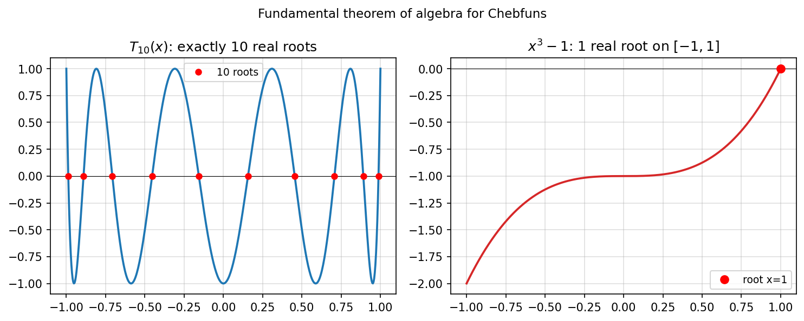

# Does a Chebfun of degree n have n roots?

**Alex Townsend, October 2013**

---

The **Fundamental Theorem of Algebra** states that a polynomial of degree $n$
has exactly $n$ roots in $\mathbb{C}$ (counting multiplicity).

The chebfunjax `roots()` method uses the *colleague matrix* — the Chebyshev
analogue of the companion matrix — whose $n$ eigenvalues are exactly the
$n$ roots of the polynomial in the complex plane.

## Real roots on [-1, 1]

For the Chebyshev polynomial $T_n$, all $n$ roots are **real** and lie in
$(-1, 1)$:

$$
T_n\!\left(\cos\frac{(2k-1)\pi}{2n}\right) = 0, \quad k = 1, \ldots, n.
$$

```python
import jax.numpy as jnp
import chebfunjax as cj

for n in [5, 10, 20]:
    coeffs = jnp.zeros(n+1).at[n].set(1.0)   # T_n = e_n in Chebyshev basis
    f = cj.Chebfun.from_coeffs(coeffs)
    r = f.roots()
    print(f"T_{n}: {len(r)} roots found")   # should print n
```

## x^n - 1 on [-1, 1]

For $x^n - 1$, the only real root(s) in $[-1, 1]$ are $x = 1$ (always)
and $x = -1$ (if $n$ is even):

```python
for n in [3, 4, 8]:
    f = cj.chebfun(lambda x, _n=n: x**_n - 1.0)
    r = f.roots()
    print(f"n={n}: roots =", r)
```

```
n=3: roots = [1.]
n=4: roots = [-1.  1.]
n=8: roots = [-1.  1.]
```

## Gallery



*Left*: $T_{10}$ with all 10 real roots marked.
*Right*: $x^3 - 1$ with its single real root $x = 1$.

## Reference

Townsend, A. (2013). Chebfun example roots/FundamentalTheoremOfAlgebra.m.
[chebfun.org](https://www.chebfun.org/)
