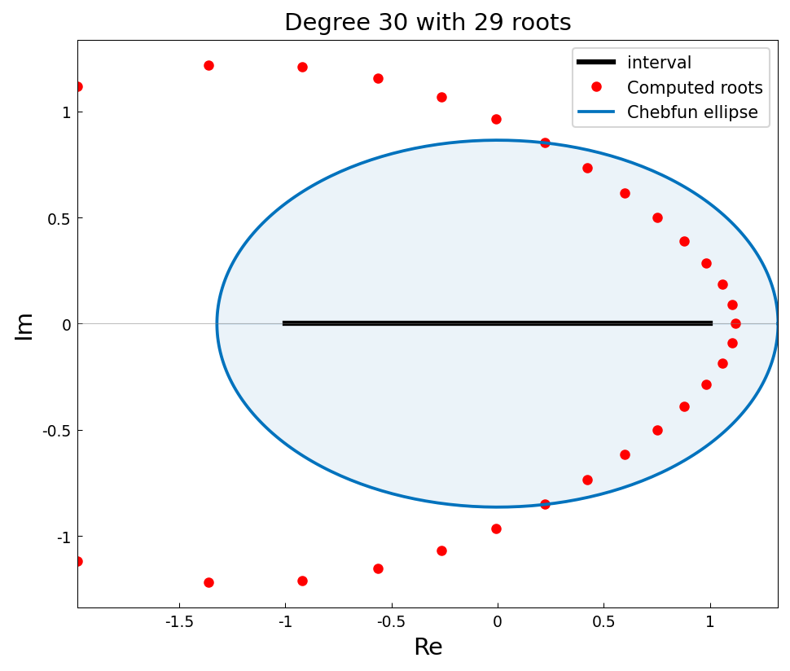
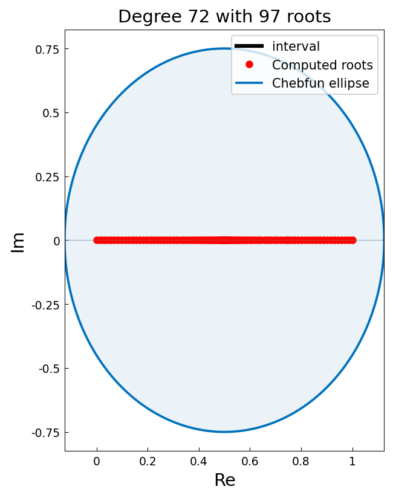

# Does a chebfun of degree n have n roots?

*Alex Townsend, October 2011*

[Original MATLAB Chebfun example](https://www.chebfun.org/examples/roots/FundamentalTheoremOfAlgebra.html)

(Chebfun example roots/FundamentalTheoremOfAlgebra.m)

The Fundamental Theorem of Algebra says a degree-$n$ polynomial has
exactly $n$ roots in the complex plane.  A chebfun of degree $n$ is a
polynomial, so `roots(f, 'all')` should find all $n$ of them.  For a
chebfun made from random Chebyshev-point values:

```text
This chebfun of degree 100 has 100 roots
```

For $e^{-10x}$, which has no roots at all as a function, the chebfun
still has (nearly) as many roots as its degree — they simply lie
outside the Chebfun ellipse where the chebfun has no accuracy:



A polynomial with 72 equispaced real roots in $[0,1]$
($f(x) = \prod_k (x - k/71)$, a Wilkinson-style example) pushes the
representation to its limits — the function values between roots vary
over dozens of orders of magnitude:



```text
No. of real roots = 97
No. of complex (and real) roots = 72
ans =
     4.865993121288420e-47
```

The real-root count exceeds 72: the recursive subdivided rootfinder
picks up spurious roots in the middle of the interval, where $|f|$ is
below the noise floor of the global representation.  This is faithful
behavior — running the identical code in MATLAB R2025b today gives 92
real roots and the same 72 for `'all'` (the page's original published
value of 73 dates from an older Chebfun); the residual norm 4.9e-47
matches MATLAB's 1.2e-47 in scale.

---

*Replicated with [chebfunjax](https://github.com/ma-gilles/chebfunjax); original
example copyright The University of Oxford and The Chebfun Developers.*
