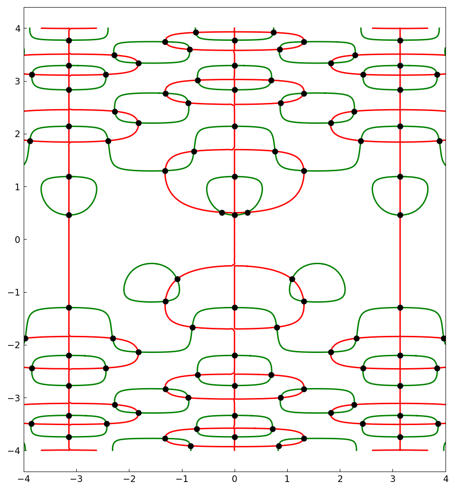
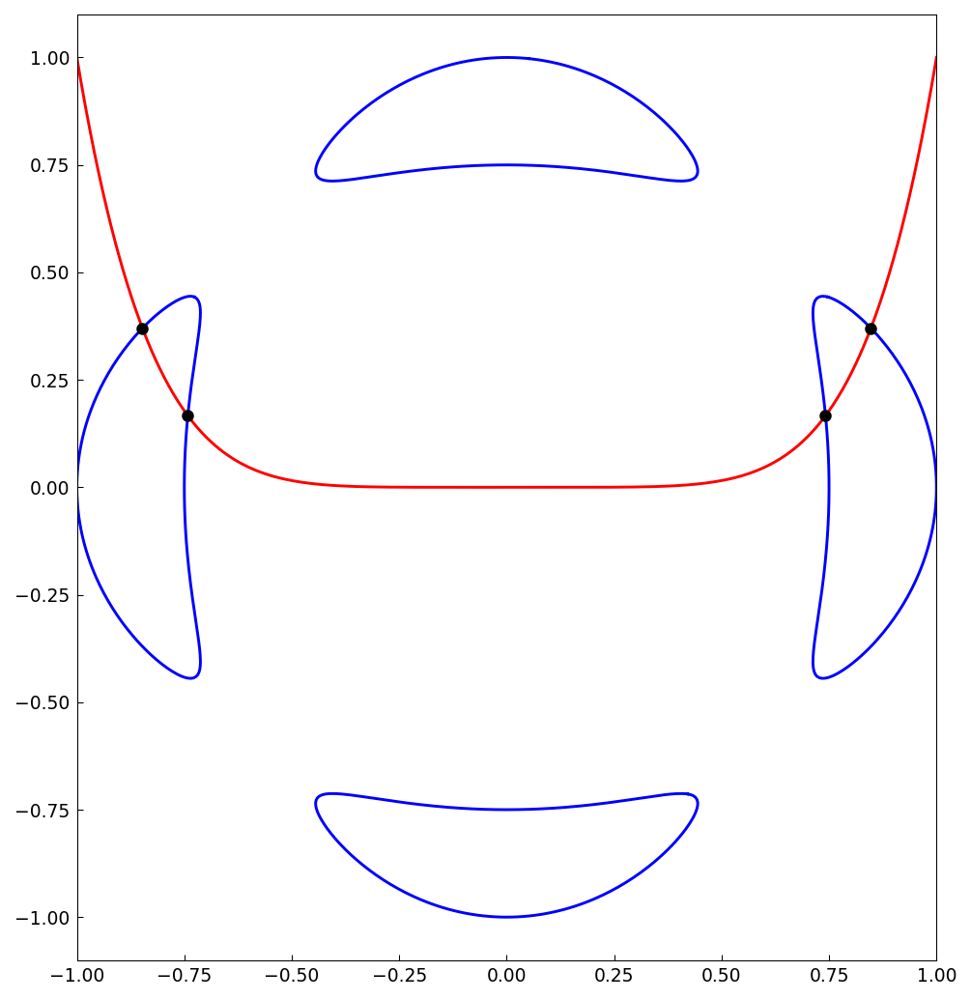
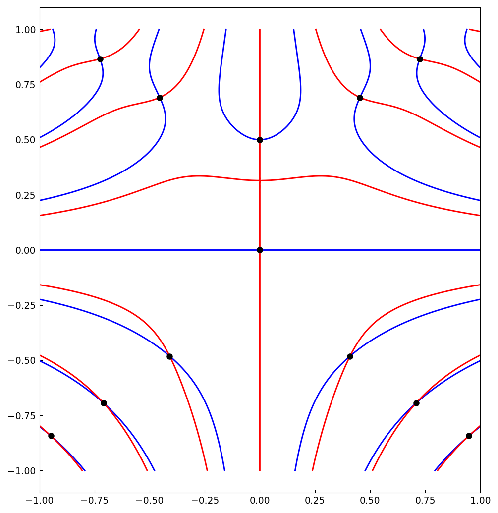

# Marching squares for bivariate rootfinding

*Alex Townsend, August 2013*

[Original MATLAB Chebfun example](https://www.chebfun.org/examples/roots/MarchingSquares.html)

(Chebfun example roots/MarchingSquares.m)

The zero curves of two chebfun2 objects generically intersect in
isolated points, which `roots` locates by tracing the curves with
marching squares and polishing with Newton's method.  A wavy example
on $[-4,4]^2$:

The blue quartic below is the Trott curve, an example from algebraic
geometry with the maximal number (28) of real bitangents; intersecting
it with $y = x^6$:

Critical points of a function $f$ are the common zeros of
$f_x$ and $f_y$ — here for
$f(x,y) = (x^2 - y^3 + 1/8)\sin(10xy)$:

---

*Replicated with [chebfunjax](https://github.com/ma-gilles/chebfunjax); original
example copyright The University of Oxford and The Chebfun Developers.*
