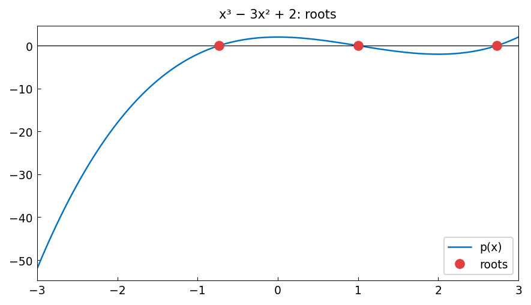

# Newton's method

**Kuan Xu, October 2012**

[Original MATLAB Chebfun example](https://www.chebfun.org/examples/roots/NewtonRaphson.html)

---

Newton's method is the most fundamental root-finding algorithm. Starting from
an initial guess $x^{(0)}$, it iterates

$$
x^{(k+1)} = x^{(k)} - \frac{f(x^{(k)})}{f'(x^{(k)})}
$$

converging quadratically to a simple root. Chebfun's `roots` command uses a
more robust polynomial colleague-matrix approach, but Newton's method can be
demonstrated elegantly as well.

## Example: $f(x) = x^3 - 3x^2 + 2$

```python
import jax.numpy as jnp
import chebfunjax as cj

f  = cj.chebfun(lambda x: x**3 - 3*x**2 + 2)
fp = f.diff()
r  = f.roots()
print("Roots:", r)   # three roots: 1 and 2 (with multiplicity) and -0.732...
```

## Manual Newton iteration

```python
x = 1.5   # initial guess
for k in range(10):
    fx  = float(f(x))
    fpx = float(fp(x))
    x  -= fx / fpx
    print(f"k={k}: x = {x:.15f}, f(x) = {float(f(x)):.2e}")
```

## Convergence comparison

For a simple root, Newton's method converges quadratically. Chebfun's
colleague-matrix approach finds all roots simultaneously — usually faster and
more robust for high-degree polynomials.

## Gallery



*Left*: $f(x)$ with all roots marked.
*Right*: Newton iterates converging to the largest root from $x_0 = 2.5$.
