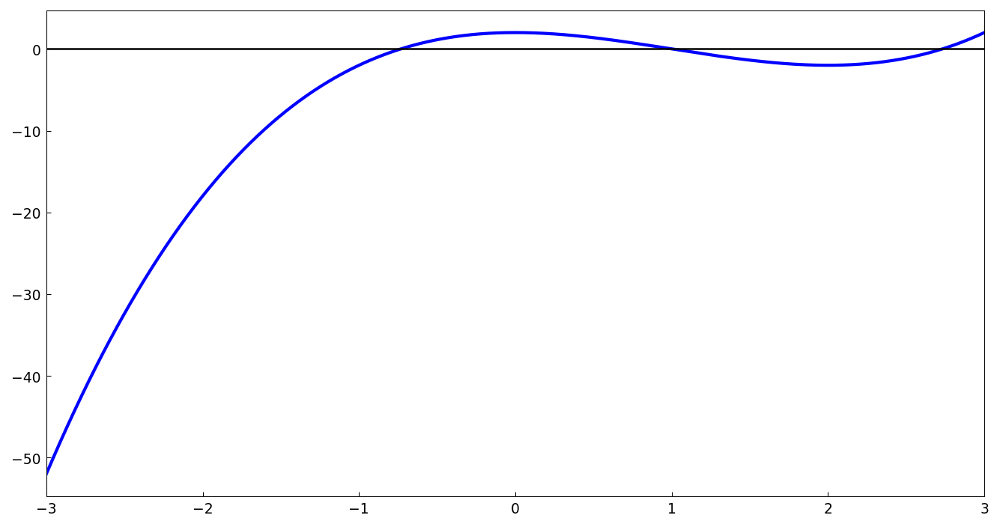
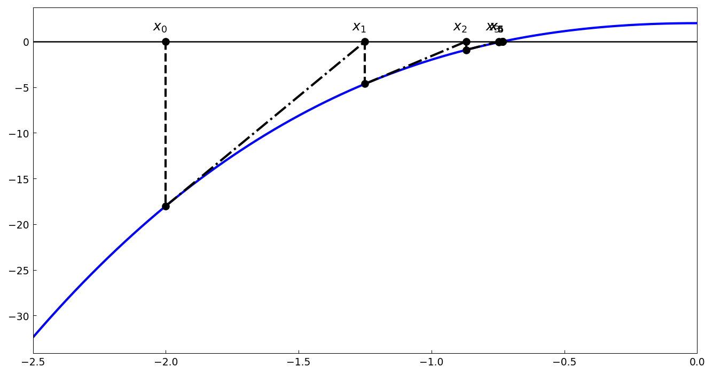

# Newton's method

*Kuan Xu, October 2012*

[Original MATLAB Chebfun example](https://www.chebfun.org/examples/roots/NewtonRaphson.html)

(Chebfun example roots/NewtonRaphson.m)

Newton's method, as the most fundamental root-finding algorithm,
uses the first two terms of the Taylor series of a function $f(x)$ in
the vicinity of a suspected root to find successively better
approximations:

$$ x^{(k+1)} = x^{(k)} - \frac{f(x^{(k)})}{f'(x^{(k)})}. $$

Let's consider $f(x) = x^3-3x^2+2$, which has several roots:



Here are the roots.

```text
ans =
  -0.732050807568877
  1.000000000000002
  2.732050807568879
```

If we try to locate the leftmost root by Newton's method starting
from $x_0 = -2$:



```text
root1 =
  -0.732050807568877
```

The solid black dots are the successive approximations, the circles
their projections on the curve, and the dash-dot lines the tangents.
The table shows quadratic convergence:

```text
iterations     Logarithm of the step size
    1                 0.23740079
    2                -0.65787813
    3                -1.98646163
    4                -4.28606060
    5                -8.73432460
    6               -17.61270703
    7               -35.12736266
```

For the middle root, starting from $x_0 = 0.5$:

```text
root2 =
   1.000000000000000
iterations     Logarithm of the step size
    1                -0.69314718
    2                -2.19722458
    3                -6.98471632
    4               -21.35961374
```

This time we are evidently achieving cubic convergence!  Is there
something wrong?  No, for it is to be expected if you notice that
$f''(1) = 0$ in this example.

---

*Replicated with [chebfunjax](https://github.com/ma-gilles/chebfunjax); original
example copyright The University of Oxford and The Chebfun Developers.*
