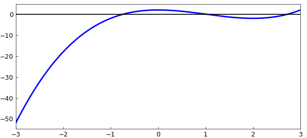

# Newton's method

*Kuan Xu, October 2012*

[Original MATLAB Chebfun example](https://www.chebfun.org/examples/roots/NewtonRaphson.html)

Python translation: [`examples/roots/newton_raphson.py`](https://github.com/ma-gilles/chebfunjax/blob/main/examples/roots/newton_raphson.py)

Newton's method, as the most fundamental root-finding algorithm, usually appears no later than Chapter 2 in most numerical analysis textbooks. It uses the first two terms of the Taylor series of a function $f(x)$ in the vicinity of a suspected root to find successively better approximations to the root, using the formula $$ x^{(k+1)} = x^{(k)} - \frac{f(x^{(k)})}{f'(x^{(k)})}. $$

Let's consider $f(x) = x^3-3x^2+2$, which has several roots, as we see in the next plot.

```matlab
LW = 'linewidth'; lw = 2;
MS = 'MarkerSize'; ms = 18;
dom = [-3 3];
f = chebfun('x.^3-3*x.^2+2', dom);
plot(f, LW, lw), hold on
plot(dom, [0 0], 'k'), hold off
```



Here are the roots.

```matlab
roots(f)
```

```text
ans =
  -0.732050807568877
  1.000000000000002
  2.732050807568879
```

If we try to locate the leftmost root by Newton's method, we need to pick an initial guess, for example $-3$.

```matlab
fprime = diff(f);
d = norm(f,inf);
tol = 1e-8;
xold = -2;
x = [];
i = 0;

plot(f, LW, lw), xlim([-2.5 0]), hold on
plot(dom, [0 0], 'k')
while(d > tol)
    x = [x xold];
    xnew = xold - f(xold)/fprime(xold);
    d = abs(xnew - xold);

    plot(xold, f(xold), 'ok')
    strx = ['x_{' num2str(i) '}'];
    text(xold - 0.05, 1.2, strx,'fontsize',12)
    plot(xold, 0, '.k', MS, ms)
    plot([xold xold], [0 f(xold)], '--k', LW, lw)
    plot([xold xnew], [f(xold) 0], '-.k', LW, lw)

    xold = xnew;
    i = i+1;
end
hold off
root1 = xnew
```

```text
root1 =
  -0.732050807568877
```


In the above plot, the solid black dots are the successive approximations of the root, while the circles are their projections on the curve, from which the Newton's method locates the next approximation along the tangent (black dash-dot lines). The following table tells us with no surprise that Newton's method is quadratically convergent.

```matlab
n = size(x,2);
res = abs(x - xnew);
LogRes = log(res);

disp('iterations     Logarithm of the step size')
for i = 1:n
    fprintf('%5d  %25.8f\n', i, LogRes(i))
end
```

```text
iterations     Logarithm of the step size
    1                 0.23740079
    2                -0.65787813
    3                -1.98646163
    4                -4.28606060
    5                -8.73432460
    6               -17.61270706
    7               -34.65735903
```

You may expect that the same order of convergence to appear when we approximate the middle root in this example.

```matlab
d = norm(f,inf);
xold = 0.5;
x = [];
while(d > tol)
    x = [x xold];
    xnew = xold - f(xold)/fprime(xold);
    d = abs(xnew - xold);
    xold = xnew;
end
hold off
root2 = xnew

n = size(x,2);
res = abs(x - xnew);
LogRes = log(res);

disp('iterations     Logarithm of the step size')
for i = 1:n
    fprintf('%5d  %25.8f\n', i, LogRes(i))
end
```

```text
root2 =
   1.000000000000000
iterations     Logarithm of the step size
    1                -0.69314718
    2                -2.19722458
    3                -6.98471632
    4               -21.35961248
```

But now, this time we are evidently achieving cubic convergence! Is there something wrong? No, for it is to be expected if you notice that $f''(1) = 0$ in this example.

---

*Translated with [chebfunjax](https://github.com/ma-gilles/chebfunjax); prose and MATLAB code from the original example, copyright The University of Oxford and The Chebfun Developers.  Printed outputs and figures are chebfunjax's.*
