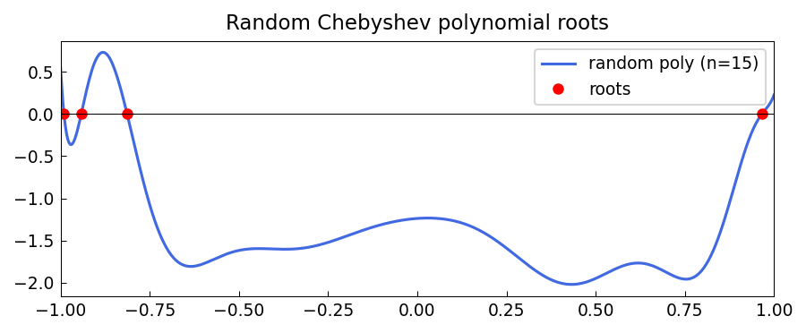

# Roots of random polynomials

**Nick Trefethen, November 2011**

[Original MATLAB Chebfun example](https://www.chebfun.org/examples/roots/RandomPolynomials.html)

---

If $p(z) = a_0 + a_1 z + \cdots + a_{n-1} z^{n-1} + z^n$ is a monic
polynomial with independent standard-normal coefficients $a_0, \ldots,
a_{n-1}$, then its roots tend to cluster near the unit circle in the complex
plane. This remarkable fact was proved by Hammersley (1956) and Shparo and
Shur (1962).

## Monomial roots near the unit circle

```python
import numpy as np
import matplotlib.pyplot as plt

rng = np.random.default_rng(42)
for n in [50, 200]:
    coeffs = rng.standard_normal(n)
    coeffs = np.append(coeffs, 1.0)     # monic: leading coeff = 1
    r = np.roots(coeffs[::-1])          # numpy roots
    theta = np.linspace(0, 2*np.pi, 300)
    # plot roots vs unit circle
```

## Chebyshev roots in the complex plane

Random polynomials expressed in the Chebyshev basis have roots that cluster
near $[-1, 1]$ — the Chebyshev ellipse acts as the analogue of the unit circle:

```python
import jax.numpy as jnp
import chebfunjax as cj

rng2  = np.random.default_rng(0)
n     = 80
coeffs = rng2.standard_normal(n + 1) * (0.95 ** np.arange(n + 1))
f      = cj.Chebfun.from_coeffs(jnp.array(coeffs))
r_real = f.roots()          # real roots in [-1, 1]
print(f"Real roots of random degree-{n} Chebyshev polynomial: {len(r_real)}")
```

## Gallery



Roots of random monomial polynomials (degrees 50 and 200) in the complex plane,
clustering near the unit circle.
