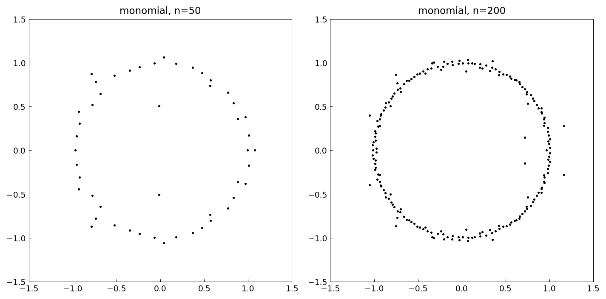
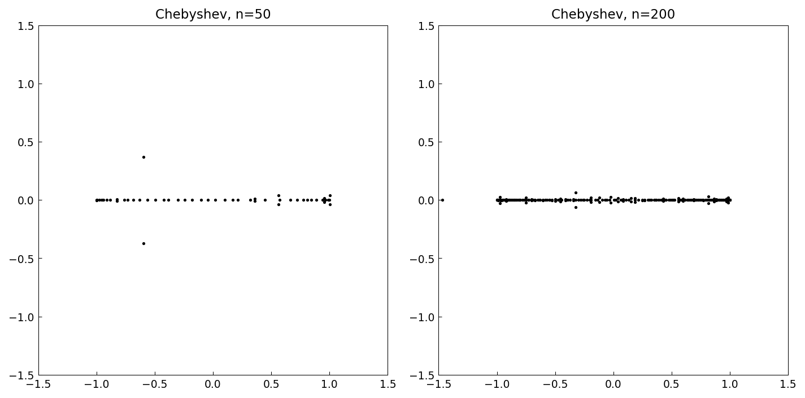
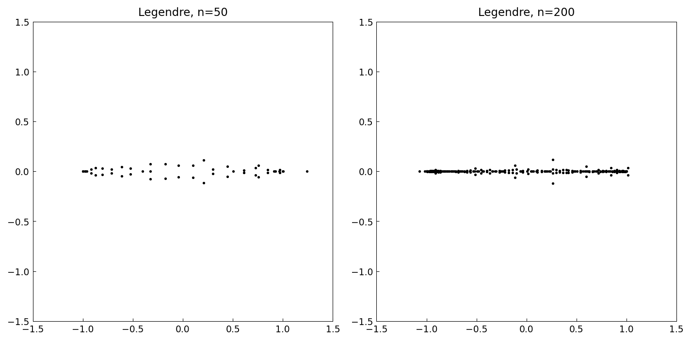

# Roots of random polynomials

*Nick Trefethen, March 2016*

[Original MATLAB Chebfun example](https://www.chebfun.org/examples/roots/RandomPolynomials.html)

(Chebfun example roots/RandomPolynomials.m)

Where are the roots of a degree-$n$ polynomial with random
coefficients?  The answer depends on the basis.  With independent
standard-normal coefficients in the *monomial* basis, the roots
cluster on the unit circle:

In the *Chebyshev* basis, the roots cluster on the interval $[-1,1]$
together with a surrounding circle:

The *Legendre* basis gives essentially the same picture:

(The `randn` draws are not bit-reproducible between MATLAB and
numpy, so the pictures are statistically, not pointwise, identical.)

---

*Replicated with [chebfunjax](https://github.com/ma-gilles/chebfunjax); original
example copyright The University of Oxford and The Chebfun Developers.*
