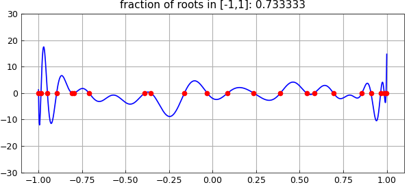
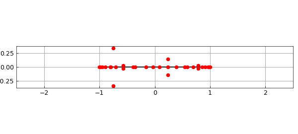

# Roots of random polynomials on an interval

*Nick Trefethen, June 2014*

[Original MATLAB Chebfun example](https://www.chebfun.org/examples/roots/RandomPolys.html)

Python translation: [`examples/roots/random_polys.py`](https://github.com/ma-gilles/chebfunjax/blob/main/examples/roots/random_polys.py)

Recently I heard a talk by Igor Pritsker of Oklahoma State University at which he discussed a theorem of Das in 1971 about the roots of random real polynomials [1,3]. This can be very nicely illustrated in Chebfun.

Das's result asserts that for a random polynomial on $[-1,1]$ with real coefficients, the fraction of roots that lie in $[-1,1]$ will be about $1/\sqrt 3 \approx 0.57735$. By a random polynomial on $[-1,1]$, we mean a linear combination of Legendre polynomials (normalized by 2-norm on $[-1,1]$) with random independent coefficients drawn from the standard normal distribution. For such polynomials, the fraction of roots in $[-1,1]$ approaches $1/\sqrt 3$ as $n\to\infty$ with probability 1.

Here for example is a random polynomial of degree 30:

```matlab
rng('default');
n = 30;
cleg = randn(n+1,1);                  % Legendre coeffs
ccheb = leg2cheb(cleg,'norm');        % Chebyshev coeffs
p = chebfun(ccheb,'coeffs');
plot(p), axis([-1.1 1.1 -n n]), grid on
rr = roots(p);
hold on, plot(rr,p(rr),'.r','markersize',12), hold off
ratio = length(rr)/n;
title(['fraction of roots in [-1,1]: ' num2str(ratio)])
```



Here are its roots in the complex plane, both real and complex:

```matlab
r = roots(p,'all');
plot([-1 1],[0 0],'k'), grid on
hold on, plot(r,'.r','markersize',12), hold off
xlim([-2.5 2.5]), axis equal
set(gca,'xtick',-2:2)
```



Now let's construct ten random polynomials of degree 1000 and print the fraction of roots in $[-1,1]$ for each:

```matlab
n = 1000;
data = [];
for k = 1:10
  cleg = randn(n+1,1);                % Legendre coeffs
  ccheb = leg2cheb(cleg,'norm');      % Chebyshev coeffs
  p = chebfun(ccheb,'coeffs');
  rr = roots(p);
  ratio = length(rr)/n;
  data = [data ratio];
  disp(['fraction of roots in [-1,1]: ' num2str(ratio)])
end
```

```text
fraction of roots in [-1,1]: 0.592
fraction of roots in [-1,1]: 0.557
fraction of roots in [-1,1]: 0.542
fraction of roots in [-1,1]: 0.566
fraction of roots in [-1,1]: 0.58
ans =
   0.570200000000000
```

The mean for the whole experiment is pretty close to $0.577$,

```matlab
mean(data)
```

```text

```

One could vary these experiments in all kinds of ways, for example defining random polynomials via Chebyshev or more generally Jacobi expansions or by interpolation of random data in Chebyshev or other points. Such more general problems have been treated recently in [2].

## References

1. M. Das, Real zeros of a random sum of orthogonal polynomials, *Proceedings of the American Mathematical Society*, 27 (1971), 147-153.
2. D. S. Lubinsky, I. E. Pritsker, and X. Xie, Expected numer of real zeros for random linear combinations of orthogonal polynomials, manuscript, 2014.
3. J. E. Wilkins, The expected value of the number of real zeros of a random sum of Legendre polynomials, *Proceedings of the American Mathematical Society*, 125 (1997), 1531-1536.

---

*Translated with [chebfunjax](https://github.com/ma-gilles/chebfunjax); prose and MATLAB code from the original example, copyright The University of Oxford and The Chebfun Developers.  Printed outputs and figures are chebfunjax's.*
