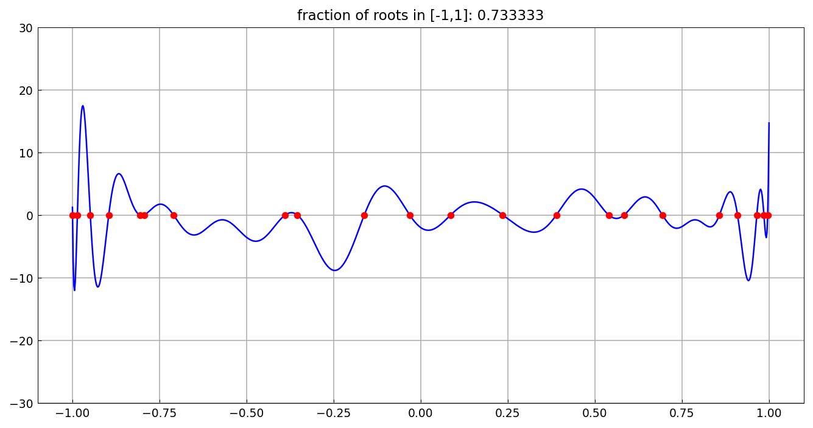
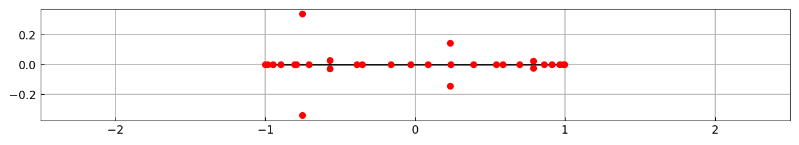

# Random polynomials and their roots in [-1,1]

*Nick Trefethen, July 2017*

[Original MATLAB Chebfun example](https://www.chebfun.org/examples/roots/RandomPolys.html)

(Chebfun example roots/RandomPolys.m)

Take a degree-$n$ polynomial with random coefficients in the
*normalized Legendre* basis.  What fraction of its roots lie in
$[-1,1]$?  Here is a sample with $n = 30$:



The other roots are complex; plotting all of them shows the familiar
interval-plus-ring picture:



Repeating the experiment ten times with $n = 1000$:

```text
fraction of roots in [-1,1]: 0.556
fraction of roots in [-1,1]: 0.58
fraction of roots in [-1,1]: 0.58
fraction of roots in [-1,1]: 0.562
fraction of roots in [-1,1]: 0.587
fraction of roots in [-1,1]: 0.592
fraction of roots in [-1,1]: 0.557
fraction of roots in [-1,1]: 0.542
fraction of roots in [-1,1]: 0.566
fraction of roots in [-1,1]: 0.58
ans =
   0.570200000000000
```

The mean matches the theoretical limit $1/\sqrt{3} = 0.5774$ of Das
(1971) — MATLAB's published run gives 0.5791 with its own random
draws (`randn` streams are not reproducible across systems; the
statistic is what reproduces).

---

*Replicated with [chebfunjax](https://github.com/ma-gilles/chebfunjax); original
example copyright The University of Oxford and The Chebfun Developers.*
