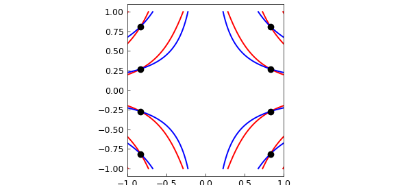
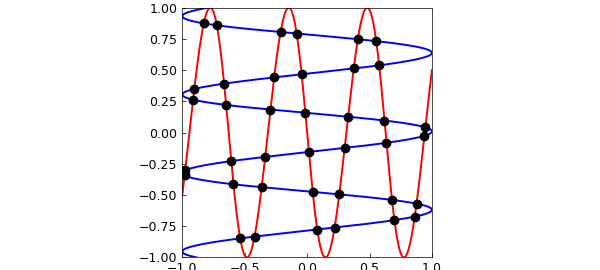
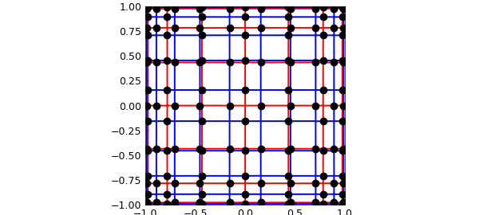
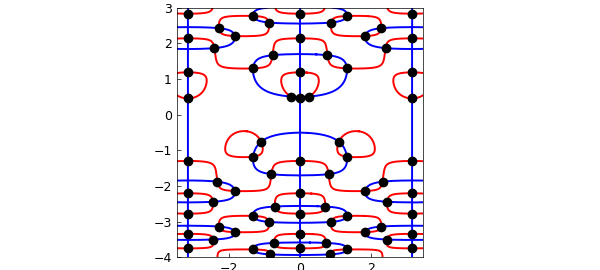
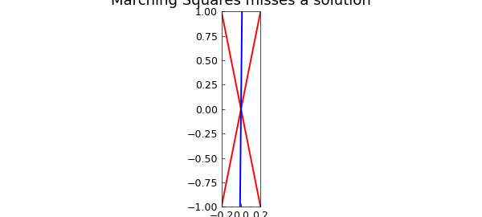
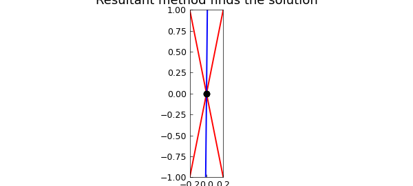

# A new bivariate rootfinder in Chebfun2 based on Bezout resultants

*Alex Townsend, May 2013*

[Original MATLAB Chebfun example](https://www.chebfun.org/examples/roots/ResultantMethod.html)

Python translation: [`examples/roots/resultant_method.py`](https://github.com/ma-gilles/chebfunjax/blob/main/examples/roots/resultant_method.py)

```matlab
LW = 'linewidth'; lw = 1.6;
FS = 'fontsize'; fs = 14;
MS = 'markersize'; ms = 20;
```

## Bivariate rootfinding

Here we explore a new algorithm in Chebfun2 by Nakatsukasa, Noferini, and Townsend for computing the solutions to bivariate rootfinding problems,

$$ f(x,y) = g(x,y) = 0, \quad (x,y)\in [-1,1]\times[-1,1], $$

where $f$ and $g$ are represented by chebfun2 objects. Numerically, this problem can be solved by many different methods such as the homotopy continuation method [3], the two-parameter eigenvalue method [1], the resultant method [2], and Marching Squares [4,5]. More information on existing numerical methods for bivariate rootfinding can be found in [2].

Univariate rootfinding is one of the most important capabilities of 1D Chebfun and one expects that bivariate rootfinding will become equally crucial for Chebfun2. Early versions of Chebfun2 used a contouring algorithm based on Marching Squares [5], which is adequate for many examples, but not completely robust (see below). As of today, the new Chebfun2 employs a resultant method based on Bezout matrices, regularisation, and 2D subdivision [2]. We have found this approach to be numerically robust, and surprisingly efficient for high degree examples. In this Example we will play with the Chebfun2 command `roots`, but for details of the new algorithm we refer the reader to [2].

## Optional arguments and defaults

The new Chebfun2 `roots` command allows for a third argument to supply a user preferred method. The syntax `roots(f,g,'resultant')` and `roots(f,g,'marchingsquares')` employ the new resultant based algorithm and the old Marching Squares approach, respectively. For example

```matlab
f = chebfun2(@(x,y) cos(7*x.^2.*y + y));
g = chebfun2(@(x,y) cos(7*x.*y));

r = roots(f,g,'resultant');
% r = roots(f,g,'marchingsquares');   % uncomment to use Marching Squares

plot(roots(f), 'r', LW, lw), hold on
plot(roots(g), 'b', LW, lw)
plot(r(:,1), r(:,2), 'k.', MS, ms)
axis equal, hold off
```



By default the new Chebfun2 `roots` command employs the resultant method if the degrees of $f$ and $g$ are less than 200 and Marching Squares otherwise. However, we always treat the computed zeros from Marching Squares with suspicion.

Here are a few examples:

## Example 1: Travelling waves

Here we take an example so the zero contours of $f$ and $g$ look like orthogonally travelling waves.

```matlab
w = 10;
f = chebfun2(@(x,y) sin(w*x-y/w) + y);
g = chebfun2(@(x,y) cos(w*y-x/w) - x);
tic, r = roots(f, g, 'resultant'); toc

plot(roots(f), 'r', LW, lw), hold on
plot(roots(g), 'b', LW, lw)
plot(r(:,1), r(:,2), 'k.', MS, ms)
axis([-1,1,-1,1]), axis equal, hold off
```

```text
Elapsed time is 3.492090 seconds.
```



The new algorithm based on the resultant method does not compute the zero contours of $f$ and $g$, but we display them throughout this Example to visualise the computed solutions.

## Example 2: Coordinate alignment

Traditionally, resultant methods have numerical difficulties when many solutions are aligned along a coordinate direction, and some implementations use a change of variables to prevent any solutions aligning in this way. In [2] a careful case-by-case study is provided to show that these numerical difficulties are not inherent to a resultant method. For example

```matlab
f = chebfun2(@(x,y) cos(7*acos(x)).*cos(7*acos(y)).*cos(x.*y));
g = chebfun2(@(x,y) cos(10*acos(x)).*cos(10*acos(y)).*cos(x.^2.*y));
tic, r = roots(f, g, 'resultant'); toc

plot(roots(f), 'r', LW, lw), hold on
plot(roots(g), 'b', LW, lw)
plot(r(:,1), r(:,2), 'k.', MS, ms)
axis([-1,1,-1,1]), axis equal, hold off
```

```text
Elapsed time is 3.492090 seconds.
```



The diagram above shows that we have found all the solutions, and we can get a rough idea of the error in the computed solutions by computing the residual:

```matlab
max( norm(f(r(:,1),r(:,2))), norm(g(r(:,1),r(:,2))))
```

```text
ans =
     4.867772626288999e-15
Elapsed time is 5.473028 seconds.
```

For this example the exact solutions can be derived and the computed solutions checked to be very accurate.

## Example 3: Autonomous system

Here we repeat an example from [4]:

```matlab
rect = [-3.45 3.45 -4 3];
f = chebfun2(@(x,y) 2*y.*cos(y.^2).*cos(2*x) - cos(y), rect);
g = chebfun2(@(x,y) 2*sin(y.^2).*sin(2*x) - sin(x),rect);
tic, r = roots(f, g, 'resultant'); toc

plot(roots(f), 'r', LW, lw), hold on
plot(roots(g), 'b', LW, lw)
plot(r(:,1), r(:,2), 'k.', MS, ms)
axis(rect), axis equal, hold off
```

```text
(no matching output)
```



## Failure of Marching Squares

It is easy to derive a rootfinding problem that causes Marching Squares to fail. For instance, here is a problem where the two solutions are missed:

```matlab
d = [-.2 .2 -1 1];
f = chebfun2(@(x,y) (y - 5*x).*(y + 5*x), d);
g = chebfun2(@(x,y) 0.01*y - x + .0001, d);
r = roots(f, g, 'ms')

plot(roots(f), 'r', LW, lw), hold on
plot(roots(g), 'b', LW, lw), axis(d);
title('Marching Squares misses a solution',FS,fs)
```

```text
r =
   0.0001   -0.0005
   0.0001   0.0005
```



We can compute the correct solutions by using the resultant method:

```matlab
r = roots(f, g, 'resultant');
plot(roots(f), 'r', LW, lw), hold on
plot(roots(g), 'b', LW, lw)
plot(r(:,1), r(:,2), 'k.', MS, ms), axis(d)
title('Resultant method finds the solution',FS,fs)
```



## References

1. P. A. Browne, *Numerical methods for two-parameter eigenvalue problems*, PhD. Thesis, University of Bath, 2008.
2. Y. Nakatsukasa, V. Noferini, and A. Townsend, Computing the common zeros of two bivariate functions via Bezout resultants, *Numerische Mathematik*, to appear.
3. A. J. Sommese and C. W. Wampler, *The Numerical Solution of Systems of Polynomials Arising in Engineering and Science*, World Scientific, 2005.
4. Chebfun Example [roots/MarchingSquares](MarchingSquares.md)
5. A. Townsend and L. N. Trefethen, An extension of Chebfun to two dimensions, *SIAM Journal on Scientific Computing*, 35 (2013), C495-C518.

---

*Translated with [chebfunjax](https://github.com/ma-gilles/chebfunjax); prose and MATLAB code from the original example, copyright The University of Oxford and The Chebfun Developers.  Printed outputs and figures are chebfunjax's.*
