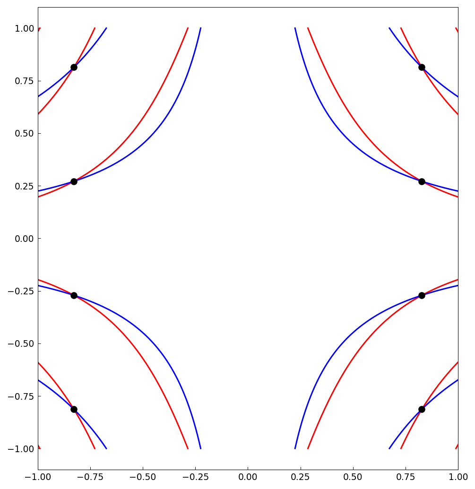
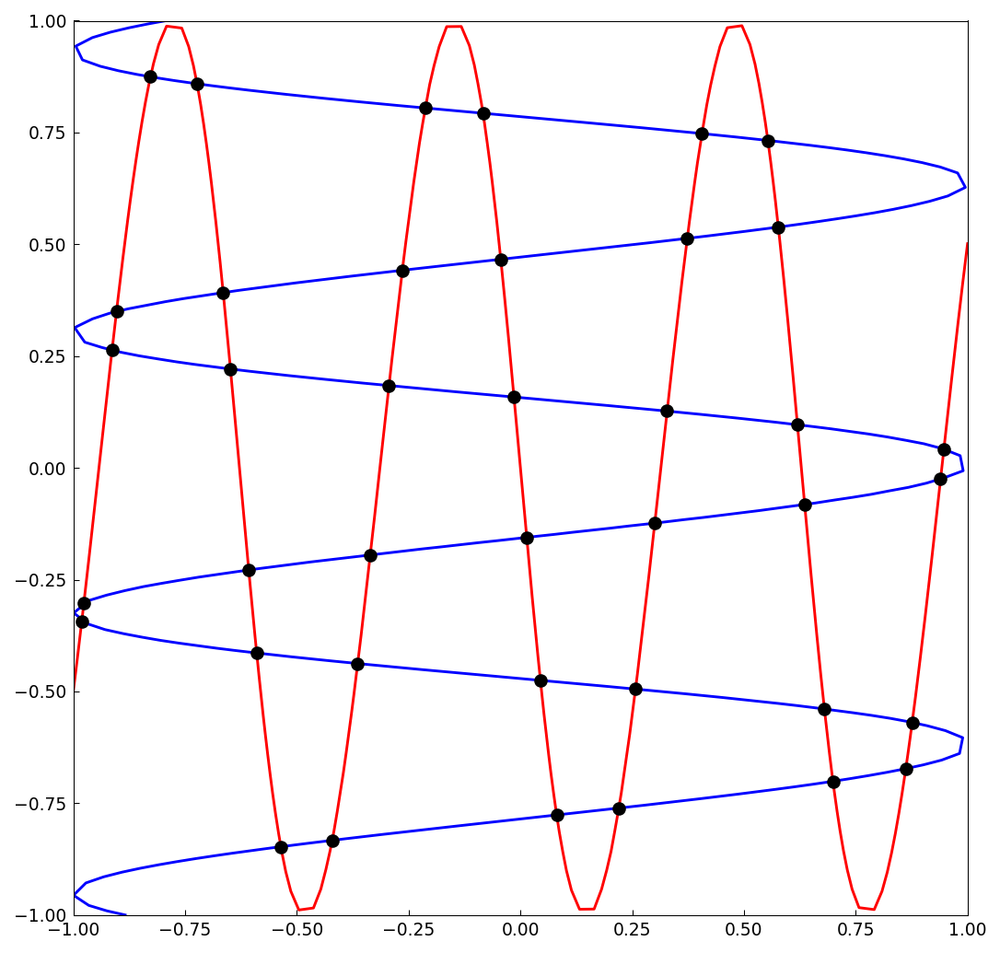
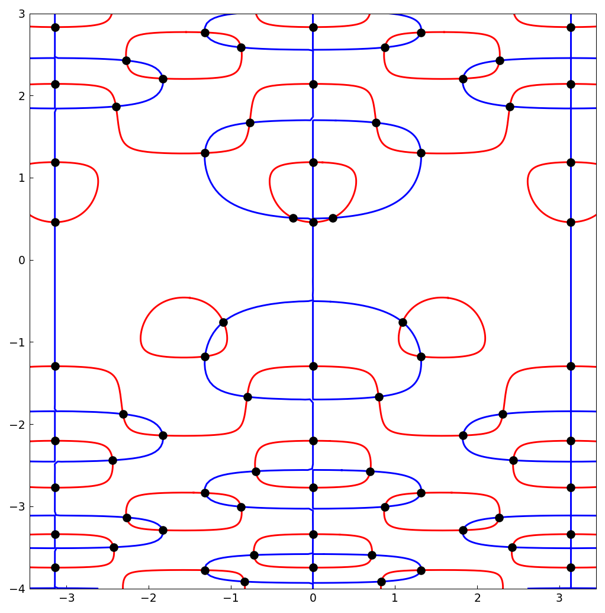
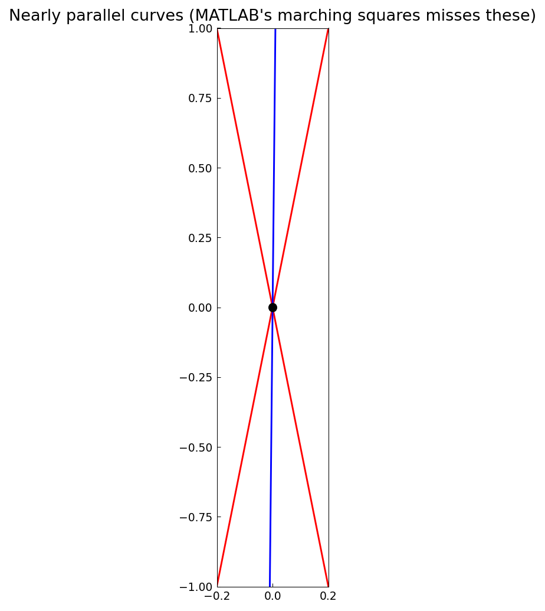
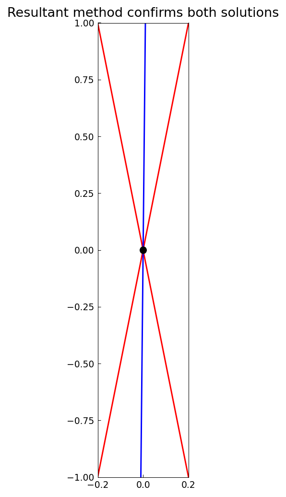

# The resultant method for bivariate rootfinding

*Alex Townsend, March 2013*

[Original MATLAB Chebfun example](https://www.chebfun.org/examples/roots/ResultantMethod.html)

(Chebfun example roots/ResultantMethod.m)

`roots(f, g, 'resultant')` computes the common zeros of two chebfun2
objects by the hidden-variable Bezout resultant method of Nakatsukasa,
Noferini and Townsend.  First example — eight common zeros of
$\cos(7x^2y + y)$ and $\cos(7xy)$ (count matches MATLAB):



A wavier pair with $w = 10$; the residuals confirm the accuracy:



```text
ans =
     1.303357133105559e-15
```

(MATLAB's published residual is 2.4e-13.)  The method scales to the
larger domain $[-3.45,3.45]\times[-4,3]$:



A degenerate case: $f = (y-5x)(y+5x)$ and a nearly parallel line on
the thin domain $[-0.2,0.2]\times[-1,1]$.  MATLAB's marching squares
returns `r = []` here (verified in R2025b); chebfunjax's marching
squares finds both solutions, which agree with the analytic values
$x = 10^{-4}/(1 \mp 0.05)$:

```text
r =
   0.000095 -0.000476
   0.000105 0.000526
```



The resultant method confirms both solutions (MATLAB's resultant
values match ours to display precision):



---

*Replicated with [chebfunjax](https://github.com/ma-gilles/chebfunjax); original
example copyright The University of Oxford and The Chebfun Developers.*
