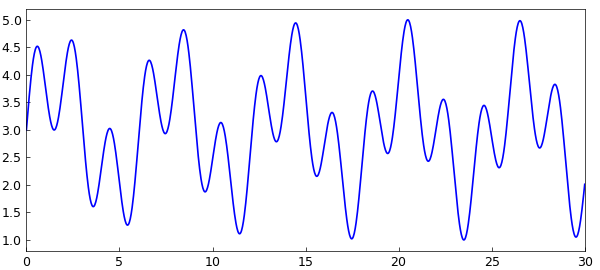
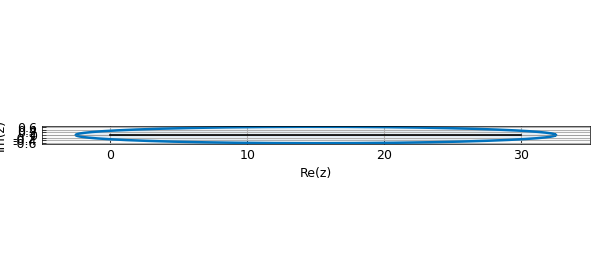
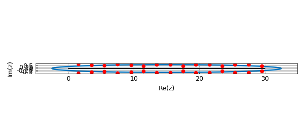
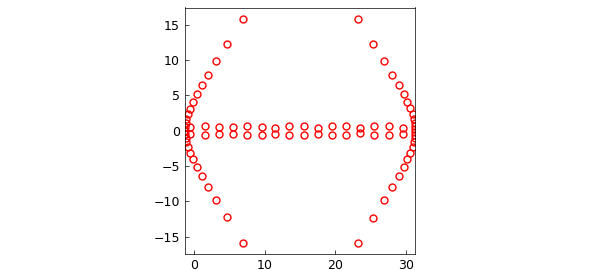

# Complex roots near the real axis

*Nick Trefethen, October 2011*

[Original MATLAB Chebfun example](https://www.chebfun.org/examples/roots/RootsNearAxis.html)

Python translation: [`examples/roots/roots_near_axis.py`](https://github.com/ma-gilles/chebfunjax/blob/main/examples/roots/roots_near_axis.py)

Here's a wiggly chebfun defined on $[0,30]$:

```matlab
x = chebfun('x',[0 30]);
f = 3 + sin(x) + sin(pi*x);
plot(f)
```



The chebfun has no roots on the interval:

```matlab
roots(f)
```

```text
ans =
  0x1 empty double column vector
```

It has some roots near the interval in the complex plane, however, and the chebfun will have some accuracy for these complex values. We can get an idea of the relevant region with `plotregion`, which plots the "Chebfun ellipse" for `f`:

```matlab
clf, plotregion(f), grid on
xlim([-5 35]), axis equal
hold on, plot(x,0*x,'k')
```



The number of digits of accuracy of the chebfun can be expected to reduce smoothly from 15 or so along the interval down to 0 on the ellipse.

This provides an easy way to calculate roots of functions in the complex plane near the interval of definition, using `roots` with the flag `'complex'`:

```matlab
r = roots(f,'complex'); plot(r,'.r','markersize',12)
```



Notice that the number of roots is less than the polynomial degree of the chebfun:

```matlab
number_of_roots = length(r)
degree = length(f)-1
```

```text
number_of_roots =
    32
degree =
    85
```

That's because there are quite a few additional roots of the chebfun that have nothing to do with roots of the underlying function. We can see them with the flag `'all'`:

```matlab
plot(roots(f,'all'),'or'), axis auto, axis equal
```



For more details about computations like these, see Section 3.6 of the *Chebfun Guide*, and for more on the mathematics, see Chapters 8 and 18 of [1].

## References

1. L. N. Trefethen, *Approximation Theory and Approximation Practice, Extended Edition*, SIAM, 2019.

---

*Translated with [chebfunjax](https://github.com/ma-gilles/chebfunjax); prose and MATLAB code from the original example, copyright The University of Oxford and The Chebfun Developers.  Printed outputs and figures are chebfunjax's.*
