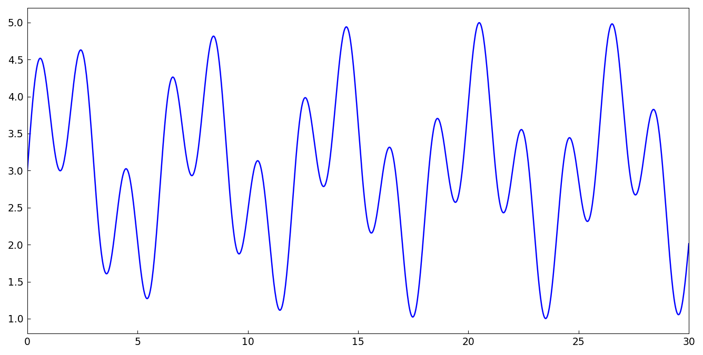
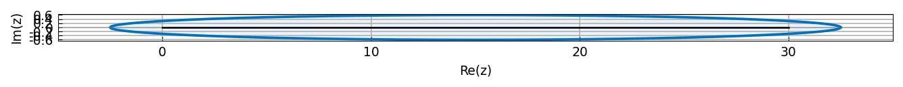
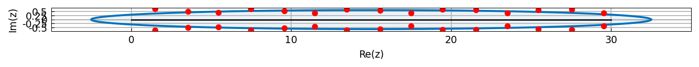
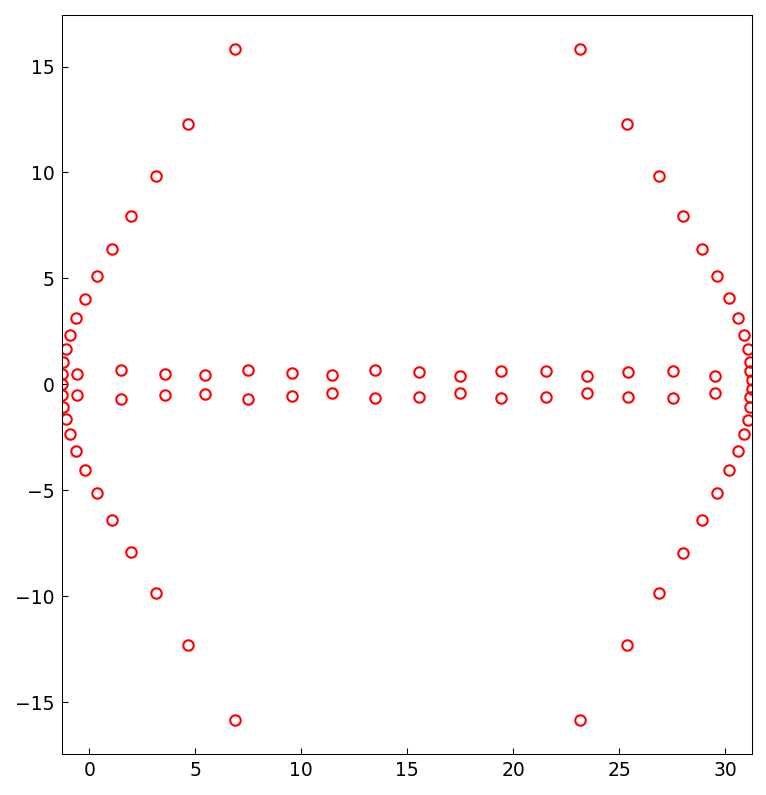

# Complex roots near the real axis

*Nick Trefethen, October 2011*

[Original MATLAB Chebfun example](https://www.chebfun.org/examples/roots/RootsNearAxis.html)

(Chebfun example roots/RootsNearAxis.m)

Here's a wiggly chebfun defined on $[0,30]$:

```python
f = chebfun(lambda x: 3 + sin(x) + sin(pi*x), domain=(0, 30))
```



The chebfun has no roots on the interval:

```text
ans =
  0x1 empty double column vector
```

It has some roots near the interval in the complex plane, however, and
the chebfun will have some accuracy for these complex values.  We can
get an idea of the relevant region with `plotregion`, which plots the
"Chebfun ellipse" for `f`:



The number of digits of accuracy of the chebfun can be expected to
reduce smoothly from 15 or so along the interval down to 0 on the
ellipse.  This provides an easy way to calculate roots of functions in
the complex plane near the interval of definition, using `roots` with
the flag `'complex'`:

```python
r = f.roots(complex_roots=True)
```



Notice that the number of roots is less than the polynomial degree of
the chebfun:

```text
number_of_roots =
    32
degree =
    85
```

That's because there are quite a few additional roots of the chebfun
that have nothing to do with roots of the underlying function.  We can
see them with the flag `'all'`:



For more details about computations like these, see Section 3.6 of the
*Chebfun Guide*, and for more on the mathematics, Chapters 8 and 18 of
Trefethen, *Approximation Theory and Approximation Practice*.

---

*Replicated with [chebfunjax](https://github.com/ma-gilles/chebfunjax); original
example copyright The University of Oxford and The Chebfun Developers.*
