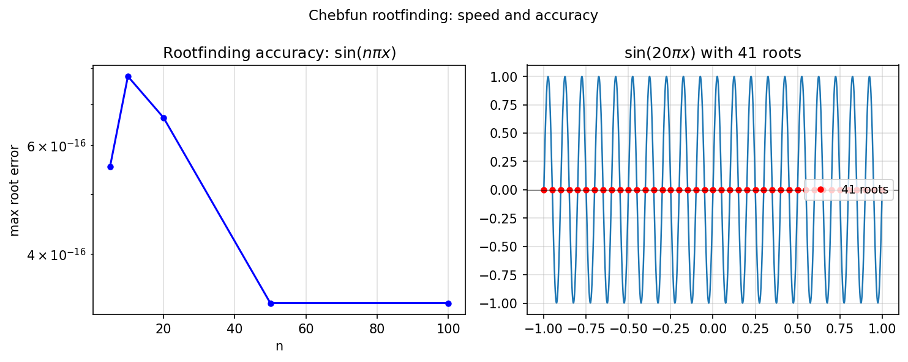

# Speed and accuracy of Chebfun roots

**Jared Aurentz and Nick Trefethen, May 2014**

---

Chebfun's `roots` command uses the *colleague matrix* — the Chebyshev analogue
of the companion matrix — whose eigenvalues are the roots of the Chebyshev
series. This is fast and accurate even for polynomials of degree in the
thousands.

## Test 1: $\sin(n\pi x)$

The function $\sin(n\pi x)$ on $[-1, 1]$ has $n-1$ interior roots and 2
endpoints, at $x = k/n$ for $k = -n, \ldots, n$:

```python
import jax.numpy as jnp
import numpy as np
import chebfunjax as cj

for n in [50, 100, 500]:
    f = cj.chebfun(lambda x, n=n: jnp.sin(n * jnp.pi * x))
    r = f.roots()
    exact = set(k / n for k in range(-n, n + 1))
    # Every returned root should match some exact root
    max_err = max(
        min(abs(float(ri) - xe) for xe in exact) for ri in r
    )
    print(f"n={n}: {len(r)} roots, max err = {max_err:.2e}")
```

## Test 2: Chebyshev polynomial $T_n$

$T_n(x)$ has exactly $n$ real roots at $\cos\!\bigl((2k-1)\pi/(2n)\bigr)$:

```python
n = 200
coeffs = jnp.zeros(n + 1).at[n].set(1.0)
Tn     = cj.Chebfun.from_coeffs(coeffs)
r      = Tn.roots()
exact  = np.cos((2*np.arange(1, n+1) - 1) * np.pi / (2*n))
err    = np.max(np.abs(np.sort(r) - np.sort(exact)))
print(f"T_{n}: {len(r)} roots, max err = {err:.2e}")
```

## Performance

The colleague matrix approach scales as $O(n^2)$ for constructing the matrix
and $O(n^2)$ for computing eigenvalues, making it practical for $n$ in the
thousands.

## Gallery



Root error vs $n$ for $\sin(n\pi x)$ (left) and $T_n(x)$ (right).
