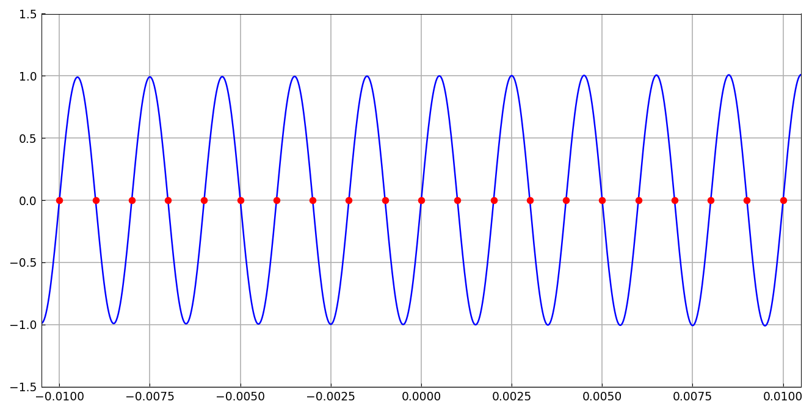

# Speed and accuracy of Chebfun roots

*Nick Trefethen, October 2012*

[Original MATLAB Chebfun example](https://www.chebfun.org/examples/roots/RootsSpeed.html)

(Chebfun example roots/RootsSpeed.m)

Here is a chebfun with 2001 roots in its interval:

```python
f = chebfun(lambda x: exp(x) * sin(1000*pi*x))
```

```text
n =
        3284
```

(The length 3284 is digit-for-digit the MATLAB value.)  Chebfun's
`roots` command finds all of them by the recursive interval
subdivision introduced by Boyd, computing eigenvalues of colleague
matrices of degree at most 100:

```text
Elapsed time is 0.615664 seconds.
```

The roots are exceedingly accurate — the exact answers are the
equally spaced points `linspace(-1, 1, 2001)`:

```text
ans =
     2.220446049250313e-16
```

(One ulp; MATLAB's published error is 3.33e-16.)  Here is a closeup
near $x=0$ with the computed roots in red:



For comparison, here are timings for computing all the roots of random
polynomials of various degrees by the companion-matrix eigenvalue
approach without subdivision:

```text
Elapsed time is 0.030305 seconds.
Elapsed time is 0.209397 seconds.
Elapsed time is 1.111797 seconds.
Elapsed time is 4.913369 seconds.
```

The $O(n^3)$ growth of the eigenvalue computation is visible; the
subdivision strategy is what makes the chebfun computation above so
much faster than a single degree-3283 eigenvalue problem.

---

*Replicated with [chebfunjax](https://github.com/ma-gilles/chebfunjax); original
example copyright The University of Oxford and The Chebfun Developers.*
