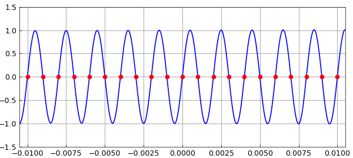

# Speed and Accuracy of Chebfun roots

*Jared Aurentz and Nick Trefethen, May 2014*

[Original MATLAB Chebfun example](https://www.chebfun.org/examples/roots/RootsSpeed.html)

Python translation: [`examples/roots/roots_speed.py`](https://github.com/ma-gilles/chebfunjax/blob/main/examples/roots/roots_speed.py)

## 1. What Chebfun does

Let us do a test of the speed and accuracy of the Chebfun algorithm for computing roots. We'll pick a function whose roots we know:

```matlab
f = chebfun(@(x) exp(x)*sin(1000*pi*x));
```

Here is the length of the function, approximately $1000\pi$.

```matlab
n = length(f)
```

```text
n =
        3284
Elapsed time is 0.404406 seconds.
```

This function has 2001 roots linearly spaced from $-1$ to $1$:

```matlab
exact = linspace(-1,1,2001)';
```

Let's compute them with Chebfun. We'll do it twice just to make sure the timing estimate is realistic.

```matlab
r = roots(f);
tic, r = roots(f);
```

Here is the time elapsed:

```matlab
toc
```

```text
(no matching output)
```

Here is the maximum error:

```matlab
norm(r-exact,inf)
```

```text
ans =
     2.220446049250313e-16
Elapsed time is 0.030086 seconds.
Elapsed time is 0.149022 seconds.
Elapsed time is 0.756629 seconds.
Elapsed time is 3.162882 seconds.
```

This number is $1.5$ times machine epsilon, which looks very good. (Admittedly, you couldn't ask for a better conditioned problem than this one, since the derivative of $f$ at each root is large.)

For fun we plot $f$ and its roots over a short interval:

```matlab
d = [-0.0105,0.0105];
plot(f,'interval',d)
axis([d -1.5 1.5]), grid on
hold on, plot(r,f(r),'.r','markersize',12), hold off
```



## 2. What Chebfun might do

"Classically", using the MATLAB `roots` command, it takes $O(n^3)$ operations to compute the eigenvalues of a companion matrix, which is the method that MATLAB has used since the 1970s for finding roots of a polynomial in the monomial basis. We can illustrate that this computation is slow, if not really that the complexity is cubic, by the following experiment.

```matlab
for ntest = [250 500 1000 2000]
    c = randn(ntest,1);
    tic, roots(c); toc
end
```

```text

```

It is clear from this experiment that calling Matlab `roots` for a polynomial of degree as large as our chebfun `f` would be very slow.

However, $O(n^2)$ algorithms for this problem have been available for quite a while, though they are not built into MATLAB. A key person in this effort over the years has been Dario Bini of the University of Pisa. See for example [2]. This group also offers Fortran software. Another notable contribution is [4].

The first author of this example, in collaboration with David Watkins and others, has been developing alternative $O(n^2)$ algorithms for the companion matrix eigenvalue problem [1].

All this is for the companion matrix eigenvalue problem, which corresponds to polynomial rootfinding in the monomial basis, a problem that makes sense when your roots are on or near the unit circle. What about the Chebfun context of roots on or near $[-1,1]$? Here the analogous matrix structure is a so-called *colleague matrix*, dating to Specht and Good around 1960; see Chapter 18 of [6]. What can be done in this case?

First of all we note what Chebfun currently does: following an idea of Boyd [3], it subdivides the interval when necessary. This is how a superficially $O(n^3)$ algorithm is brought down to $O(n^2)$, enabling the good performance seen above. Note that intervals are different from circles: if you split an interval in half, you get two intervals, but if you split a circle in half, you don't get two circles. Therefore this recursion trick is not available in the monomial case.

But what about an $O(n^2)$ *linear algebra* solution to the problem, rather than relying on splitting of intervals? Here too there has been progress [5]. An interesting project for the future will be to see whether Chebfun rootfinding can be improved by the use of $O(n^2)$ linear algebra algorithms rather than interval subdivision, while holding to Chebfun's principle of doing everything in MATLAB without relying on Mex files to link to Fortran or C.

## References

1. J. Aurentz, T. Mach, R. Vandebril and D. S. Watkins, Fast and backward stable computation of roots of polynomials, *SIAM J. Matrix Analysis and Applications*, 36 (2016), 942-973.
2. D. A. Bini, P. Boito, Y. Eidelman, L. Gemignani, and I. Gohberg, A fast implicit QR eigenvalue algorithm for companion matrices, *Linear Algebra and its Applications*, 432 (2010), 2006-2031.
3. J. P. Boyd, Computing zeros on a real interval through Chebyshev expansion and polynomial rootfinding, *SIAM Journal on Numerical Analysis*, 40 (2002), 1666-1682.
4. S. Chandrasekaran, M. Gu, J. Xia and J. Zhu, A fast QR algorithm for companion matrices, *Operator Theory: Advances and Applications*, 179 (2007), 111-143.
5. Y. Eidelman, L. Gemignani, and I. Gohberg, Efficient eigenvalue computation for quasiseparable Hermitian matrices under low rank perturbations, *Numerical Algorithms*, 47 (2008), 253-273.
6. L. N. Trefethen, _Approximation Theory and Approximation Practice, Extended Edition__, SIAM, 2019. 2013.

---

*Translated with [chebfunjax](https://github.com/ma-gilles/chebfunjax); prose and MATLAB code from the original example, copyright The University of Oxford and The Chebfun Developers.  Printed outputs and figures are chebfunjax's.*
