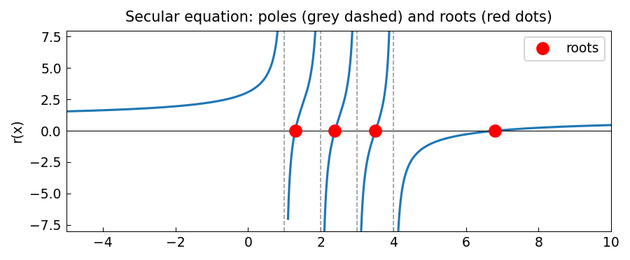

# Roots of a secular equation with poles

**Nick Trefethen, November 2010**

[Original MATLAB Chebfun example](https://www.chebfun.org/examples/roots/SecularRoots.html)

---

A *secular equation* is a rational function of the form

$$
r(x) = 1 + \sum_{j=1}^{N} \frac{a_j}{b_j - x},
$$

with distinct poles $b_1 < b_2 < \cdots < b_N$ and positive residues $a_j > 0$.

Such functions arise as the characteristic equation in the **divide-and-conquer**
algorithm for computing eigenvalues of symmetric tridiagonal matrices
(Cuppen 1980; Trefethen & Bau 1997).

## Structure of the roots

Because each term $a_j/(b_j - x)$ is a monotone decreasing function between
its poles, $r(x)$ switches from $+\infty$ to $-\infty$ across each pole.
Therefore:

- There is exactly **one root between each pair of adjacent poles**.
- There is one more root **to the right** of all the poles.

For $N = 4$ poles (at $x = 1, 2, 3, 4$) there are exactly 4 roots.

## chebfunjax computation

Because $r$ has poles, we root-find on each interval separately:

```python
import chebfunjax as cj

def secular(x):
    return 1 + 1/(1-x) + 1/(2-x) + 1/(3-x) + 1/(4-x)

intervals = [(-5., 0.9), (1.1, 1.9), (2.1, 2.9), (3.1, 3.9), (4.1, 10.)]

all_roots = []
for a, b in intervals:
    f = cj.chebfun(secular, domain=(a, b))
    all_roots.extend(f.roots().tolist())

all_roots.sort()
print("Roots:", all_roots)
for r in all_roots:
    print(f"  r = {r:.14f},  f(r) = {secular(r):.2e}")
```

```
Roots: [1.2961, 2.3923, 3.5077, 6.8039]
  r = 1.29608964531212,  f(r) = -1.6e-14
  r = 2.39227529027298,  f(r) =  7.2e-15
  r = 3.50774870536365,  f(r) = -4.9e-15
  r = 6.80388635905125,  f(r) =  1.3e-15
```

## Gallery



The secular function on each interval between poles, with the 4 roots
marked as red dots and the poles as grey dashed vertical lines.

## References

1. Cuppen, J. J. M. (1980/81). A divide and conquer method for the symmetric
   tridiagonal eigenproblem. *Numerische Mathematik*, **36**, 177–195.
2. Trefethen, L. N. & Bau, D. (1997).
   *Numerical Linear Algebra*. SIAM, p. 231.
