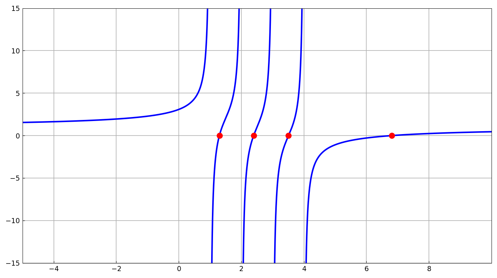

# Roots of a secular equation with poles

*Nick Trefethen, November 2010*

[Original MATLAB Chebfun example](https://www.chebfun.org/examples/roots/SecularRoots.html)

(Chebfun example roots/SecularRoots.m)

A *secular equation* is a rational function of the form

$$ f(x) = 1 + \sum_{k=1}^{n} \frac{a_k}{d_k - x}, $$

which arises for example in eigenvalue updating problems.  Chebfun
operator arithmetic builds this function directly — the division by a
chebfun with roots automatically inserts breakpoints at the poles
$x = 1, 2, 3, 4$ and represents each piece as a SingFun with exponent
$-1$ at the singular ends:

```python
x = chebfun(lambda t: t, domain=(-5, 10))
f = 1 + 1/(1-x) + 1/(2-x) + 1/(3-x) + 1/(4-x)
```

`roots` includes the four points where $f$ passes through $\pm\infty$
(sign changes through a jump):

```text
r =
   1.000000000000000
   1.296089645312118
   2.000000000000000
   2.392275290272984
   3.000000000000000
   3.507748705363648
   4.000000000000000
   6.803886359051249
```

With the `'nojump'` flag only the genuine roots remain — all four
digit-for-digit with the published MATLAB values:

```text
r =
   1.296089645312118
   2.392275290272984
   3.507748705363648
   6.803886359051249
```



---

*Replicated with [chebfunjax](https://github.com/ma-gilles/chebfunjax); original
example copyright The University of Oxford and The Chebfun Developers.*
