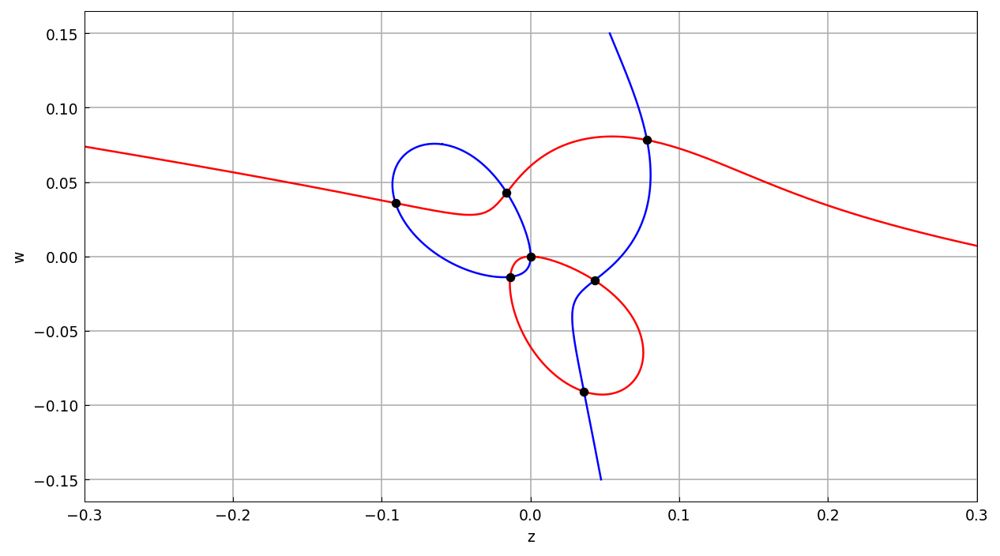
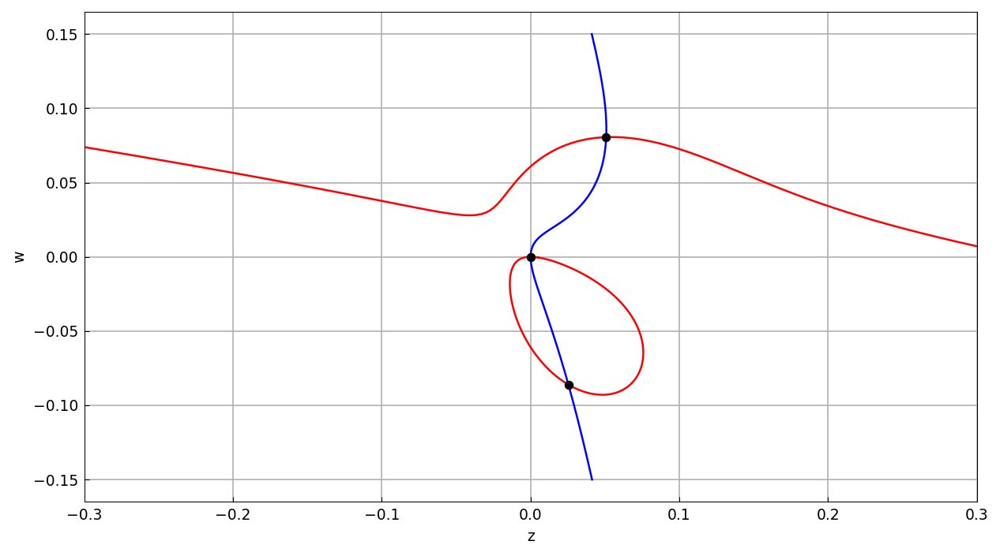

# Bivariate rootfinding for a fluid mechanics problem

*Nick Trefethen, December 2015*

[Original MATLAB Chebfun example](https://www.chebfun.org/examples/roots/Subramanian.html)

(Chebfun example roots/Subramanian.m)

Ganga Prasath Subramanian and colleagues encountered a problem of
finding the common zeros of two cubic bivariate polynomials in a
fluid mechanics stability calculation.  With Chebfun2 this is a call
to `roots(p, q)`.  For $Q=1$, $\mu=\nu=0.1$ on the domain
$[-0.3,0.3]\times[-0.15,0.15]$:

```text
r =
  -0.090831644586318   0.035835847280723
  -0.016094658586370   0.042959596438007
  -0.013740321798295  -0.013740321798296
   0.000000000000000  -0.000000000000000
   0.035835847280723  -0.090831644586318
   0.042959596438007  -0.016094658586370
   0.078256450830554   0.078256450830554
```



Seven common zeros.  (The published page lists only six — running the
identical code in MATLAB R2025b today also finds all seven, agreeing
with the values above to 15 digits; the seventh, on the symmetry
diagonal $z=w$, has residuals of $3\times 10^{-16}$ in both
polynomials, so the published run simply missed a genuine root.)

Changing $\mu$ to $-0.1$:

```text
r =
   0.000000000000000   0.000000000000000
   0.025417412018832  -0.086077285970435
   0.050811642467768   0.080598330616729
```



All three values match the published output digit-for-digit.

---

*Replicated with [chebfunjax](https://github.com/ma-gilles/chebfunjax); original
example copyright The University of Oxford and The Chebfun Developers.*
