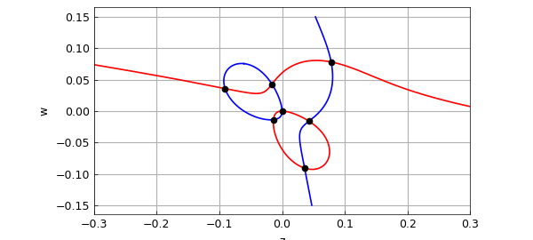
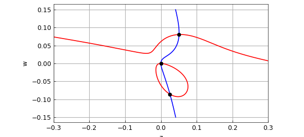

# Bivariate rootfinding for pattern formation

*Nick Trefethen, October 2019*

[Original MATLAB Chebfun example](https://www.chebfun.org/examples/roots/Subramanian.html)

Python translation: [`examples/roots/subramanian.py`](https://github.com/ma-gilles/chebfunjax/blob/main/examples/roots/subramanian.py)

Priya Subramanian at Oxford is interested in the patterns that arise in nonlinear reaction-diffusion PDEs such as the Swift-Hohenberg equation and its relatives [2,3,4]. A particular interest of hers is cases where the patterns may have quasicrystalline structure.

In her analysis, systems of polynomial equations arise whose roots need to be computed. She uses the Bertini software for this, based on a homotopy method [1]. Sometimes there are just two independent variables, however, and this gives nice problems for Chebfun2 (chapter 14 of the *Chebfun Guide*).

Here is one of her examples. We have parameters $Q$, $\mu$, and $\nu$, for which reasonable parameters are these:

```matlab
Q = 1;
mu = 0.1;
nu = 0.1;
```

The independent variables are called $z$ and $w$, and here are the two cubic polynomials of interest:

```matlab
tic
dom = [-.3 .3 -.15 .15];
z = chebfun2(@(z,w) z, dom);
w = chebfun2(@(z,w) w, dom);
p = mu*z + 2*Q*w.^2 + 4*Q*w.*z - 6*w.^3 - 42*w.^2.*z - 18*w.*z.^2 - 27*z.^3;
q = nu*w + 4*Q*w.*z + 2*Q*z.^2 - 27*w.^3 - 18*w.^2.*z - 42*w.*z.^2 - 6*z.^3;
```

Let's plot the zero curves in blue for $p$ and red for $q$, with black dots for the common roots:

```matlab
MS = 'markersize';
plot(roots(p),'b'), hold on, grid on
plot(roots(q),'r')
r = roots(p,q)
plot(r(:,1),r(:,2),'.k',MS,12), axis equal, hold off
xlabel z, ylabel w
```

```text
r =
  -0.090831644586318   0.035835847280723
  -0.016094658586370   0.042959596438007
  -0.013740321798296  -0.013740321798296
   0.000000000000000  -0.000000000000000
   0.035835847280723  -0.090831644586318
   0.042959596438007  -0.016094658586370
   0.078256450830554   0.078256450830554
```



For comparison, here is what we get if we negate $\mu$:

```matlab
mu = -0.1;
p = mu*z + 2*Q*w.^2 + 4*Q*w.*z - 6*w.^3 - 42*w.^2.*z - 18*w.*z.^2 - 27*z.^3;
plot(roots(p),'b'), hold on, grid on
plot(roots(q),'r')
r = roots(p,q)
plot(r(:,1),r(:,2),'.k',MS,12), axis equal, hold off
xlabel z, ylabel w
```

```text
r =
   0.000000000000000  -0.000000000000000
   0.025417412018832  -0.086077285970435
   0.050811642467768   0.080598330616729
```



```matlab
Time_for_this_example = toc
```

```text
Time_for_this_example =
   11.529765844345093
```

[1] D. J. Bates, J. D. Hauenstein, A. J. Sommese, and C. W. Wampler, *Numerically Solving Polynomial Systems with Bertini*, SIAM, 2013.

[2] H. Montanelli, Swift-Hohenberg equation in 2D, `www.chebfun.org/examples/pde/SwiftHohenberg.html`.

[3] P. Subramanian, A. J. Archer, E. Knobloch, and A. M. Rucklidge, Three-dimensional phase field quasicrystals, *Physical Review Letters* 117:1075501, 2016.

[4] P. Subramanian and A. M. Rucklidge, Mode interactions and complex spatial patterns II. Quasicrystals, in preparation.

---

*Translated with [chebfunjax](https://github.com/ma-gilles/chebfunjax); prose and MATLAB code from the original example, copyright The University of Oxford and The Chebfun Developers.  Printed outputs and figures are chebfunjax's.*
