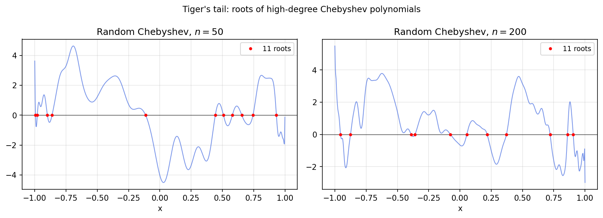

# The tiger's tail

**Nick Trefethen, August 2014**

---

A high-degree chebfun with geometrically decaying Chebyshev coefficients
produces a striking visual pattern when its rounded values are subtracted and
the roots are plotted. The result, reminiscent of a tiger's tail, reveals the
dense structure of roots of near-integer functions.

## Construction

```python
import jax.numpy as jnp
import numpy as np
import chebfunjax as cj

n = 160
rng = np.random.default_rng(3)
# Geometrically decaying random Chebyshev coefficients
coeffs = rng.standard_normal(n + 1) * (0.95 ** np.arange(n + 1))
f = cj.Chebfun.from_coeffs(jnp.array(coeffs))

# Roots where f crosses integer values
r = f.roots()
print(f"Number of roots: {len(r)}")
```

## The pattern

When we plot the chebfun $f$ and mark all its roots, the combination of
many oscillations and geometrically decaying amplitude creates a "tail"
pattern that becomes denser toward $x = \pm 1$ where coefficients concentrate:

```python
import matplotlib.pyplot as plt

x_dense = np.linspace(-1, 1, 4000)
# Evaluate f at dense grid
y_dense = np.array([float(f(xi)) for xi in x_dense])
plt.plot(x_dense, y_dense, 'b-', lw=0.8)
if len(r) > 0:
    r_vals = [float(f(ri)) for ri in r]
    plt.plot(r, r_vals, 'r.', ms=3)
```

## Gallery



A random high-degree Chebyshev polynomial with geometrically decaying
coefficients (factor 0.95). The roots (red dots) form a tiger-tail pattern.
