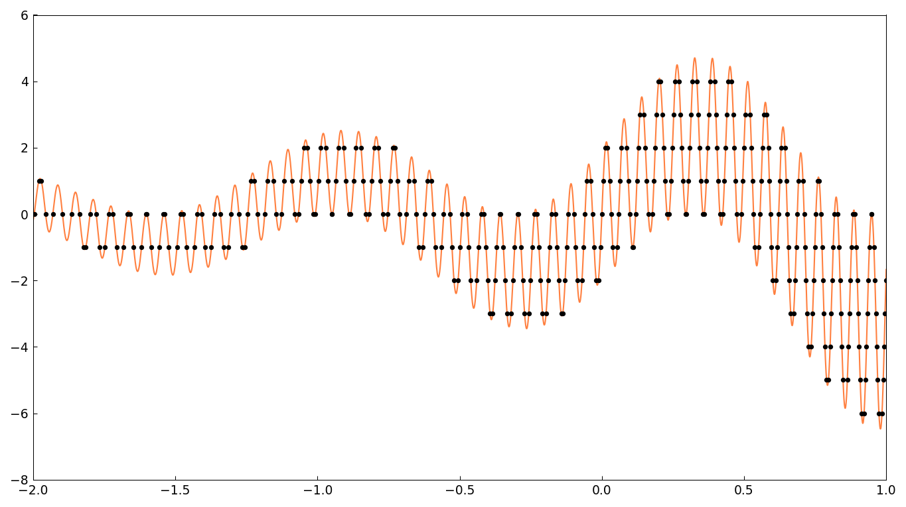
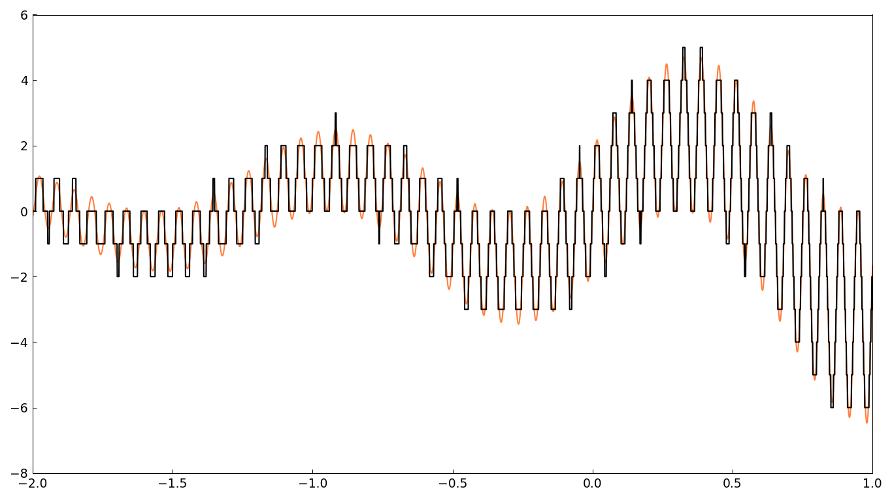
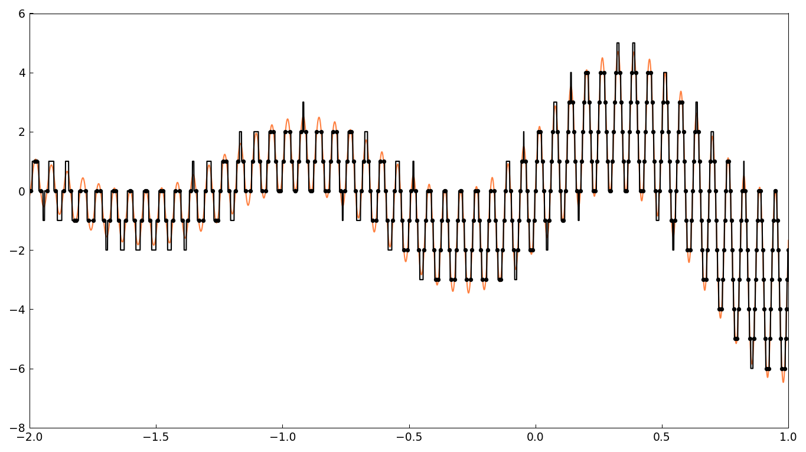

# The tiger's tail

*Nick Trefethen, November 2013*

[Original MATLAB Chebfun example](https://www.chebfun.org/examples/roots/Tiger.html)

(Chebfun example roots/Tiger.m)

The stripes on a tiger's tail can be generated by solving the equation

$$ f(x) = \mathrm{round}(f(x)), \qquad
f(x) = 2e^{x/2}\left(\sin 5x + \sin 101x\right) $$

on $[-2,1]$, where `round` denotes rounding to the nearest integer —
a piecewise-constant chebfun.  The roots (excluding jumps) mark where
the wiggly function crosses the staircase:

```python
f = chebfun(lambda x: 2*exp(.5*x)*(sin(5*x) + sin(101*x)),
            domain=(-2, 1))
r = (f - f.round()).roots()
```



Here is the staircase `round(f)` on top of $f$:



```text
number_of_roots =
   345
```

(Digit-for-digit the MATLAB count.)  And here is the full picture —
the tiger's tail:



---

*Replicated with [chebfunjax](https://github.com/ma-gilles/chebfunjax); original
example copyright The University of Oxford and The Chebfun Developers.*
