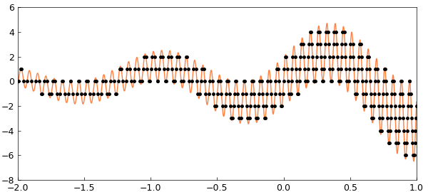
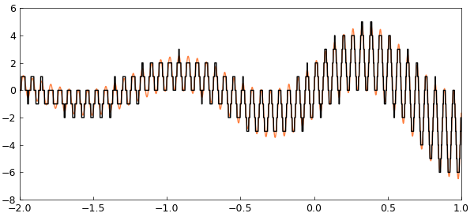
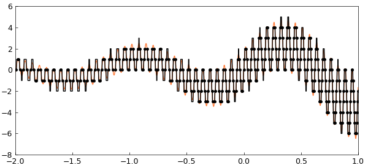
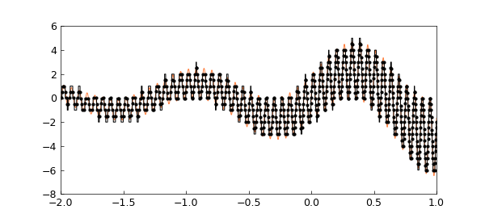

# The tiger's tail

*Nick Trefethen, August 2014*

[Original MATLAB Chebfun example](https://www.chebfun.org/examples/roots/Tiger.html)

Python translation: [`examples/roots/tiger.py`](https://github.com/ma-gilles/chebfunjax/blob/main/examples/roots/tiger.py)

My essay "Six myths of polynomial interpolation and quadrature", reproduced as an appendix in [1], closes with an example that reminds one of a tiger's tail. Here with a few modifications is that example:

```matlab
x = chebfun('x',[-2 1]);
CO = 'color'; orange = [1 .5 .25];
f = 2*exp(.5*x).*(sin(5*x) + sin(101*x));
roundf = round(f);
r = roots(f-roundf,'nojump');
hold off, plot(f,CO,orange), hold on
ylim([-8 6])
plot(r,f(r),'.k'), hold off
```



Let's look at what's going on here. First of all a chebfun $f$ is constructed:

```matlab
plot(f,CO,orange)
ylim([-8 6])
```



Then another chebfun is constructed consisting of $f$ rounded to integers:

```matlab
plot(roundf,'k','jumpline','k')
ylim([-8 6])
```



Superimposing the two curves yields a lot of intersections, which are computed by `roots`:

```matlab
number_of_roots = length(r)
plot(f,CO,orange), hold on
plot(roundf,'k','jumpline','k')
plot(r,f(r),'.k'), hold off
```

```text
number_of_roots =
   345
```



In [1], dots appear not only where $f$ is equal to an integer, but also where it is equal to a half-integer. In the present version of the tiger's tail, this effect has been eliminated by use of the `'nojump'` flag in `roots`.

## Reference

1. L. N. Trefethen, *Approximation Theory and Approximation Practice, Extended Edition*, SIAM, 2019.

---

*Translated with [chebfunjax](https://github.com/ma-gilles/chebfunjax); prose and MATLAB code from the original example, copyright The University of Oxford and The Chebfun Developers.  Printed outputs and figures are chebfunjax's.*
