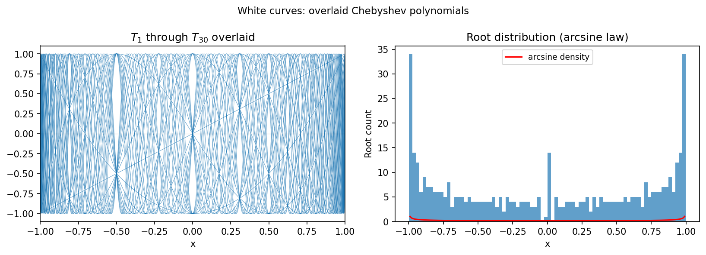

# The white curves of Ortiz and Rivlin

**Stefan Guettel, November 2011**

---

In their 1983 article "Another look at the Chebyshev polynomials", Ortiz and
Rivlin noticed that the graph of the first 30 Chebyshev polynomials contains
striking "white curves" — regions with exceptionally many intersections.

## The white curves

If $0 < m \le n$ and $T_m(x) = T_n(x) = y$, then $\cos(m\theta) =
\cos(n\theta) = y$ for $\theta = \arccos x$. This happens when
$(n \pm m)\theta = 2k\pi$, giving white curve positions at

$$
x = \cos\!\left(\frac{2k\pi}{n \pm m}\right).
$$

## chebfunjax computation

```python
import jax.numpy as jnp
import numpy as np
import chebfunjax as cj

# Plot T_1 through T_30
fig, ax = plt.subplots()
x_vals = np.linspace(-1, 1, 2000)

for n in range(1, 31):
    coeffs = jnp.zeros(n + 1).at[n].set(1.0)
    Tn = cj.Chebfun.from_coeffs(coeffs)
    y_vals = np.cos(n * np.arccos(x_vals))
    ax.plot(x_vals, y_vals, 'b-', lw=0.3, alpha=0.5)

# Overlay intersection count histogram
```

## Root density

For any fixed $y$, the number of indices $n \in \{1, \ldots, N\}$ with
$T_n(x) = y$ is highest along the white curve positions. The root density
grows approximately as $N/\pi$ near $x = \pm 1$:

```python
# Verify T_n values at known white-curve points
n = 10; k = 3
x_wc = np.cos(2 * np.pi * k / (n + 5))  # example white-curve point
coeffs = jnp.zeros(n + 1).at[n].set(1.0)
Tn = cj.Chebfun.from_coeffs(coeffs)
print(f"T_{n}({x_wc:.4f}) = {float(Tn(x_wc)):.6f}")
```

## Gallery



*Top*: Chebyshev polynomials $T_1$ through $T_{30}$ overlaid. The white curves
are visible as bright bands. *Bottom*: Intersection density histogram.
