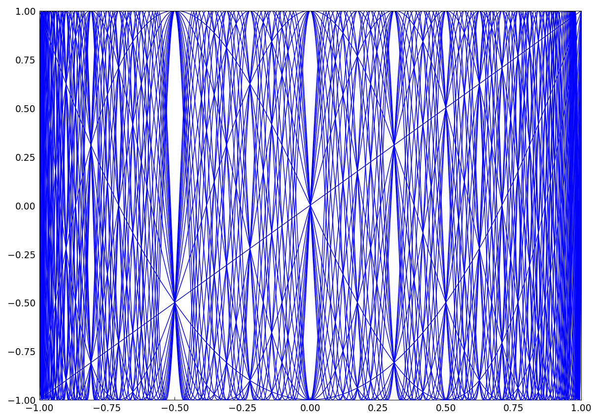
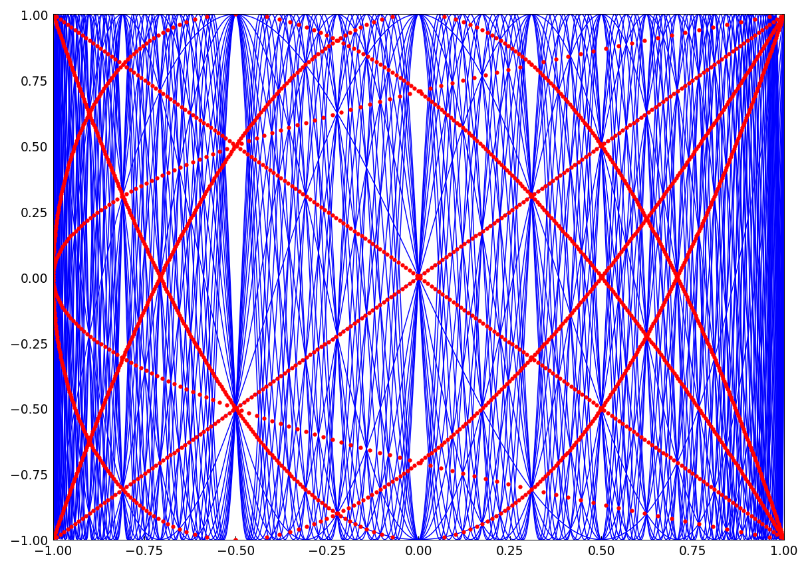
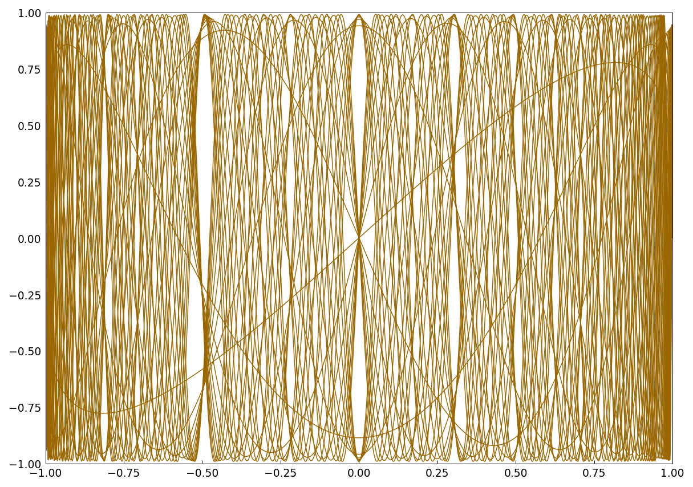
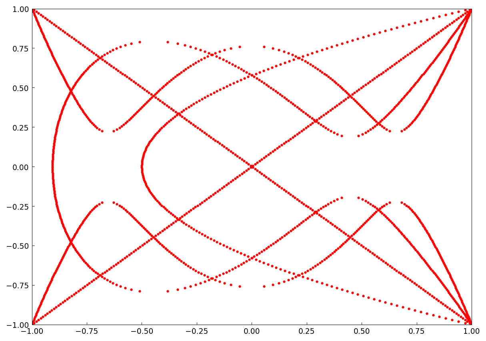

# The white curves of Ortiz and Rivlin

*Nick Trefethen, November 2010*

[Original MATLAB Chebfun example](https://www.chebfun.org/examples/roots/WhiteCurves.html)

(Chebfun example roots/WhiteCurves.m)

In their 1983 article "Another look at the Chebyshev polynomials",
Ortiz and Rivlin noticed that when the first thirty Chebyshev
polynomials are plotted together, curious white curves appear in the
picture:

They showed the white curves are described by the condition
$T_{n-m}(x) = T_2(y)$: for each fixed difference $j = n - m$, the
points where consecutive-index curves nearly intersect line up.
Superimposing the roots of $T_j(x) - T_2(y)$ for $j = 1,\dots,4$ in
red:

The same phenomenon appears for Legendre polynomials, once each
$P_n$ is scaled by its envelope $(\pi n/2)^{1/2}(1-x^2)^{1/4}$:

And the corresponding white curves $P_j(x) = P_2(y)$:

---

*Replicated with [chebfunjax](https://github.com/ma-gilles/chebfunjax); original
example copyright The University of Oxford and The Chebfun Developers.*
