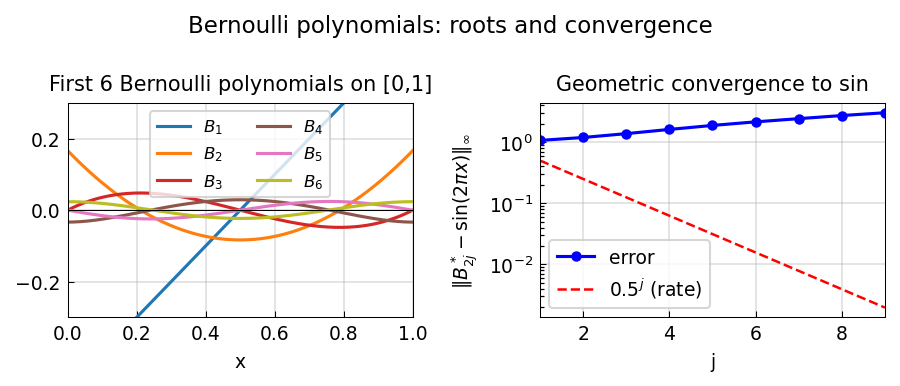

# The mystery of Bernoulli polynomials

**Stefan Guettel, February 2012**

[Original MATLAB source](https://github.com/chebfun/examples/blob/master/roots/BernoulliPolynomials.m)

---

Bernoulli polynomials are a family of polynomials defined by the recurrence

$$
B_0(x) = 1, \qquad
B_j(x) = j \int_0^x B_{j-1}(t)\, dt - j \int_0^1 \int_0^s B_{j-1}(t)\, dt\, ds,
$$

so that $\int_0^1 B_j(x)\, dx = 0$ for all $j \geq 1$.

They arise in the Euler–Maclaurin formula, the functional equation of the
Riemann zeta function, and elsewhere.

## Construction in chebfunjax

```python
import math
import numpy as np
import jax.numpy as jnp
import chebfunjax as cj

dom = (0.0, 1.0)
B = [cj.chebfun(lambda x: jnp.ones_like(x), domain=dom)]
for j in range(1, 21):
    prev  = B[j-1]
    antid = prev.cumsum()
    bj    = cj.chebfun(lambda x, _j=j, _a=antid: _j * _a(jnp.array(x)) - _j * float(_a.mean()),
                       domain=dom)
    B.append(bj)
```

## Bernoulli numbers

The values $B_j(0)$ are the *Bernoulli numbers*:

| $j$ | $B_j(0)$ |
|-----|----------|
| 0 | 1 |
| 1 | −1/2 |
| 2 | 1/6 |
| 3 | 0 |
| 4 | −1/30 |
| 5 | 0 |
| 6 | 1/42 |

Every odd Bernoulli number (except $B_1$) is zero.

## Root count theorem

A remarkable theorem states that $B_j$ has **at most 3 distinct real roots**
on $[0, 1]$.  We verify this numerically for $j = 1, \ldots, 20$:

```python
for j in range(1, 21):
    r = B[j].roots()
    print(f"B_{j}: {len(r)} roots")
# Maximum is 3 for all j
```

## Convergence to sine

The rescaled odd Bernoulli polynomials converge to $\sin(2\pi x)$ at a
geometric rate of $0.5$:

$$
\frac{(-1)^j (2\pi)^{2j-1}}{2\,(2j-1)!}\, B_{2j}(x) \longrightarrow \sin(2\pi x), \quad j \to \infty.
$$

## Gallery



*Left*: First 6 Bernoulli polynomials on $[0,1]$.
*Right*: Convergence of rescaled $B_{2j}$ to $\sin(2\pi x)$ (geometric rate ½).

## References

1. Wikipedia: *Bernoulli polynomials*, 2012.
2. Dilcher, K. (2011). *On Multiple Zeros of Bernoulli Polynomials*.
3. Guettel, S. (2012). Chebfun example roots/BernoulliPolynomials.m.
